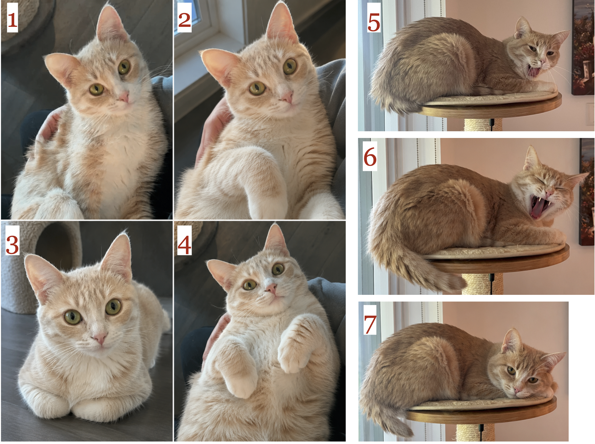
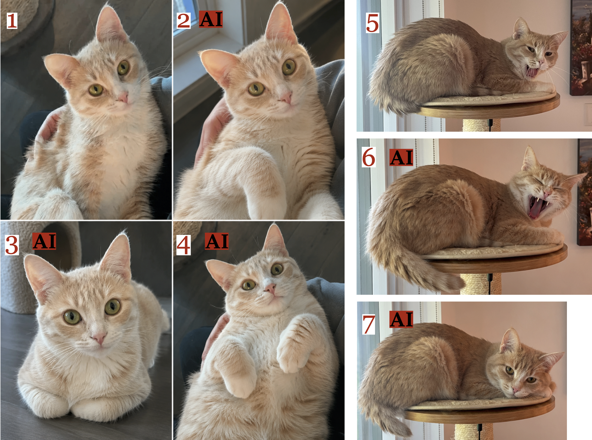
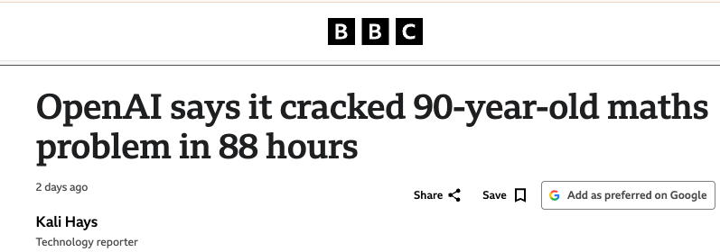
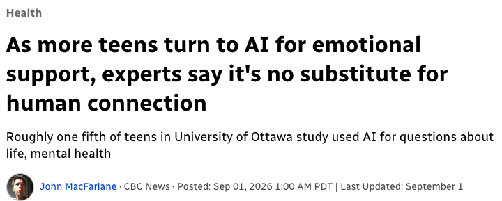
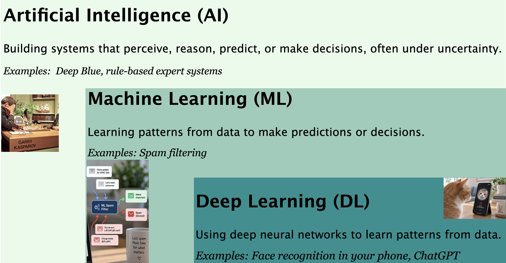
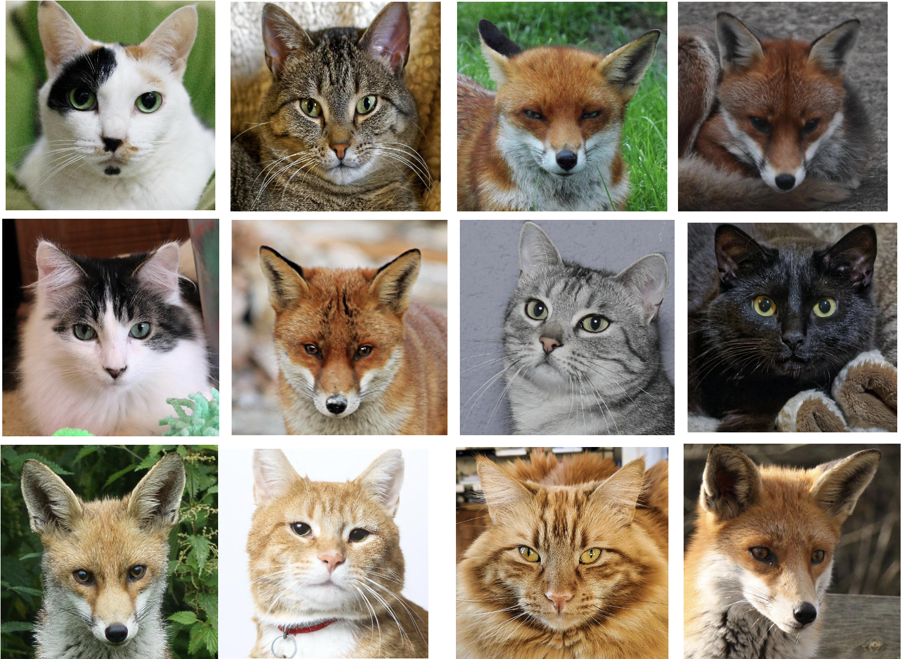
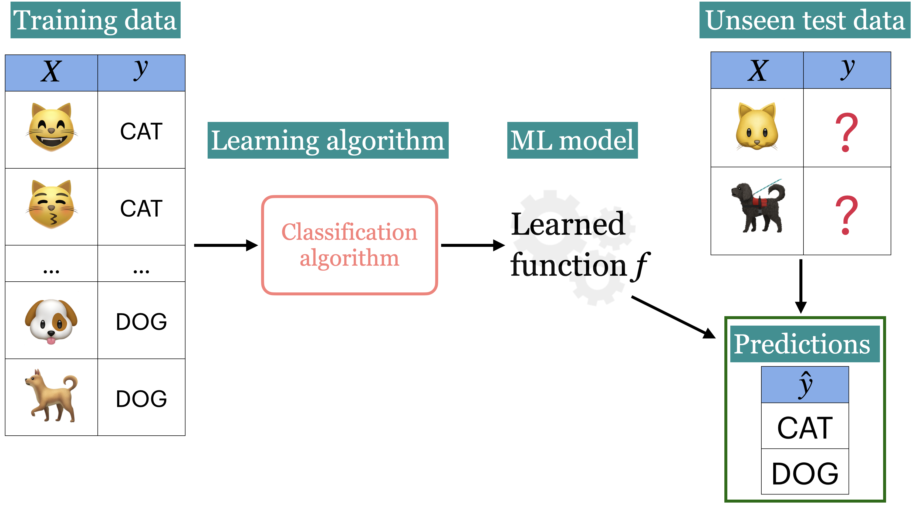
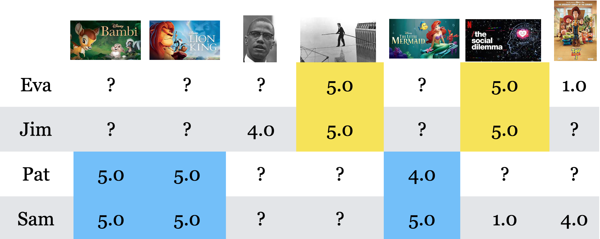
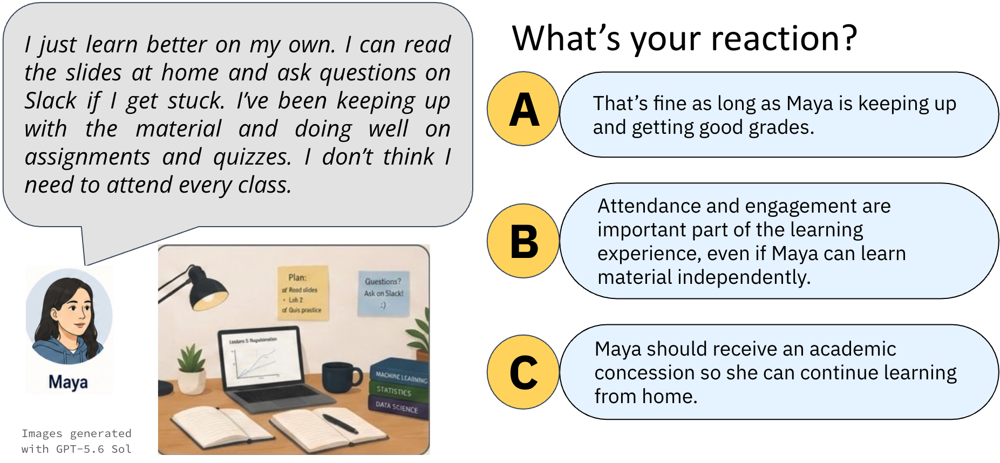
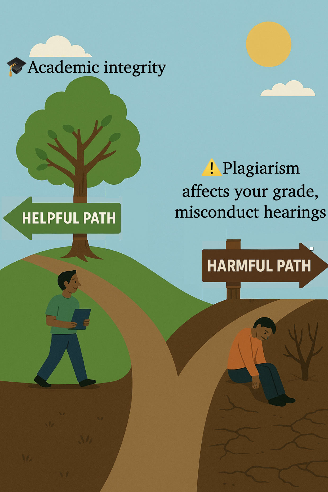

```{python}
import numpy as np
import pandas as pd
import matplotlib.pyplot as plt
import os
import sys
sys.path.append(os.path.join(os.path.abspath("."), "code"))
from plotting_functions import *
from unsupervised_learning_code import *
from IPython.display import HTML, display
from sklearn.feature_extraction.text import CountVectorizer
from sklearn.linear_model import LogisticRegression
from sklearn.model_selection import train_test_split
from sklearn.pipeline import make_pipeline

plt.rcParams["font.size"] = 16
pd.set_option("display.max_colwidth", 200)
%matplotlib inline

DATA_DIR = 'data/' 
```

## Focus on the breath!

{.nostretch fig-align="center" width="500px"}


## 🎯 Today’s big questions

- **AI, ML, DL:** What’s the difference?

- **Learning from examples:** How does it work?

- **Rules, ML, or people:** Which should we choose?

- **Getting started in CPSC 330:** What do you need?

## CPSC 330 course materials

- [Course website](https://ubc-cs.github.io/cpsc330-2026W1/): schedules, syllabus, and policies
- [Course book](https://ubc-cs.github.io/cpsc330-book/): shared course notes
- Today’s reading: [Chapter 1: Course Introduction](https://ubc-cs.github.io/cpsc330-book/book/01_intro.html)
- [Course GitHub repository](https://github.com/UBC-CS/cpsc330-2026W1)

# 🤝 Introductions 🤝 {.middle}

## Meet your instructor {.smaller}

:::: {.columns}

::: {.column width="20%"}

:::

::: {.column width="80%"}
- Varada Kolhatkar [[ʋəɾəda kɔːlɦəʈkər](https://en.wikipedia.org/wiki/International_Phonetic_Alphabet)]
- You can call me Varada, **V**, or **Ada**.
- Associate Professor of Teaching in the Department of Computer Science.
- Ph.D. in Computational Linguistics at the University of Toronto. 
- I primarily teach machine learning courses in the [Master of Data Science (MDS) program](https://masterdatascience.ubc.ca/). 
- Contact information
    - Email: kvarada@cs.ubc.ca
    - Office: ICCS 237
:::

::::

## Meet Eva (a fictitious persona)!

:::: {.columns}

::: {.column width="40%"}

:::

::: {.column width="60%"}
Eva is among one of you. She has some experience in Python programming. She knows machine learning as a buzz word. During her recent internship, she has developed some interest and curiosity in the field. She wants to learn what is it and how to use it. She is a curious person and usually has a lot of questions!  
:::

::::

## Activity 1 {background-color="#c2eaf5"}
\
Discuss the following questions with your neighbour. 

- What's your name and major?
- Where have you encountered machine learning?
- What would you like to get out of this course?
- What's one thing you're excited or unsure about?

# AI in everyday life

## Original vs AI? {.smaller}

Which cats do you think are AI-generated? 



## Original vs AI? {.smaller}

How did you decide?

 

## AI in the news {.smaller}

:::: {.columns}

::: {.column width="50%"}

**[Mathematical discovery](https://www.bbc.com/news/articles/cy7zygy3rl2o):** 

OpenAI reports an AI-generated solution to a major problem about fluid motion. 

**[Emotional support](https://www.cbc.ca/news/health/ai-teenagers-mental-health-study-9.7327227):** 

About one in five students in an Ontario study reported seeking emotional support from AI. The association with emotional problems does not establish causation. 
:::
:::{.column width="50%"}



:::
::::

**What would you want to know before trusting an AI system in either setting?**

::: {.notes}
Maybe: How accurate is it? How was it tested? Who checked the answer? What data was it trained on? What happens when it's wrong? Who is accountable?

Exactly.

And notice that the answers may be different in different contexts.

For mathematics, perhaps we can formally verify part of an argument. But people still have to decide whether the formal statement actually corresponds to the original mathematical problem and whether the result is significant.

For emotional support, the questions are quite different. What evidence do we have that this is safe? For whom? What happens in a crisis? What information is being collected? Who is responsible?:::
:::

## Which of these do you think use AI? {background-color="#c2eaf5"}

- A spam detector 📧
- Autocomplete on your phone 📱
- A basic calculator ➕
- Finding the closest holiday destination by straight-line distance 🛫
- Predicting traffic conditions tomorrow 
- Recommending a holiday destination you would enjoy 🛳️
- A chatbot planning your holiday 💬

**What makes you call something AI?** 

::: {.notes}
Invite explanations rather than seeking a single correct label for every example. Calculators and straight-line distance calculations are usually considered ordinary computation. Route-finding can illustrate classical AI search, although shortest-path algorithms also belong to general computer science. Spam detection, autocomplete, traffic prediction, and recommendations can use learned models, explicit rules, or combinations. A holiday-planning chatbot can combine a language model with a calculator to total costs, web search to find opening hours, and route search to plan travel. Ask which parts of its work each component handles. Determinism alone does not exclude a system from AI. Use the ambiguity to motivate the next slide's distinction between AI, ML, and DL, without requiring students to know those terms yet.
:::

# AI, ML, and DL

## What are AI, ML, and DL?

{.nostretch fig-align="center" height="400px"}

Our focus: learning from examples and applying what we learn to new cases.

:::{.notes}
Imagine a self-driving car. To drive safely, the system needs to perceive what's around it—is there a pedestrian? Where are the other cars? It needs to reason about what it perceives—if there's a pedestrian in front of me, what should I do? And then it needs to act—perhaps slow down or stop.

These are examples of capabilities we often associate with AI: perception, reasoning, planning, and decision-making.

But AI doesn't necessarily mean machine learning. We can build AI systems using explicit rules, search, machine learning, or combinations of these approaches.

Chess gives us a nice historical example. IBM built a chess-playing system called Deep Blue. Deep Blue relied heavily on search: it could examine enormous numbers of possible chess positions and evaluate which moves looked promising. A human chess player can't possibly search through that many possibilities.

In 1997, Deep Blue defeated Garry Kasparov, who was the reigning world chess champion.

So AI is broader than machine learning. Machine learning is one way of building systems with intelligent capabilities—and that's the approach we're mainly interested in in CPSC 330.
:::

# How ML works

## Image classification {.smaller}
Searching photos for animals involves **image classification**. Imagine telling cats and foxes apart. How might we do this with traditional programming? With ML?

:::: {.columns}

::: {.column width="35%"}
 
:::

::: {.column width="65%"}

| Image ID | Whiskers Present | Ear Size  | Face Shape | Fur Color  | Eye Shape   | Label |
|----------|------------------|-----------|------------|------------|-------------|-------|
| 1        | Yes              | Large     | Round      | Mixed      | Round       | Cat   |
| 2        | Yes              | Medium    | Round      | Brown      | Almond      | Cat   |
| 3        | Yes              | Large     | Pointed    | Red        | Narrow      | Fox   |
| 4        | Yes              | Large     | Pointed    | Red        | Narrow      | Fox   |
| 5        | Yes              | Small     | Round      | Mixed      | Round       | Cat   |
| 6        | Yes              | Large     | Pointed    | Red        | Narrow      | Fox   |
| 7        | Yes              | Small     | Round      | Grey       | Round       | Cat   |
| 8        | Yes              | Small     | Round      | Black      | Round       | Cat   |
| 9        | Yes              | Large     | Pointed    | Red        | Narrow      | Fox   |

::: 
::::

## Who writes the rules?

:::: {.columns}
::: {.column width="48%"}
**Traditional programming**

We write the rules.

**Pointed face + red fur + narrow eyes**

↓

Predict **fox**
:::
::: {.column width="48%"}
**Machine learning**

We provide labeled examples.

**Features + cat/fox labels**

↓

Learn a **prediction rule**
:::
::::

::: {.fragment}
**What would happen with either approach if we encountered a fox with white fur?**
:::

::: {.notes}
In the example table, fur colour helps distinguish the classes, while whiskers do not because every animal has them. These patterns need not hold for all cats and foxes. ML can learn rules, too; the distinction is whether we specify the prediction rule ourselves or learn it from examples. Both approaches need evaluation on new cases.
:::

## DL approach: example 

:::: {.columns}

::: {.column width="40%"}
 
:::

::: {.column width="60%"}
- A neural network automatically learns which features to look at (edges $\rightarrow$ textures $\rightarrow$ objects).
- No need to even specify face shape or fur colour. It learns relevant features on its own. 
::: 

::::

## Supervised learning: inputs, targets, and predictions {.smaller}

- **Inputs ($X$):** observations described by features, such as fur colour and ear size.
- **Targets ($y$):** labels or values we want to predict, such as cat or fox.
- **Training:** learn a model $f$ relating inputs to targets.
- **Prediction:** use the model to predict targets for unseen examples.

{.nostretch fig-align="center" height="280px"}

# Applications and coding examples

## What to look for in the demos

For each example, identify the inputs, the desired output, and where learning happens.

- **Spam:** learn to predict a category from labeled messages.
- **House prices:** predict a continuous value.
- **Images:** reuse a model trained elsewhere.
- **Clustering and recommendations:** discover groups or patterns in preferences.

Focus on the inputs and outputs. You do not need to understand all the code yet.

## Spam classification: labeled examples {.smaller}

- Suppose you are given some data with labeled spam and non-spam messages and you want to predict whether a new message is spam or not spam.  

::: panel-tabset
### Code

```{python}
#| echo: true
sms_df = pd.read_csv(DATA_DIR + "spam.csv", encoding="latin-1")
sms_df = sms_df.drop(columns = ["Unnamed: 2", "Unnamed: 3", "Unnamed: 4"])
sms_df = sms_df.rename(columns={"v1": "target", "v2": "sms"})
train_df, test_df = train_test_split(sms_df, test_size=0.10, random_state=42)
```

### Output {.smaller}

::: {.scroll-container style="overflow-y: scroll; height: 400px;"}

```{python}
HTML(train_df.head().to_html(index=False))
```
:::
:::

## Spam classification: training 

```{python}
#| echo: true
X_train, y_train = train_df["sms"], train_df["target"]
X_test, y_test = test_df["sms"], test_df["target"]
clf = make_pipeline(CountVectorizer(max_features=5000), LogisticRegression(max_iter=5000))
clf.fit(X_train, y_train) # Training the model
```

## Spam classification: predictions on unseen messages {.smaller}

These are predictions for a few unseen messages. We need a larger evaluation to judge how reliable the model is.

::: {.scroll-container style="overflow-y: scroll; height: 400px;"}

```{python}
pred_dict = {
    "sms": X_test[0:4],
    "spam_predictions": clf.predict(X_test[0:4]),
}
pred_df = pd.DataFrame(pred_dict)
pred_df.style.set_properties(**{"text-align": "left"})
```
:::

## Example: Supervised regression {.smaller}

Suppose we want to predict housing prices given a number of attributes associated with houses. The target here is **continuous** and not **discrete**. 

```{python}
df = pd.read_csv( DATA_DIR + "kc_house_data.csv")
df = df.drop(columns = ["id", "date"])
df.rename(columns={"price": "target"}, inplace=True)
train_df, test_df = train_test_split(df, test_size=0.2, random_state=4)
HTML(train_df.head().to_html(index=False))
```

```{python}
#| echo: false
from lightgbm.sklearn import LGBMRegressor

X_train, y_train = train_df.drop(columns= ["target"]), train_df["target"]
X_test, y_test = test_df.drop(columns= ["target"]), test_df["target"]

model = LGBMRegressor(n_jobs=1, verbosity=-1)
model.fit(X_train, y_train);
```

## Predicting prices of unseen houses {.smaller}

```{python}
#| echo: true
pred_df = pd.DataFrame(
    {"Predicted_target": model.predict(X_test[0:4]).tolist()}
)
df_concat = pd.concat([pred_df, X_test[0:4].reset_index(drop=True)], axis=1)
HTML(df_concat.to_html(index=False))
```
We are predicting **continuous values** here as opposed to discrete values in `spam` vs. `ham` example. 


## Example: Predicting image labels {.smaller}
- We reuse an image classifier trained elsewhere to predict labels for new photos.
- The model learned from labeled images during its original training; we do not train it here. 

::: {.scroll-container style="overflow-y: scroll; height: 400px;"}

```{python}
import img_classify
from PIL import Image
import glob
import matplotlib.pyplot as plt
# Predict topn labels and their associated probabilities for unseen images
images = glob.glob(DATA_DIR + "test_images/*.*")
class_labels_file = DATA_DIR + 'imagenet_classes.txt'
for img_path in images:
    img = Image.open(img_path).convert('RGB')
    img.load()
    plt.imshow(img)
    plt.show();    
    df = img_classify.classify_image(img_path, class_labels_file)
    print(df.to_string(index=False))
    print("--------------------------------------------------------------")
```
:::

## Finding groups in food images {.smaller}

- **Clustering** groups similar examples without supplied target labels.
- The image representation affects what counts as similar.
- People must interpret the groups: do they reflect food types, plate colour, or backgrounds?
```{python}
data_dir = "data/food/train"
file_names = [image_file for image_file in glob.glob(data_dir + "/*/*.jpg")]
n_images = len(file_names)
BATCH_SIZE = n_images  # because our dataset is quite small
food_inputs, food_classes = read_img_dataset(data_dir, BATCH_SIZE)
X_food = food_inputs.numpy()
plot_sample_imgs(food_inputs[0:24,:,:,:])
```

## Clustering images 

```{python}
#| echo: true
import torch
densenet = models.densenet121(weights="DenseNet121_Weights.IMAGENET1K_V1")
densenet.classifier = torch.nn.Identity()  # remove that last "classification" layer

Z_food = get_features_unsup(densenet, food_inputs)
k = 5
km = KMeans(n_clusters=k, n_init='auto', random_state=123)
km.fit(Z_food);
```

## Examining food clusters
\

::: {.scroll-container style="overflow-y: scroll; height: 400px;"}

```{python}
#| echo: false
for cluster in range(k):
    get_cluster_images(km, Z_food, X_food, cluster, n_img=6)

```
:::

## Learning patterns in preferences {.smaller}

{.nostretch fig-align="center" height="350px"}

- Sam and Pat like many of the same movies. What should we recommend to Pat next?

# When should we use ML?

## Rules, ML, or human judgment? {.smaller}

| Starting point | When it is appropriate |
|---|---|
| **Explicit rules** | The logic is known, stable, and can be stated precisely. |
| **Machine learning** | Useful patterns exist in representative data, hand-written rules are difficult, and we can evaluate errors. |
| **Human judgment** | Context, empathy, values, or accountability are central to the decision. |

Real systems can combine all three. Making a prediction does not automatically justify delegating the decision to a model.


## ❓❓ Rules, ML, or human judgment? {.smaller background-color="#c2eaf5"}

Choose a starting point for each problem and explain why. Combinations are possible.

- **(A)** Checking whether an email address ends with `@student.ubc.ca`
- **(B)** Awarding a scholarship based on a student's personal essay
- **(C)** Predicting which songs a listener might enjoy
- **(D)** Checking whether two essays are exactly identical
- **(E)** Tagging photos of friends

Where could mistakes cause harm, and who should be responsible?

::: {.notes}
Suggested starting points: A and D use explicit rules; C and E use ML; B requires accountable human judgment. ML could assist parts of B, but predicting a score does not settle who deserves a scholarship. Exact matching in D is only one narrow check, not a complete plagiarism detector.
:::

## 🤔 Eva's questions

- How can a model predict a label for an example it has never seen before?
- What happens when it makes a mistake, such as marking a genuine message as spam?
- How do we measure whether it is reliable enough to use?

These questions will guide our work throughout the course.

## Developing ML solutions {.smaller}

In this course, we will learn to:

- Frame problems and decide what role ML should play.
- Prepare data and engineer and select useful features.
- Choose suitable methods and evaluate their results.
- Study errors, limitations, and possible harms.
- Communicate findings and explore deployment.

**A trained model is one component of a solution.**

## Break 


# Course overview

## Course website 
::: {.callout-important}
Use the [2026W1 course website](https://ubc-cs.github.io/cpsc330-2026W1/) for schedules, announcements, and policies. Read the syllabus carefully. The [separate course book](https://ubc-cs.github.io/cpsc330-book/) contains our shared notes.
:::

::: {.callout-important}
Make sure you go through the syllabus thoroughly and complete the syllabus quiz before Sept 19th at 11:59pm. 
:::

## What do we cover {.smaller}

- Designed for a **diverse group of students** (CS, Statistics, and beyond)  
- **Gentle introduction** to machine learning, but also valuable for those with prior experience  
- Covers **foundational concepts** in ML and data science:  
  - Data preprocessing, supervised learning, clustering  
  - Recommendation systems, text processing  
  - Intro to neural networks, time series, survival analysis  
- Emphasis on **hands-on skills**:  
  - Model development, evaluation, interpretation  
  - Ethical considerations and clear communication  

## Course structure {.smaller}

- Part I: Foundations and Supervised Learning
  - Weeks 2, 3, 4, 5, 6, 7
- Unsupervised Learning and Recommendation
  - Weeks 8, 9
- Working with Different Data Types
  - Weeks 9, 11, 12 
- Responsible Machine Learning in Practice 
  - Weeks 12, 13 

## CPSC 330 vs. 340

Read [330_vs_340](https://github.com/UBC-CS/cpsc330-2026W1/blob/main/docs/330_vs_340.md) which explains the difference between two courses.  

**TLDR:**

- 340: how do ML models work?
- 330: how do I use ML models and develop ML solutions?
- CPSC 340 has many prerequisites. 
- CPSC 340 goes deeper but has a more narrow scope.
- I think CPSC 330 will be more useful if you just plan to apply basic ML.

## Lecture format

- In person lectures T/Th.
- Sometimes there will be videos to watch before lecture. You will find the list of pre-watch videos in the schedule on the course webpage.
- We will also try to work on some questions and exercises together during the class. 
- Use the course website for the schedule and slides, and the course book for shared notes. 

## Tutorials 
- Weekly tutorials will be run by the TAs. 
- Participation is worth **5%** of the course grade and is planned to be assessed during tutorials starting next week. Details will be announced. 
- Make use of this helpful resource. 

## Lecture notes and slides

- Read the shared notes in the [CPSC 330 course book](https://ubc-cs.github.io/cpsc330-book/).
- For this lecture, read [Chapter 1: Course Introduction](https://ubc-cs.github.io/cpsc330-book/book/01_intro.html).
- Each instructor prepares slides and demos based on the book.
- Use the [2026W1 course website](https://ubc-cs.github.io/cpsc330-2026W1/) for deadlines and policies.

## Registration, waitlist and prerequisites {.smaller}

::: {.callout-important}
Please go through [this document](https://ubc-cs.github.io/cpsc330-2026W1/syllabus.html#registration-and-prerequisites) carefully before contacting your instructors about these issues. Even then, we are very unlikely to be able to help with registration, waitlist or prerequisite issues.
:::

- See the current syllabus for registration and waitlist deadlines.
- If you are on the waitlist and would like to try your chances, you should already have access to Ed Discussion and PrairieLearn.
- **Please note that it is your responsibility to complete and submit all assessments while you are on the waitlist. No concessions will be made for students who are waitlisted.**
- Instructors cannot change the waitlist order or help you bypass it.


# Setting up your computer for the course 

# Tools used in this course

We will use the following tools throughout the course:

- **Coding:** `Python`, with either `Jupyter Lab` or `VS Code`
- **Version Control:** `git` and `GitHub`
- **Assignment Submission:** `PrairieLearn`
- **Discussion Forum:** `Ed Discussion`
- **Exams and Final Grades:** `PrairieLearn` and `Canvas`
- **Recommended Browsers:** [Google Chrome](https://www.google.com/chrome/) or [Mozilla Firefox](https://www.mozilla.org/en-US/firefox/new/)

## Course Python environment

- Follow the setup instructions [here](https://ubc-cs.github.io/cpsc330-2026W1/docs/setup.html) to set up the course Python environment with `uv` on your computer. 
- If you do not have your computer with you, you can partner up with someone and set up your own computer later.

## Python requirements/resources {.smaller}

We will primarily use Python in this course.

Here is the basic Python knowledge you'll need for the course: 

- Basic Python programming
- Numpy
- Pandas
- Basic matplotlib

Homework 1 is all about Python.

:::{.callout-note}
We do not have time to teach all the Python we need 
but you can find some useful Python resources [here](https://github.com/UBC-CS/cpsc330-2026W1/blob/main/docs/resources.md).  
:::

<br><br>

## Workload 
What does a typical week look like?

- **Before class:** Watch pre-lecture videos or preview notes  
- **In class:** Two 80-minute lectures with iClicker questions, activities, and live demos  
- **Support:** Weekly tutorials and office hours  

- **Practice:** Weekly assignments (except exam weeks)  

## Tips for success:

- Attend lectures regularly and ask questions  
- Start homework early. Hands-on practice is essential  

- Use Generative AI tools **responsibly**. No blind copy-pasting  

- Always question your data, methods, and results. Justify your choices.   

# Course policies 

## Attendance {.smaller}
### Scenario: I can learn just as well from home
{.nostretch fig-align="center" width="700px"}

Your presence and engagement matters!! Together we create energy that makes lectures valuable! 


## Grading scheme 

- The grading breakdown is [here](https://github.com/UBC-CS/cpsc330-2026W1/blob/main/syllabus.md#grade-weights). 

- The policy on challenging grades is [here](https://github.com/UBC-CS/cpsc330-2026W1/blob/main/docs/grades.md).


## Exams 

- Two midterms, conducted in ORCA by self-reservation over a multi-day period.
- A comprehensive final exam during the exam period.
- Check the [course website](https://ubc-cs.github.io/cpsc330-2026W1/) for dates and assessment instructions.

## Homework assignments {.smaller}

- Our notes are created in a [Jupyter notebook](https://jupyter.org/), with file extension `.ipynb`.
- Also, you will complete your homework assignments using Jupyter notebooks.
- Confusingly, "Jupyter notebook" is also the original application that opens `.ipynb` files - but has since been replaced by **Jupyter Lab**.
  - I am using Jupyter Lab, some things might not work with the Jupyter notebook application.
  - You can also open these files in Visual Studio Code.

## Important note 
- Note that your first homework assignment is due **Monday, September 14, 11:59 PM** (tentative; check the [course schedule](https://ubc-cs.github.io/cpsc330-2026W1/README.html#deliverable-due-dates-tentative)). This is a relatively straightforward assignment on Python. 
- If you struggle with this assignment then that could be a sign that you will struggle later on in the course.    
- Write your own answers and code unless the assignment explicitly permits group work.

## Plagiarism 

Raise your hand if you've ever copied code from StackOverflow.

:::: {.columns}

::: {.column width="50%"}

:::

::: {.column width="50%"}
- Copying isn't always wrong but not acknowledging it is. 
- Plagiarism may lead to serious consequences
:::
::::

## Using generative AI in this course {.smaller}
**Please read our [full Generative AI usage policy](https://ubc-cs.github.io/cpsc330-2026W1/syllabus.html#use-of-generative-ai-genai).**

TL;DR: use AI to support, not substitute, your work. If you use a tool:

- Name the tool and briefly explain how you used it.
- Be able to explain and reproduce your work without the tool.
- Do not share instructor-provided course materials or sensitive information without permission.
- GenAI is not permitted during exams or timed assessments unless explicitly allowed.
- Follow group-work rules and be extra careful when collaborating.
- You are responsible for any errors (“hallucinations”) the tool produces.

## Who to contact: Grading concerns? 
- Start by opening a regrade request.   
- If not resolved in two weeks, reach out to your section instructor on Ed Discussion 

## Who to contact: admin stuff/concessions?
- Read [Frequently Asked Questions](https://ubc-cs.github.io/cpsc330-2026W1/docs/faq.html) before contacting. 
- Contact our [course co-ordinator](https://ubc-cs.github.io/cpsc330-2026W1/README.html#course-co-ordinator)

## Who to contact: Questions on the content? 
- Make sure to read [our guide on asking for help](https://ubc-cs.github.io/cpsc330-2026W1/docs/asking_for_help.html) before reaching out.  
- Post your question on Ed Discussion.
- Make use of instructor and TA office hours and tutorials 
- I am open to answering questions after class.  

## Code of conduct

- Our main forum for getting help will be [Ed Discussion](https://edstem.org/us/courses/104703/discussion).

::: {.callout-important}
Please read [this entire document about asking for help](https://github.com/UBC-CS/cpsc330-2026W1/blob/main/docs/asking_for_help.md).
**TLDR:** Be respectful.
:::

## Asking questions during class {.smaller}

- You are encouraged to ask questions by raising your hand.
- No question is a stupid question. 
- Recommended reading as you begin your learning journey: [The Fear of Publicly Not Knowing](https://medium.com/bucknell-hci/the-fear-of-publicly-not-knowing-239e1b7a39f3)

> What I quickly came to realize was that publicly not knowing wasn't a indicator of stupidity, it was an indicator of understanding. And from what I’ve seen, it is one of the clearest indicators of success in people — more than school prestige, more than GPA.

## Checklist for you before the next class {.smaller}

- [ ] Have you read [the syllabus](https://ubc-cs.github.io/cpsc330-2026W1/syllabus.html) and course policies carefully? 
- [ ] Are you able to access course [Canvas](https://canvas.ubc.ca/courses/190981) shell? 
- [ ] Are you able to access [course Ed Discussion](https://edstem.org/us/courses/104703/discussion)?
- [ ] Are you able to access [iClicker Cloud for Section 102](https://join.iclicker.com/GHJB) for this course? 
- [ ] Did you follow the setup instructions [here](https://ubc-cs.github.io/cpsc330-2026W1/docs/setup.html) to set up the course Python environment with `uv` on your computer?
- [ ] Have you read [Chapter 1 in the course book](https://ubc-cs.github.io/cpsc330-book/book/01_intro.html)?
- [ ] Are you almost finished or at least started with homework 1?

# Optional demos and activities {.appendix}

These examples extend the main lecture and can be explored as time permits.

## Example: Supervised classification {.smaller}
- We want to predict liver disease from tabular features:
```{python}
df = pd.read_csv(DATA_DIR + "indian_liver_patient.csv")
df = df.drop(columns=["Gender"])
df["Dataset"] = df["Dataset"].replace(1, "Disease")
df["Dataset"] = df["Dataset"].replace(2, "No Disease")
df.rename(columns={"Dataset": "Target"}, inplace=True)
train_df, test_df = train_test_split(df, test_size=4, random_state=42)
X_train = train_df.drop(columns=["Target"])
y_train = train_df["Target"]
X_test = test_df.drop(columns=["Target"])
y_test = test_df["Target"]
HTML(train_df.head().to_html(index=False))
```

## Model training 
```{python}
#| echo: true
from lightgbm.sklearn import LGBMClassifier
# Use one worker to avoid a native multithreading crash on macOS.
model = LGBMClassifier(random_state=123, verbosity=-1, n_jobs=1)
model.fit(X_train, y_train)
```

## New examples 

- Given features of new patients below we'll use this model to predict whether these patients have the liver disease or not.
```{python}
HTML(X_test.reset_index(drop=True).to_html(index=False))
```

## Model predictions on new examples {.smaller}
- Let's examine predictions

```{python}
#| echo: true
pred_df = pd.DataFrame({"Predicted_target": model.predict(X_test).tolist()})
df_concat = pd.concat([pred_df, X_test.reset_index(drop=True)], axis=1)
HTML(df_concat.to_html(index=False))
```

## Text classification with a pretrained language model
\ 

- We reuse a language model that has already been fine-tuned for positive/negative sentiment classification.
- We do not train it on a new sentiment dataset here.

```{python}
#| echo: true
from transformers import pipeline, AutoModelForTokenClassification, AutoTokenizer
# Sentiment analysis pipeline
analyzer = pipeline("sentiment-analysis", model='distilbert-base-uncased-finetuned-sst-2-english')
analyzer(["I asked my model to predict my future, and it said '404: Life not found.'",
          '''Machine learning is just like cooking—sometimes you follow the recipe, 
            and other times you just hope for the best!.'''])
```


## Zero-shot learning {.smaller}
\

- Now suppose you want to identify the emotion expressed in the text rather than just positive or negative.
- **Zero-shot** means no labeled training examples for this particular task; the model was still trained on other data.
- Candidate labels and wording affect predictions. We still need to evaluate them. 

::: {.scroll-container style="overflow-y: scroll; height: 400px;"}
```{python}
from datasets import load_dataset

dataset = load_dataset("dair-ai/emotion")
exs = dataset["test"]["text"][0:10]
exs
```
:::

## Zero-shot learning for emotion detection 
\

```{python}
#| echo: true
from transformers import AutoTokenizer
from transformers import pipeline 
import torch

#Load the pretrained model
model_name = "facebook/bart-large-mnli"
classifier = pipeline('zero-shot-classification', model=model_name)
exs = dataset["test"]["text"][10:20]
candidate_labels = ["sadness", "joy", "love","anger", "fear", "surprise"]
outputs = classifier(exs, candidate_labels)
```

## Zero-shot learning for emotion detection {.smaller}
\

::: {.scroll-container style="overflow-y: scroll; height: 400px;"}
```{python}
pd.DataFrame(outputs)
```
:::

## Optional: How the food clusters were computed

The main demo groups neural-network representations with K-Means.

```python
import torch

densenet = models.densenet121(weights="DenseNet121_Weights.IMAGENET1K_V1")
densenet.classifier = torch.nn.Identity()
Z_food = get_features_unsup(densenet, food_inputs)
km = KMeans(n_clusters=5, n_init="auto", random_state=123)
km.fit(Z_food)
```

The representation determines which similarities the clustering method can find.

## Activity 2 

Think of a problem you have come across in the past which could be solved using machine learning. 

- What would be the input and output? 
- How do humans solve this now? Are there heuristics or rules?
- What kind of data do you have or could you collect?
- What mistakes could the system make, and who would be affected?
- Should ML support a person or make the final decision?

## Ways of learning from data

- **Supervised learning:** predict targets from labeled examples
- **Unsupervised learning:** discover structure without supplied targets
- **Reinforcement learning:** learn actions through interaction and rewards
- **Generative AI:** generate content; models can use several learning approaches
- **Recommendation systems:** learn preferences, often combining multiple approaches

These categories are not mutually exclusive.
