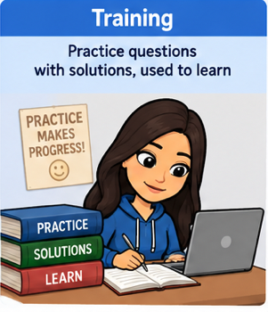
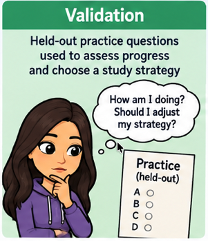
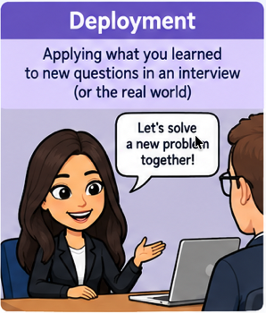
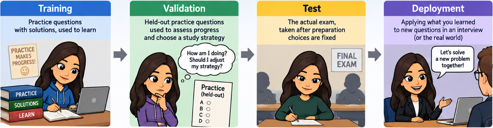
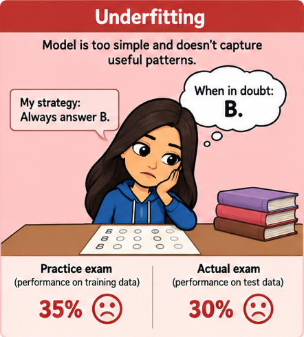
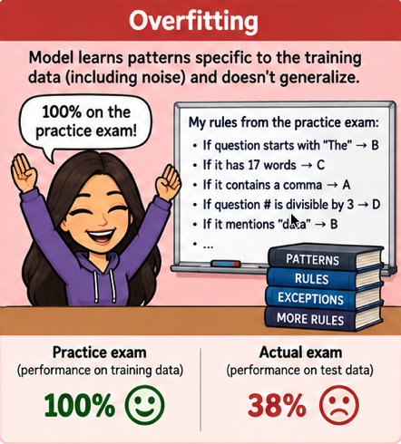
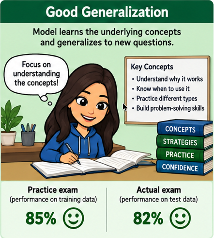
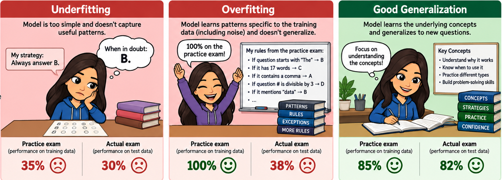
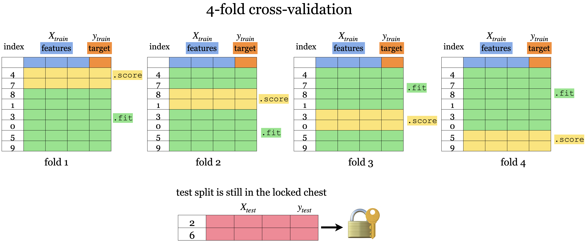

## Focus on the breath!

{.nostretch fig-align="center" width="500px"}

## Announcements

- **Homework 2:** released; due September 21, 11:59 pm
  - You may broadly discuss it with classmates; final answers and submissions must be your own.
  - Group submissions are not allowed for this assignment.
- Practice, and start early on homework assignments.
- iClicker Cloud link: https://join.iclicker.com/GHJB

## iClicker recap: what does a tree learn? {.slide-your-turn}

**Link:** https://join.iclicker.com/GHJB

We create `DecisionTreeClassifier(max_depth=2)`, then call `fit(X, y)`.

**Which statement is correct?**

- **A.** The model learns `max_depth=2` from the data.
- **B.** We set the depth limit; the model learns splits and leaf predictions.
- **C.** We must supply every split before calling `fit`.
- **D.** The fitted tree must have depth exactly 2.

::: {.notes}
Answer: B. Connect to the job-happiness example: X contains job attributes and y contains happiness labels. Split features, thresholds, and leaf predictions are learned parameters; max_depth is a hyperparameter. A limit does not guarantee the tree reaches that depth.
:::

## Recap: fit, predict, score

| Method | What it does |
|---|---|
| **`fit(X, y)`** | Learns from features and known targets |
| **`predict(X)`** | Returns predicted targets |
| **`score(X, y)`** | Evaluates predictions against known targets |

::: {.fragment}
Last lecture, we fitted and scored on **the same examples**.
:::

## A perfect training score? {.slide-your-turn}

A tree gets every training example right.

**Would you trust it to predict happiness for a new person? Why?**

::: {.fragment}
We need evidence about **new examples**.

**Generalization:** how well a model performs on unseen data from the population we want to predict for.
:::

::: {.notes}
Connect directly to Lecture 2's exit ticket. Training performance alone cannot establish generalization. Today's housing example lets us investigate this with more data.
:::

## Today's big questions {.slide-goals}

- How can we estimate performance on **unseen data**?
- How do we choose **model complexity** without overfitting?
- How do we keep our final evaluation **independent of model selection**?

We'll investigate these questions in a **live housing-price demo**.

# [Class demo](https://github.com/UBC-CS/cpsc330-2026W1/blob/main/content/classes/varada/lecture-03-ml-fundamentals-demo.ipynb)

## Why split the data?

A model has already used the training targets to learn.

**Scoring those same examples does not tell us how well it predicts unseen examples.**

Reserve data to evaluate predictions on examples **not used in that fit**.

## Exam analogy {.slide-your-turn}

Imagine your midterm is a few weeks away and you have a set of **practice questions with solutions**.

For this analogy, suppose all questions are multiple choice.

**If you can answer every practice question correctly, are you ready for the exam?**

::: {.notes}
Invite students to distinguish remembering answers from learning how to solve new questions. This is a hypothetical exam format, not an announcement about our midterm.
:::

## Training: learn from practice

:::: {.columns}
::: {.column width="43%"}
{.nostretch fig-align="center" height="400px" fig-alt="Training: practice questions with solutions, used to learn."}

<small>Image created by GPT-6 Astra</small>

:::
::: {.column width="57%"}
Use practice questions **and their solutions** to learn.

- **Features $X$:** information in each question.
- **Targets $y$:** the correct answers.
- **Training:** learn patterns from these examples.
:::
::::

A training score measures performance on questions you have already studied.

::: {.notes}
In the housing demo, features describe each property and the target is its sale price. Training uses both. The analogy illustrates learning from examples; a model need not learn concepts in the same way a person does.
:::

## Validation: choose how to study

:::: {.columns}
::: {.column width="43%"}
{.nostretch fig-align="center" height="440px" fig-alt="Validation: held-out practice questions used to assess progress and choose a study strategy."}

<small>Image created by GPT-6 Astra</small>

:::
::: {.column width="57%"}
Hold out some practice questions from your study material.

Try them to check whether your preparation transfers to **unseen questions**.

Use the results to choose a study strategy.

**In ML:** compare models and choose hyperparameters such as `max_depth`.
:::
::::

::: {.notes}
Validation examples are not used in the fit being evaluated. Their scores do influence model selection. For a fixed split, keep them separate from the fitting subset; they can join the training data for the final refit after choices are fixed.
:::

## Test: the actual exam

:::: {.columns}
::: {.column width="43%"}
{.nostretch fig-align="center" height="440px" fig-alt="Test: the actual exam, taken after preparation choices are fixed."}

<small>Image created by GPT-6 Astra</small>

:::
::: {.column width="57%"}
Take the actual exam **after your preparation choices are fixed**.

**In ML:** evaluate the selected model on the held-out test set.

If you use the exam answers to change how you prepare, it is no longer an independent assessment.
:::
::::

::: {.notes}
A test set estimates performance on the population it represents; it does not establish every real-world ability. In our deliberately naive demo, earlier test comparisons mean the final score is illustrative rather than a pristine independent assessment.
:::

## Deployment: new interview questions

:::: {.columns}
::: {.column width="43%"}
{.nostretch fig-align="center" height="440px" fig-alt="Deployment: apply learning to new questions in an interview."}

<small>Image created by GPT-6 Astra</small>

:::
::: {.column width="57%"}
Now apply what you learned in an interview.

**In ML:** use the fitted model to predict targets for new examples.

- Correct answers may be unavailable or arrive later.
- Interview questions may differ from the exam.
:::
::::

**Would a high exam score guarantee success?**

::: {.notes}
Connect to predicting prices in a different city or future year. Strong test performance does not guarantee performance when deployment data differ substantially from the evaluation data.
:::

## Training, validation, test, and deployment {.slide-summary}

{.nostretch fig-align="center" width="1000px" fig-alt="Practice to learn; held-out practice to choose a strategy; the exam to assess the final choice; interview questions to apply learning."}

<small>Image created by GPT-6 Astra</small>

**Train to learn. Validate to choose. Test to assess. Deploy to predict.**

Validation results influence our choices. **Test results must not.**

## Train, validation, test, and deployment data in `sklearn`

|         | `fit` | `score` | `predict` |
|----------|-------|---------|-----------|
| Train    | ✔️      | ✔️      | ✔️         |
| Validation |      | ✔️      | ✔️         |
| Test    |       | Final evaluation | Final evaluation |
| Deployment    |       |       | ✔️         |

**Keep test results out of modeling choices; the number of method calls is not the issue.**

::: {.notes}
These are roles in the evaluation workflow, not API restrictions. After selection, validation examples can join the fitting data for the final refit. Deployment data can be scored later if reliable targets become available.
:::

## The golden rule {background-color="#fce8e6"}

**Test data must not influence training or model selection.**

Knowing the actual exam answers before studying would undermine the assessment.

- Set it aside before exploring features or choosing models.
- Use training and validation data to develop the model.
- Evaluate on the test set after your choices are fixed.

::: {.notes}
The final-exam analogy: training and validation are practice; the test set is the independent final assessment. The principle is independence, not a literal limit on calls to predict. Preprocessing must also be learned only from the fitting data for each evaluation; we will revisit this with pipelines.
:::

## iClicker 3.1: Data splitting {.slide-your-turn .smaller}

**Link:** https://join.iclicker.com/GHJB

**Select all true statements.**

- **A.** An unrestricted decision tree is likely to score very well on its training data.
- **B.** Held-out data help us assess generalization.
- **C.** Deployment data always come with known targets for scoring.
- **D.** Validation data can be used to choose `max_depth`.
- **E.** Randomly shuffling before splitting is appropriate for every prediction task.

::: {.notes}
Answers: A, B, D. C: deployment targets may be unavailable or arrive later. E: time order and groups can matter; random splitting is not universal. Use this to check the roles of the subsets before fitting anything.
:::

## Back to the demo: split and compare {.slide-your-turn}

- Split the data and fit a fresh decision tree on the training subset.
- Compare training and held-out scores with a dummy baseline.
- Try a stump and a deeper tree. Predict the scores before running.

**Which dataset is influencing our choices?**

::: {.notes}
Work through “Data splitting” and “Does limiting depth help?” in the notebook. The repeated test comparisons deliberately expose a mistake: this set is becoming part of model selection. Name that mistake explicitly before returning to the analogy. The next notebook section introduces validation; it does not undo the earlier test use.
:::

## Underfitting: an overly simple strategy

:::: {.columns}
::: {.column width="43%"}
{.nostretch fig-align="center" height="440px" fig-alt="An always-answer-B strategy gets low practice and actual exam scores."}
:::
::: {.column width="57%"}
“When in doubt, always answer B.”

This rule misses useful patterns **even in the practice questions**.

**In ML:** the model is too simple; training and validation performance are both poor.

**Demo connection:** could a decision stump capture the housing-price relationships?
:::
::::

::: {.notes}
The marks in these illustrations are hypothetical exam percentages, not housing R² scores or diagnostic thresholds. A stump can underfit a complex problem, but depth alone does not establish underfitting; use the observed scores and comparisons.
:::

## Overfitting: memorize the practice details

:::: {.columns}
::: {.column width="43%"}
{.nostretch fig-align="center" height="440px" fig-alt="A student memorizes wording-specific rules, scoring 100 percent on practice but poorly on the actual exam."}
:::
::: {.column width="57%"}
“If the question has 17 words, choose C.”

The rules fit the practice questions, but do not transfer to new ones.

**In ML:** the model fits training-specific details, including noise.

**Demo connection:** a deep tree scores highly on training data but much worse on validation data.
:::
::::

::: {.notes}
A large gap is a warning sign; compare with simpler models to see whether additional complexity is hurting validation performance. The illustration shows the eventual exam outcome; diagnose and tune with validation data during development.
:::

## Good generalization: transfer to new questions

:::: {.columns}
::: {.column width="43%"}
{.nostretch fig-align="center" height="440px" fig-alt="Learning transferable patterns gives strong practice and actual exam performance."}
:::
::: {.column width="57%"}
Learn patterns that help solve **unfamiliar questions**.

You do not need a perfect practice score to do well on the exam.

**In ML:** seek strong performance on representative unseen data.

**Demo connection:** choose depth using validation evidence, not the highest training score.
:::
::::

::: {.notes}
Similar scores alone are not enough: both could be poor. Look for useful held-out performance as well as the training–validation gap. The image is a teaching analogy, not a claim that a tree understands concepts like a person.
:::

## Compare the three patterns {.slide-your-turn}

{.nostretch fig-align="center" width="1000px" fig-alt="Underfitting: poor practice and exam scores. Overfitting: perfect practice but poor exam performance. Good generalization: strong performance on both."}

**Which student needs a richer strategy? Which needs a strategy that transfers?**

::: {.notes}
The percentages are illustrative. Underfitting calls for capturing more useful structure; overfitting calls for avoiding practice-specific details. In ML, use validation results to guide these changes, keeping the test set aside.
:::

## The fundamental tradeoff

:::: {.columns}

::: {.column width="50%"}
{fig-align="center"}
:::

::: {.column width="50%"}
- Too simple: misses useful patterns
- More complexity: both scores may improve
- Too complex: training improves while validation may worsen
- Choose complexity using **validation scores**
:::

::::

## Back to the demo: choose a depth {.slide-your-turn}

Create a **validation subset** from the training data.

- Loop over `max_depth` values.
- Plot training and validation scores.
- Choose a depth using validation performance.

**Would we choose the same depth with a different validation split?**

::: {.notes}
Work through “Single validation set.” Ask students to identify regions of underfitting and overfitting in the actual plot. Creating validation data now improves subsequent choices but does not restore independence to the already-used test set.
:::

## Cross-validation

{.nostretch fig-align="center" width="800px" fig-alt="Cross-validation rotates the held-out validation fold, fitting on the remaining folds."}

**Fit a fresh model for each fold. Keep the final test set aside.**

::: {.notes}
In five-fold CV, each non-test example is used for validation once and for training in four other fits. Average the validation scores to compare a configuration. We do not average the fitted trees into a final model.
:::

## Why cross-validation?

- Depend less on one particular training–validation split.
- Use every non-test example for training and validation, **in different fits**.
- Examine variation across folds alongside the mean score.

**Cost:** more model fits. **Limit:** it does not replace the final test set.

## Back to the demo: compare depths with CV {.slide-your-turn}

Use five-fold CV on **all non-test training data**.

- Compare mean validation scores and their variation across folds.
- Choose a depth and explain your reasoning.

**Does `cross_validate`'s `test_score` mean our final test score?**

::: {.fragment}
No. Here it is the score on each **validation fold**.
:::

::: {.notes}
Work through the cross-validation section. Seventeen candidate depths require 85 fits with five folds. Fold standard deviation describes variability; it is not automatically a confidence interval. Stop before the final refit.
:::

## iClicker 3.2: Complexity and CV {.slide-your-turn .smaller}

**Link:** https://join.iclicker.com/GHJB

**Select all true statements.**

- **A.** $k$-fold CV calls `fit` $k$ times for one hyperparameter configuration.
- **B.** CV makes evaluation less dependent on one validation split.
- **C.** A much higher mean training score than mean validation score can indicate overfitting.
- **D.** Whenever training score increases, validation score must decrease.
- **E.** A decision stump on a complex prediction problem can underfit.

::: {.notes}
Answers: A, B, C, E. A excludes the separate final refit. Use the depth plot to explain why D is false: additional complexity can initially improve both scores.
:::

## Back to the demo: refit and evaluate {.slide-your-turn}

1. Fix the selected depth using CV results.
2. Fit a fresh model on **all non-test training data**.
3. Evaluate it on the test set.

**In this demo, we used test results earlier to compare models. This score is therefore not an independent final assessment.**

::: {.notes}
Complete the final evaluation. The opening full-data EDA was also a deliberate shortcut. A fresh project should reserve test data before EDA and model development. Creating a validation set later does not erase earlier exposure. Feature importances are optional; if they prompt further model changes, return to validation.
:::

## The workflow to take away {.slide-summary}

1. **Split:** reserve test data before exploring or fitting.
2. **Explore:** perform EDA on training data.
3. **Compare:** establish a baseline and select hyperparameters using CV on training data.
4. **Refit:** train the selected configuration on all training data.
5. **Evaluate:** assess it on the untouched test set.

**Keep test results out of model selection.**

::: {.notes}
Here “training data” means all non-test data. Inside CV, fit each model—and any learned preprocessing—on its training folds only. Choose a split appropriate to the prediction task. The notebook's initial shortcuts motivate this workflow; they are not steps to copy into a final evaluation.
:::

## Exit ticket {.slide-your-turn}

A classmate proposes choosing the tree with the **highest training score**.

1. Use today's demo to explain the problem with this proposal.
2. How would you choose a depth instead?
3. Which data would you use for the final fit and evaluation?

::: {.notes}
Allow one to two minutes individually or in pairs. Expected reasoning: training performance rewards complexity without establishing generalization; compare validation or CV scores; refit the selected configuration on all non-test data and evaluate on the untouched test set.
:::

## Recap: Chapter 3 {.slide-summary}

- Why do we split the data? What are train/validation/test splits?
- What are the benefits of cross-validation?
- What are underfitting and overfitting?
- What is the fundamental trade-off in supervised learning?
- What is the golden rule of machine learning?

[Chapter 3: ML fundamentals](https://ubc-cs.github.io/cpsc330-book/book/03_ml-fundamentals.html)

::: {.notes}
Use the demo workflow to answer each question briefly. The notebook's “Looking back” section provides additional reflection prompts for practice after class.
:::
