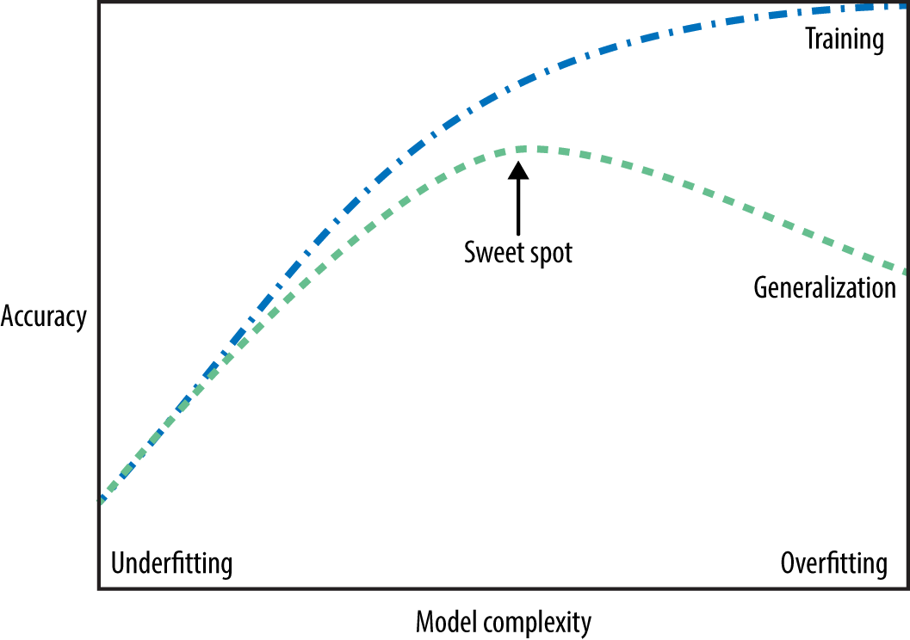
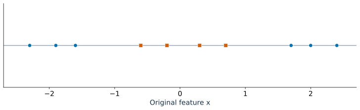
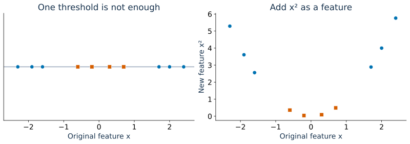
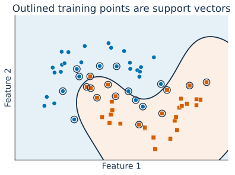
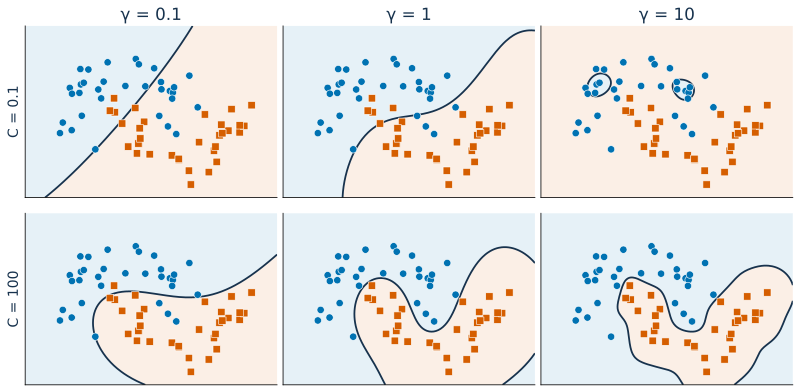

## Focus on the breath!

{.nostretch fig-align="center" width="500px"}

## Announcements 

- HW2 was due yesterday 
- Homework 3 (hw3) has been released (Due: Oct 5th, 11:59 pm)

## Recap: iClicker overfitting 1 {.slide-your-turn .smaller}

**Link:** https://join.iclicker.com/

Which scenarios, by themselves, do NOT provide sufficient evidence that a model is overfitting? Select all that apply.

- (A) Training accuracy is 0.98, while validation accuracy is 0.60.

- (B) A wildlife classifier learns that snow in the background is strongly associated with "wolf" in the training data. On validation images where wolves appear in a variety of backgrounds, its performance drops substantially.

- (C) A classifier has a highly irregular decision boundary, but you are not given its training or validation performance.

- (D) Training and validation accuracies are both approximately 0.88.

- (E) A cancer-detection model learns that a ruler in the corner of an image is associated with positive cases. This association was present in the training data but not in validation data, where performance drops substantially.

## Recap: iClicker overfitting 2 {.slide-your-turn}

**Link:** https://join.iclicker.com/GHJB

Which of the following statements about **overfitting** is true? 

- (A) Overfitting makes the model more accurate on both training and unseen data.
- (B) Overfitting means the model captures noise or irrelevant details from the training data.
- (C) Overfitting is desirable because it reduces both training and test error.
- (D) Overfitting can be identified by looking at training performance alone.

## Recap: iClicker underfitting {.slide-your-turn}

**Link:** https://join.iclicker.com/GHJB

How might one address the issue of **underfitting** in a machine learning model. 

- (A) Introduce more noise to the training data. 
- (B) Remove features that might be relevant to the prediction. 
- (C) Increase the model's complexity (e.g., more parameters, useful features, or deeper trees)
- (D) Use a smaller dataset for training. 

## The fundamental tradeoff {.smaller}

:::: {.columns}

::: {.column width="60%"}
{fig-align="center"}
:::

::: {.column width="40%"}
- As you increase the model complexity, training score tends to go up and the gap between train and validation scores tends to go up.  
- How to pick a model?
    - Compare validation scores using cross-validation on the training data.
    - Don't choose based on training score alone.
:::
::::

## Today's big questions {.slide-goals}

- How do **$k$-NN and RBF SVMs** use similarity to make predictions?
- How do **$k$, $C$, and $\gamma$** affect model complexity and generalization?
- Why do **feature scales and the number of features** matter for similarity-based models?

We'll explore these questions through **visual examples and prediction activities**.

## Similarity-based algorithms 
- Use similarity or distance metrics to predict targets.
- Examples: $k$-nearest neighbors, Support Vector Machines (SVMs) with RBF Kernel.

## $k$-nearest neighbours intuition 
Predict the query point's class using a majority vote of its $k$ nearest neighbours.

```{=html}
<iframe src="demos/knn.html" title="Interactive k-nearest neighbours classification demo" style="width:100%;height:490px;border:0;" loading="eager"></iframe>
```

## $k$-nearest neighbours
- Classifies an object based on the majority label among its $k$ closest neighbors. 
- Main hyperparameter: $k$ or `n_neighbors` in `sklearn`
- Distance Metrics: Euclidean
- Strengths: simple and intuitive, can learn complex decision boundaries
- Challenges: Sensitive to the choice of distance metric and **scaling** (coming up).

## iClicker 4.1 {.slide-your-turn .smaller}

**Link:** https://join.iclicker.com/GHJB

**Select all of the following statements which are TRUE.**

- (A) Analogy-based models find examples from the test set that are most similar to the query example we are predicting.
- (B) Euclidean distance will always have a non-negative value.
- (C) With $k$-NN, setting the hyperparameter $k$ to larger values typically reduces training error. 
- (D) Similar to decision trees, $k$-NNs finds a small set of good features.
- (E) In standard ($k$)-NN classification with uniform weighting and $k>1$, the closest neighbour always contributes more to the prediction than the other $k-1$ neighbours.

## Curse of dimensionality

- As dimensionality increases, the space gets much bigger and **data points become more spread out**.
- Distances become less informative:
  - Even the nearest neighbours may be far away.
  - Points start to look similarly distant.
- This makes it harder to generalize from limited data.
- How to deal with this?
  - Dimensionality reduction (e.g., PCA)
  - Feature selection

# RBF SVM intuition 

## Can a decision stump classify these points perfectly?

{.nostretch fig-align="center" height="300" fig-alt="Orange points near zero lie between two groups of Blue points on the x axis."}

A decision stump makes **one split**. Where would you split on $x$?

::: {.fragment}
**No single threshold works:** the Orange points lie between two Blue groups.
:::

::: {.notes}
Ask students to propose thresholds before revealing the answer. A deeper tree could classify these points perfectly using two splits. The question is specifically about a decision stump.
:::

## What if we add $x^2$ as a feature?

{.nostretch fig-align="center" height="350" fig-alt="The original points beside their representation using x and x squared. Orange points have small x squared values; Blue points have large values."}

Can a **decision stump** classify these points perfectly now?

::: {.fragment}
**Yes!** Split on $x^2 \leq 1.5$: **Orange** below the threshold, **Blue** above it.
:::

::: {.notes}
Ask students which feature and threshold they would choose. One split on x² corresponds to two cutoffs on x, at ±sqrt(1.5). Adding a feature makes this example easier to classify; it does not guarantee perfect separation for every dataset.
:::

## From new features to kernels

**Changing the representation can make classification easier.**

- A tree needed two splits on $x$, but only **one split on $x^2$**.
- A **support vector machine (SVM)** also learns a decision boundary.
- **Kernels** let SVMs use a new representation without explicitly building all its features.

::: {.notes}
More precisely, a tree needed two splits on x; a stump could not solve the original problem. The stump illustrates why new features help. SVM learns a different kind of boundary; it is not a transformed decision tree. RBF uses a different mapping from the x² example.
:::

## Kernels: use the new space without building it {visibility="hidden"}

**Original points** $x, z$ $\quad\longrightarrow\quad$ **transformed features** $\phi(x), \phi(z)$

- SVM can work with **dot products between transformed points**.
- A **kernel** computes those dot products directly from the original points:

$$K(x,z) = \phi(x)^\top\phi(z)$$

::: {.fragment}
We get the effect of the new representation **without constructing all its features**.
:::

::: {.notes}
The x² example motivates changing the representation. RBF uses a different, implicit feature mapping; it is not simply squaring the inputs. The kernel supplies comparisons; SVM still has to learn a decision boundary.
:::

## RBF kernel: distance into similarity

The **radial basis function (RBF)** kernel gives nearby points higher similarity.

$$ K(x,z) = \exp\!\left(-\gamma\|x-z\|^2\right) $$

| Same point | Nearby points | Far-apart points |
|:---:|:---:|:---:|
| Similarity **1** | Higher similarity | Similarity approaches **0** |

- $\|x-z\|$ is the Euclidean distance.
- $\gamma > 0$ controls **how quickly similarity falls with distance**.

## Intuition for `gamma` {.smaller}

$$ K(x,z) = \exp\!\left(-\gamma\|x-z\|^2\right) $$

| Distance $r$ | $\gamma = 0.1$ | $\gamma = 1$ | $\gamma = 10$ |
| --- | --- | --- | --- |
| 0 | 1 | 1 | 1 |
| 0.5 | 0.975 | 0.779 | 0.0821 |
| 1 | 0.905 | 0.368 | 0.0000454 |
| 2 | 0.670 | 0.0183 | $4.25\times 10^{-18}$ |

$\gamma > 0$ controls **how quickly similarity falls with distance**.

::: {.fragment}
With $\gamma=0.1$, similarity is about **0.9**; with $\gamma=10$, it is almost **zero**.
:::

## Training identifies the support vectors

:::: {.columns}
::: {.column width="50%"}

{.nostretch fig-align="center" height="350" fig-alt="A fitted RBF SVM has a curved boundary. Support vectors are outlined among the blue and orange training points."}
:::
::: {.column width="50%"}
- Training learns **which points contribute** to the decision function and **their weights**.
- These are the **support vectors**; they can be a large fraction of the training set.
:::
::::
::: {.notes}
The outlines come from a fitted SVC, not hand-picked points. Support vectors can include misclassified points. Avoid describing them exclusively as the nearest points to the visible boundary in the original space.
:::

## How does an RBF SVM predict? {.smaller}

For a new query point:

1. Compute its **RBF similarity to each support vector**.
2. Multiply each similarity by its **learned weight and class sign**.
3. Add these contributions and a **bias**; use the score's sign to choose the class.

**SVM learns how to combine similarities during training.**

## (Optional) From similarities to a score {.smaller}

For binary classification, encode **Blue as $-1$** and **Orange as $+1$**:

$$ f(x_\text{new}) = \sum_{i\in\text{SV}} \underbrace{\alpha_i}_{\text{learned weight}}\;\underbrace{y_i}_{\text{class sign}}\;\underbrace{K(x_i,x_\text{new})}_{\text{similarity}} + b $$

- $x_i$: a support vector; $\alpha_i > 0$: its learned weight; $b$: learned bias.
- **Positive score:** Orange. **Negative score:** Blue. Zero is the decision boundary.

::: {.fragment}
For example: $\underbrace{1.2(0.8)}_{\text{Orange}}-\underbrace{0.7(0.5)}_{\text{Blue}}-\underbrace{0.1}_{\text{bias}}=0.51$ $\quad\Rightarrow\quad$ **Orange**
:::

::: {.notes}
This arithmetic is an illustrative two-contribution example, not the fitted model in the preceding plot. Unlike kNN majority voting, similarity alone does not determine how strongly a support vector contributes.
:::

## Two controls: `gamma` and `C` {.smaller}

| Hyperparameter | What does it control? | Increasing it… |
| --- | --- | --- |
| $\gamma$ | How local similarity is | Makes each point's influence more local |
| $C$ | How strongly training errors are penalized | Pushes harder to fit the training data |

- Larger $\gamma$ or $C$ can produce a more intricate boundary and increase overfitting risk.
- Smaller values can underfit. **Neither direction guarantees better validation performance.**

## See how `gamma` and `C` interact

{.nostretch fig-align="center" height="410" fig-alt="Six fitted RBF SVM boundaries on the same dataset. Columns increase gamma from 0.1 to 10; rows increase C from 0.1 to 100."}

Compare **across a row**, then **down a column**. Choose both using **cross-validation**.

## KNNs vs RBF SVM 

| $k$-NN (uniform weights) | SVM with RBF |
| --- | --- |
| Find the query's nearest $k$ training points | Compare the query with the learned support vectors |
| Each neighbour gets one vote | Each similarity gets a learned, signed weight |
| Neighbours change with the query | Support vectors stay fixed; similarities change |


## More comments on RBF SVM

- A useful candidate when classes need a **nonlinear decision boundary**.
- Requires choosing both **$C$ and $\gamma$** using validation data.
- Distances depend on feature scales: **preprocessing matters** (coming up).
- Training can be expensive with many examples.


## iClicker 4.2 {.slide-your-turn}

**Select all of the following statements which are TRUE.**

- (A) In `sklearn`'s RBF `SVC`, increasing `gamma` typically increases the training score, but it does not necessarily increase the validation score.
- (B) If we increase `gamma` but decrease `C`, we can't be certain whether the model becomes more or less complex.

# [Class demo](https://github.com/UBC-CS/cpsc330-2026W1/blob/main/content/classes/varada/lecture-4-demo.ipynb)

# Models
## Supervised models we have seen 

- Decision trees: Split data into subsets based on feature values to create decision rules 
- $k$-NNs: Classify based on the majority vote from $k$ nearest neighbors
- SVM RBFs: Create a boundary using an RBF kernel to separate classes

## Comparison of models (activity)
| **Model**        | Parameters and hyperparameters | **Strengths**  | **Weaknesses**     |
|------------------|--------------------------------|---------------------------|---------------------------|
| **Decision Trees**               |  |  |  |
| **KNNs**              |  |  |  |
| **SVM RBF**            |  |  |  |


## Our workflow so far

Split $\to$ Explore $\to$ **Compare** $\to$ Refit $\to$ Evaluate

- **Compare model types and hyperparameters** using cross-validation on training data.
- Keep the test set untouched until the final evaluation.

## Preprocessing motivation: example 

You’re trying to find a suitable date based on:

- Age (closer to yours is better).
- Number of Facebook Friends (closer to your social circle is ideal).

## Preprocessing motivation: example {.smaller}

- You are 30 years old and have 250 Facebook friends.

| Person | Age | #FB Friends | Euclidean Distance Calculation  | Distance    |
|--------|-----|-------------|---------------------------------|-------------|
| A      | 25  | 400         | $\sqrt{5^2 + 150^2}$            | 150.08      |
| B      | 27  | 300         |  $\sqrt{3^2 + 50^2}$            | 50.09       |
| C      | 30  | 500         |  $\sqrt{0^2 + 250^2}$           | 250.00      |
| D      | 60  | 250         |  $\sqrt{30^2 + 0^2}$            | 30.00       |

Based on the distances, the two nearest neighbors (2-NN) are:

- **Person D** (Distance: 30.00)
- **Person B** (Distance: 50.09)

What's the problem here? 
