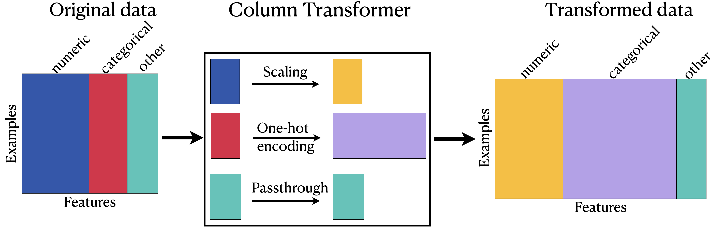

```{python}
#| include: false
import sys
import matplotlib.pyplot as plt
sys.path.append("code")
from plotting_functions import plot_improper_processing, plot_proper_processing
```

## Focus on the breath!

{.nostretch fig-align="center" width="500px"}

## Announcements

- [Lecture slides](https://kvarada.github.io/cpsc330-slides/lecture.html)
- HW3 is due Monday, Oct 5th, 11:59 pm.
  - If you haven't started yet, start now.
  - You can work in pairs for this assignment.

## Today's big questions {.slide-goals}

- Which **preprocessing mistakes** make our evaluation unreliable?
- How do we apply **different transformations to different columns**?
- How can we represent **text as numerical features**?

::: {.notes}
Last lecture, we handled missing values, scales, and categories separately. Today we'll first check that we know which rows each transformation may learn from. Then we'll combine the feature groups from our restaurant survey and introduce a representation for the comments column.
:::

## Mistake 1: fitting train and test separately {.slide-your-turn}

**What's wrong here?** Assume we have already split the data.

```python
train_scaler = StandardScaler()
train_scaled = train_scaler.fit_transform(X_train)

test_scaler = StandardScaler()
test_scaled = test_scaler.fit_transform(X_test)
```
::: {.notes}
The two sets use **different means and scales**. We also learn from test data.

Use `train_scaler.transform(X_test)` instead.

Each fit learns a coordinate system. A zero in the training representation means the training mean; a zero in the test representation means the test mean. These need not describe the same original value. Reuse the fitted training scaler, without fitting on the test set.
:::

## Same age, different coordinates {.slide-your-turn}

Suppose **age is our only feature**:

| Fit the scaler on… | Ages | Mean | Standard deviation |
|---|---|---:|---:|
| Training set | 20, 40 | 30 | 10 |
| Test set | 40, 60 | 50 | 10 |

For a **40-year-old**:

- Training scaler: $(40 - 30) / 10 = +1$
- Separate test scaler: $(40 - 50) / 10 = -1$

**Should the same age have different coordinates in training and test?** ❌


::: {.notes}
Both calculations use z = (age - mean) / standard deviation. These are the population standard deviations used by StandardScaler. The age is identical, but separate fits assign it different coordinates. Reusing the training scaler maps every 40-year-old to +1, including unseen respondents.
:::

## Why this changes the neighbours {.smaller}

**A test point's location relative to the training points determines its neighbours.**

Use the **same fitted transformation** for training and unseen rows.

::: {.notes}
The training points stay fixed at −1 and +1. With the training scaler, the test respondent lands exactly on the training respondent of the same age. With the separately fitted test scaler, they land on the 20-year-old instead. For 1-NN, this changes whose label is used; if those training labels differ, the prediction changes. The problem is not simply that scaling moves points: it is that separate fits make training and test coordinates inconsistent.
:::

## Mistake 2: fitting on train and test together {.slide-your-turn}

**What's wrong here?**

```python
X_all = np.vstack([X_train, X_test])
scaler = StandardScaler().fit(X_all)

train_scaled = scaler.transform(X_train)
test_scaled = scaler.transform(X_test)
```

::: {.notes}
The test rows influence the **learned means and scales**.

Fit only on the available training rows.

Using one coordinate system fixes the first mistake, but fitting on the combined data creates leakage. We don't need to use test labels to leak information.
:::

## Mistake 3: fitting before cross-validation {.slide-your-turn}

**The test set is untouched. Is this evaluation valid?**

```python
scaler = StandardScaler()
X_train_scaled = scaler.fit_transform(X_train)

cross_val_score(
    KNeighborsClassifier(), X_train_scaled, y_train
)
```

::: {.notes}
Each future validation fold has already influenced the scaler.

Preprocessing must be **fitted again inside each CV fold**.
:::

## Where the leakage happens {.model-plot}

```{python}
plot_improper_processing("kNN")
plt.show()
```

**The scaler's fit includes the validation fold.** ❌

## Which rows may each step learn from? {.model-plot}

```{python}
plot_proper_processing("kNN")
plt.show()
```

**Within each fold, preprocessing and the model fit on the same training rows.** ✅

## The repair: cross-validate the whole pipeline {background-color="#fce8e6"}

```python
from sklearn.pipeline import make_pipeline
from sklearn.neighbors import KNeighborsClassifier
from sklearn.model_selection import cross_val_score

pipe = make_pipeline(StandardScaler(), KNeighborsClassifier())
cross_val_score(pipe, X_train, y_train)
```

- Pass **raw features** and the **whole pipeline** to CV.
- Each fold fits its own preprocessing and classifier.
- Validation rows receive **transform**, then **predict**.

::: {.notes}
The golden rule applies to every fit call. A pipeline keeps the steps together so cross-validation can refit them using only the training portion of each fold. After model selection, refit the chosen pipeline on all training rows and evaluate once on the reserved test set.
:::

## (Optional) Alternative transformations {.smaller}

| Method | Transformation |
|---|---|
| `StandardScaler` | Centre each feature and scale by its training standard deviation |
| `MinMaxScaler` | Map each feature's training range to a chosen interval |
| `Normalizer` | Scale each row to unit norm |
| Log transform | Compress large positive values; can help with skewed counts |

**Choose based on the feature and model, then evaluate.**

::: {.notes}
StandardScaler does not require normally distributed features. MinMaxScaler uses observed training extrema, not known physical limits, so unseen values may lie outside the chosen interval. Normalizer operates on rows, unlike the two column scalers. A log transform needs suitable inputs; log1p can accommodate zero for nonnegative counts.
:::

## Different columns need different transformations

| Feature group | Columns | Preprocessing |
|---|---|---|
| Numeric | `age`, `n_people`, `price` | Impute $\to$ scale |
| Unordered categories | `food_type`, `north_america` | Impute $\to$ one-hot encode |
| Ordered category | `noise_level` | Impute $\to$ ordinal encode |

**How do we combine these into one feature matrix?**

## `ColumnTransformer` combines feature groups

{.nostretch fig-align="center"}

**Different columns $\to$ their own transformations $\to$ one feature matrix.**

::: {.notes}
A pipeline connects steps in sequence. A column transformer sends selected columns through different branches and concatenates the resulting features. A branch may itself be a pipeline, such as imputation followed by scaling. The combined matrix goes to one shared classifier.
:::

## Build the numeric and categorical branches

```python
from sklearn.impute import SimpleImputer
from sklearn.preprocessing import StandardScaler, OneHotEncoder

numeric_pipe = make_pipeline(
    SimpleImputer(strategy="median"),
    StandardScaler(),
)

categorical_pipe = make_pipeline(
    SimpleImputer(strategy="most_frequent"),
    OneHotEncoder(handle_unknown="ignore"),
)
```

Each branch is a **sequence of transformations** for one feature group.

## Build the ordinal branch

```python
from sklearn.preprocessing import OrdinalEncoder

noise_order = ["no music", "low", "medium", "high", "crazy loud"]

ordinal_pipe = make_pipeline(
    SimpleImputer(strategy="most_frequent"),
    OrdinalEncoder(categories=[noise_order]),
)
```

We **supply the meaningful order** of noise levels.

::: {.notes}
This is the same order used in Lecture 5. Imputation learns the most frequent training value. We supply the category order rather than asking the encoder to infer it. The integer codes still impose equal spacing for a distance-based model; that is a modelling choice.
:::

## `ColumnTransformer` syntax

```python
from sklearn.compose import ColumnTransformer

preprocessor = ColumnTransformer([
    ("num", numeric_pipe, ["age", "n_people", "price"]),
    ("cat", categorical_pipe, ["food_type", "north_america"]),
    ("ord", ordinal_pipe, ["noise_level"]),
], remainder="drop")
```

Each tuple contains **(name, transformer, columns)**.

- **Name:** a label for the branch.
- **Transformer:** one transformer or a preprocessing pipeline.
- **Columns:** the input columns for that branch.

::: {.notes}
Read one tuple at a time. The num branch takes only age, n_people, and price, and sends them through numeric_pipe. The cat and ord branches work on their own selected columns. The transformer list determines the order of the output blocks.

[ColumnTransformer documentation](https://scikit-learn.org/stable/modules/generated/sklearn.compose.ColumnTransformer.html)
:::

## The shortcut: `make_column_transformer`

```python
from sklearn.compose import make_column_transformer

preprocessor = make_column_transformer(
    (numeric_pipe, ["age", "n_people", "price"]),
    (categorical_pipe, ["food_type", "north_america"]),
    (ordinal_pipe, ["noise_level"]),
    remainder="drop",
)
```

Each tuple contains **(transformer, columns)**; names are generated for you.

**We'll primarily use this constructor.**

## What comes out of a column transformer? {.smaller}

- **Same rows:** each output row corresponds to the same input respondent.
- **Output order:** numeric block, categorical block, then ordinal block in our example.
- **Feature count:** may change; one-hot encoding can add columns.
- **Unlisted columns:** dropped by default (`remainder="drop"`).
- **Output format:** may be dense or sparse, depending on the transformations and sparsity.

After fitting, inspect the output names with:

```python
preprocessor.get_feature_names_out()
```

::: {.notes}
Don't infer output column positions from the original DataFrame. Use the fitted transformer's feature names. With remainder="passthrough", unlisted columns are appended, so ensure they are suitable model inputs and never include the target. Our example deliberately drops all unlisted columns.

[ColumnTransformer documentation](https://scikit-learn.org/stable/modules/generated/sklearn.compose.ColumnTransformer.html)
:::

## Put preprocessing inside the prediction pipeline

```python
pipe = make_pipeline(
    preprocessor, # column transformer object
    KNeighborsClassifier(),
)

scores = cross_val_score(pipe, X_train, y_train, cv=5)
```

**Raw survey columns $\to$ column transformer $\to$ KNN $\to$ predictions**

Cross-validation fits **every branch and the classifier** within each fold.

::: {.notes}
Here X_train is a DataFrame containing the original survey columns, and y_train contains the like/dislike labels. We do not fit the preprocessor before passing the pipeline to cross-validation. ColumnTransformer prepares features; the final classifier makes predictions.
:::


## Class demo: combine the survey features

[Open the preprocessing demo](https://github.com/UBC-CS/cpsc330-2026W1/blob/main/content/classes/varada/lecture-05-06-preprocessing-demo.ipynb)

**Task:** infer a respondent's `like` / `dislike` label from their completed survey.

As we build the column transformer:

1. Trace which columns enter each branch.
2. Inspect the transformed feature names and shape.
3. Cross-validate the complete prediction pipeline.

::: {.notes}
Resume where Lecture 5 stopped: combining numeric, categorical, and ordinal feature groups. The task is inference from a completed survey, not a prediction of enjoyment before the visit. Keep the final test set reserved while comparing pipelines.
:::

## Ordinal or one-hot? {.slide-your-turn}

Weather categories: **sunny, cloudy, rainy, snowy**.

Would you impose an order when predicting:

- Traffic volume?
- Severity of weather-related road incidents?

::: {.fragment}
Use an ordinal encoding only if you can justify the order for the feature.

A meaningful order does not automatically make ordinal encoding the right choice. Choose the encoding in the context of the prediction task.
:::

::: {.notes}
The original example suggested a least-to-most-severe order. That requires care: severity depends on location, intensity, road conditions, and other factors. One-hot encoding avoids imposing an unsupported order. Even with a defensible order, integer spacing is a separate modelling assumption.
:::

## Unseen categories {.smaller}

Suppose `food_type` contains only **Chinese** and **Italian** during training. 

With `OneHotEncoder(handle_unknown="ignore")`:

| New respondent's `food_type` | `food_type_Chinese` | `food_type_Italian` |
|---|---:|---:|
| Chinese | 1 | 0 |
| Italian | 0 | 1 |
| Ethiopian (unseen) | 0 | 0 |
| Peruvian (unseen) | 0 | 0 |

**Prediction can proceed, but this feature cannot distinguish Ethiopian from Peruvian.**

Is this the behaviour you want for your prediction task?

::: {.notes}
The encoder learns two categories during fit, so transform keeps those same two columns. It does not add a column for a new cuisine. Both unseen cuisines become all zeros for the food_type indicators; the model has not learned what either cuisine means. Other features may still distinguish the respondents. This example uses the default drop=None, so both known categories retain their own columns.

Whether this is acceptable depends on the application and the frequency and importance of unknown categories. Monitor them and revisit the representation when needed.
:::

## Binary and high-cardinality features

**Binary features:** `drop="if_binary"` keeps one of the two one-hot columns.

**Features with many categories:** possible choices include:

- Group rare categories into an “other” category.
- Combine categories using domain knowledge.
- Retain frequent categories and group the rest.

Learn frequency-based grouping rules **inside each CV fold**.

::: {.notes}
Dropping a binary indicator reduces redundancy, but is not required for every model. For many-category features, grouping trades detail for a smaller representation. Dimensionality reduction or clustering are further options, but are beyond today's scope. Any learned preprocessing must remain inside the evaluation pipeline.
:::

## iClicker: Exercise 6.1 {.slide-your-turn}

**Select all statements that are TRUE.**

(A) A column transformer alone provides class predictions.

(B) Output feature blocks follow the order of the transformer list.

(C) The number of output features must differ from the number of input features.

(D) A column transformer can be a step in a prediction pipeline.

::: {.notes}
A is false: ColumnTransformer has no predict method. C is false: scaling selected numeric columns, for example, can preserve the feature count. Ask students how one-hot encoding differs from scaling in this respect.
**B and D.** It transforms features; the classifier predicts. Feature count may change or stay the same.
:::

## Text is another feature type

Suppose our restaurant survey includes these comments:

- “good food”
- “good good service”
- “slow service”

**How could we turn each review into a row of numbers?**

::: {.notes}
These are small illustrative reviews, not a sample on which to evaluate a classifier. Treating each whole review as a category would fail to share information between reviews that contain the same words. We want a representation that can reuse those words.
:::

## Bag of words: count the vocabulary

**Vocabulary:** food, good, service, slow

| Review | food | good | service | slow |
|---|---:|---:|---:|---:|
| good food | 1 | 1 | 0 | 0 |
| good good service | 0 | 2 | 1 | 0 |
| slow service | 0 | 0 | 1 | 1 |

- One **row per document**; one **column per vocabulary term**.
- Each entry counts occurrences of that term.

::: {.notes}
A document can be a review, an email, or another piece of text. Here our terms are individual words. The second row counts good twice; this is a count representation, not just presence or absence.
:::

## `CountVectorizer`: learn and apply the vocabulary

```python
from sklearn.feature_extraction.text import CountVectorizer

reviews = ["good food", "good good service", "slow service"]
vectorizer = CountVectorizer()
X_counts = vectorizer.fit_transform(reviews)

vectorizer.get_feature_names_out()
# array(['food', 'good', 'service', 'slow'], ...)
```

- **`fit`:** learn the vocabulary from training documents.
- **`transform`:** count those terms in each document.
- The count matrix is **sparse**: store nonzero entries efficiently.

::: {.notes}
The default word analyzer lowercases text and tokenizes it; its default token pattern excludes single-character tokens. Keep the explanation focused on vocabulary learning and counting. X_counts.toarray() is useful for inspecting this tiny example, but avoid densifying a large text matrix.

[CountVectorizer documentation](https://scikit-learn.org/stable/modules/generated/sklearn.feature_extraction.text.CountVectorizer.html)
:::

## Your turn: an unseen review {.slide-your-turn}

Training vocabulary: **food, good, service, slow**

New review: **“good excellent food”**

What vector do we get? Does `excellent` create a new column?

::: {.fragment}
**[1, 1, 0, 0]**

`excellent` is outside the fitted vocabulary, so it is ignored.

**Transform only:** keep the learned columns fixed for unseen reviews.
:::

::: {.notes}
There is no error for an unseen word. If every token is unknown, the review becomes an all-zero vector. Do not refit the vectorizer on validation or test reviews: the classifier expects the training vocabulary and column order.
:::

## What does bag of words lose?

“the food was good, not bad”

“the food was bad, not good”

These have **the same unigram counts**, but different meanings.

- Word order is lost.
- Counts alone do not capture context or meaning.
- **Bigrams** can retain adjacent pairs such as `not bad` and `not good`.

::: {.notes}
Unigrams are individual tokens. Bigrams are adjacent pairs. Adding bigrams preserves some local order, but does not solve language understanding. The two reviews above make exactly the same unigram vector.
:::

## Choosing the text representation {.smaller}

| Parameter | What it controls |
|---|---|
| `max_features` | Keep at most this many terms, ranked by corpus frequency |
| `min_df`, `max_df` | Exclude terms based on how many documents contain them |
| `ngram_range=(1, 2)` | Include single words and adjacent word pairs |
| `stop_words` | Remove specified common words |

**These are modelling choices to compare using cross-validation.**

Removing words can remove meaning: consider **“not good”**.

::: {.notes}
Document frequency counts documents containing a term, not the total occurrences of that term. min_df and max_df accept integer document counts or proportions. More features do not guarantee better training or validation scores. Stop-word removal is not automatically helpful; negation can be important in reviews.

[CountVectorizer documentation](https://scikit-learn.org/stable/modules/generated/sklearn.feature_extraction.text.CountVectorizer.html)
:::

## A pipeline for text classification

```python
from sklearn.svm import SVC

text_pipe = make_pipeline(CountVectorizer(), SVC())

# Training review strings and their corresponding labels
cross_val_score(text_pipe, reviews_train, y_train, cv=5)
```

**Each fold learns its vocabulary from its training reviews only.**

Validation reviews are counted using that vocabulary, then classified.

::: {.notes}
reviews_train is a one-dimensional collection of review strings from the training split, and y_train contains their labels. The three tiny illustrative reviews are not the dataset for this cross-validation example. The vocabulary is preprocessing, just like learned scales or categories.
:::

## Combine text with the other columns

```python
# First replace missing comments with empty strings.
X_train = X_train.assign(comments=X_train["comments"].fillna(""))

preprocessor_with_text = make_column_transformer(
    (numeric_pipe, ["age", "n_people", "price"]),
    (categorical_pipe, ["food_type", "north_america"]),
    (ordinal_pipe, ["noise_level"]),
    (CountVectorizer(), "comments"),
)
pipe = make_pipeline(preprocessor_with_text, SVC())
```

Use **`"comments"`**, not `["comments"]`: the vectorizer expects a **1D sequence of strings**.

::: {.notes}
This connects our two new ideas. The text branch joins the numeric, categorical, and ordinal branches; one classifier receives the combined features. Filling missing comments with a fixed empty string learns no statistics. Apply the same fillna rule to unseen rows before using this pipeline. Empty reviews contribute zeros, provided the training corpus has other usable terms. Fit the vocabulary only inside the pipeline during CV.

[ColumnTransformer documentation: selecting a text column](https://scikit-learn.org/stable/modules/generated/sklearn.compose.ColumnTransformer.html)
:::

## iClicker: Exercise 6.2 {.slide-your-turn .smaller}

**Select all statements that are TRUE.**

(A) An unseen word causes `CountVectorizer.transform` to fail.

(B) Repeated words can produce counts greater than one.

(C) When cross-validating a pipeline containing CountVectorizer, as shown below, each fold may learn a different vocabulary size.

```python
pipe = make_pipeline(CountVectorizer(), SVC())
cross_val_score(pipe, reviews_train, y_train, cv=5)
```

(D) Increasing `max_features` guarantees a higher validation score.

::: {.notes}
Within a fold, training and validation representations must have matching columns. Across folds, different vocabularies and feature counts are fine because each fold trains its own classifier.
:::

## More preprocessing choices

There is no universal preprocessing recipe.

- Use exploratory analysis and domain knowledge to choose representations.
- Compare choices using cross-validation.
- Keep the test set reserved until those choices are settled.

## Summary {.slide-summary}

- **Preprocessing mistakes:** keep validation and test rows out of every `fit`, including vocabulary learning.
- **Different columns:** use `ColumnTransformer` to combine feature groups inside a prediction pipeline.
- **Text features:** bag of words represents documents using vocabulary counts; it loses word order.

**Cross-validate the complete procedure on raw training features.**

## Exit question {.slide-your-turn}

```python
train_vec = CountVectorizer(max_features=1000)
valid_vec = CountVectorizer(max_features=1000)

X_train = train_vec.fit_transform(reviews_train)
X_valid = valid_vec.fit_transform(reviews_valid)

model = SVC()
model.fit(X_train, y_train)
model.score(X_valid, y_valid)
```

Both matrices have **1,000 columns**, and the code runs without errors.

**Can we trust the score? What would you check or change?**

**If we remove `max_features=1000`, could `model.score` raise an error? Why?**

::: {.notes}
Matching shapes do not guarantee matching feature meanings. Each vectorizer learns its own vocabulary: column 0 might count "amazing" in training but "awful" in validation. The classifier interprets each validation column using the meaning it learned during training, so the code can run while the score is not a valid evaluation of the intended pipeline.

Compare get_feature_names_out() for the two vectorizers, including the order. max_features=1000 is an upper bound, not a shared vocabulary; the question stipulates that both happen to produce 1,000 columns. With different vocabulary sizes, prediction would normally fail because the feature counts differ. Even when the sizes match, the vocabularies may differ.

For the follow-up: yes. Without the cap, the independently learned vocabularies may have different sizes. For example, training could produce 1,500 columns and validation 900. Then model.score raises a ValueError because SVC expects the 1,500 features it was fitted on. The error is not inevitable: equal vocabulary sizes can still hide different column meanings. Even with max_features=1000, fewer than 1,000 usable terms in one split can cause a dimension mismatch; the cap does not guarantee equal sizes.

Fit one vectorizer on training reviews and use that same fitted object's transform on validation and test reviews. Unknown words are ignored; they do not create new columns. For cross-validation, put CountVectorizer and the classifier in one pipeline so each fold learns its vocabulary only from its training portion. Connect this to fitting separate scalers: matching dimensions do not ensure a consistent representation.
:::
