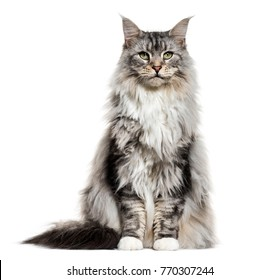

```{python}
import os
import sys

import matplotlib.pyplot as plt
import numpy as np
import pandas as pd

sys.path.append(os.path.join(os.path.abspath("."), "code"))
from plotting_functions import *
from utils import *
from sklearn.compose import ColumnTransformer, make_column_transformer
from sklearn.impute import SimpleImputer
from sklearn.model_selection import cross_val_score, cross_validate, train_test_split
from sklearn.neighbors import KNeighborsClassifier
from sklearn.pipeline import Pipeline, make_pipeline
from sklearn.preprocessing import OneHotEncoder, OrdinalEncoder, StandardScaler
from sklearn.svm import SVC
from sklearn.datasets import make_blobs, make_classification
```

## Focus on the breath!

{.nostretch fig-align="center" width="500px"}

::: {.notes}
Before we begin, take a moment to settle in. Put your feet on the floor, relax your shoulders, and take a slow breath in and out. [Pause.] Let's bring our attention to today's class.
:::

## Announcements 

- Important information about midterm 1
- Where to find slides? 
  - https://kvarada.github.io/cpsc330-slides/lecture.html
- HW3 is due on Monday, Oct 5th, 11:59 pm.

::: {.notes}
Before we start, let's review the midterm information. [Share the confirmed logistics and invite questions.] You can find the lecture slides at the link shown here. HW3 is due Monday, October 5, at 11:59 pm. Please give yourself time to work through the questions and ask for help.
:::

## Today's big questions {.slide-goals}

1. How do linear models turn features into predictions and probabilities?
2. How do loss functions and regularization guide what a model learns?
3. What can coefficients and prediction probabilities tell us and where can they mislead us?

::: {.notes}
Today we will connect three ideas. First, how does a weighted sum become a prediction or a probability? Second, how do we decide which predictions are better, and how does regularization affect learning? Finally, how should we interpret coefficients and confidence? Keep these questions in mind as we move from regression to classification.
:::

## Recap: Dealing with text features {.slide-summary}

- Preprocessing text to fit into machine learning models using text vectorization.
- Bag of words representation 

{.nostretch fig-align="center" width="700px"}

::: {.notes}
Last time we turned text into numerical features. In bag of words, each vocabulary term becomes a feature, and an example is represented by counts or indicators of those terms. We lose word order, but we gain a feature matrix that our models can use. Today we will see how a linear model combines those features using learned weights.
:::

## Linear models {.smaller}

:::: {.columns}

:::{.column width="45%"}
- Linear regression models a numeric target using a weighted sum of the features and an intercept.
- In this case, with only one feature, our model is a straight line.
- What do we need to represent a line?
  - Slope ($w_1$): Determines the angle of the line.
  - Y-intercept ($b$): Where the line crosses the y-axis.

:::

::: {.column width="55%"}
```{python}
import matplotlib.pyplot as plt
import numpy as np
# Data
hours_studied = [0.5, 1.0, 2.0, 2.0, 3.5, 4.0, 5.5, 6.0]
grades = [25, 35, 70, 40, 60, 55, 75, 80]

# Convert data to numpy arrays and reshape for model fitting
X = np.array(hours_studied).reshape(-1, 1)
y = np.array(grades)

from sklearn.linear_model import LinearRegression
# Fit a linear regression model
model = LinearRegression()
model.fit(X, y)

# Generate predictions for plotting the regression line
X_range = np.linspace(X.min(), X.max(), 100).reshape(-1, 1)
y_pred = model.predict(X_range)

# Plotting the data points and the regression line
plt.figure(figsize=(8, 4))
plt.scatter(X, y, color='green', edgecolors='black', s=130, label='Data Points')
plt.plot(X_range, y_pred, color='blue', linewidth=2, label='Regression Line')
plt.xlabel('# hours studied')
plt.ylabel('% grade in Quiz 2')
plt.title('Linear Models: Prediction')
plt.legend()
plt.grid(True)
plt.show()
```
- Making predictions: $\hat{y} = w_1 \times \text{\# hours studied} + b$

:::
::::

::: {.notes}
Let's start with a numeric target: a quiz grade. Each point shows hours studied and an observed grade. A linear model predicts a grade using a straight line. The slope tells us how much the predicted grade changes for an additional hour; the intercept is the prediction at zero hours. The line does not need to pass through every point. We need a way to choose a useful line, and that will lead us to loss.
:::

## Predictions with multiple features {.smaller}

| Feature | Value | Coefficient | Contribution |
|---|---:|---:|---:|
| Hours studied ($x_1$) | 5 | 4 | 20 |
| Practice sets ($x_2$) | 6 | 2 | 12 |
| Intercept ($b$) | | | 45 |

The predicted grade is $20+12+45=77$.

$$\hat{y}=w_1x_1+\cdots+w_dx_d+b=\mathbf{w}^{\mathsf T}\mathbf{x}+b$$

- The dot product means **multiply corresponding entries and add**.
- We learn one coefficient per feature and an intercept, shared across examples.

::: {.notes}
With multiple features, the prediction is still a weighted sum. Five hours contributes twenty points, six practice sets contributes twelve, and the intercept adds forty-five. Together, the prediction is seventy-seven. The dot product is just shorthand for multiplying corresponding feature values and coefficients and adding the results. The model learns one shared coefficient per feature, rather than a separate coefficient for each student.
:::

## What happens during `fit` {.smaller}

:::: {.columns}

:::{.column width="60%"}

{height=440px}
:::

:::{.column width="40%"}
For a linear model, `fit` learns the **coefficients and intercept**:

1. **Predict:** use candidate parameters to compute $\hat{y}$ from the training features.
2. **Measure error:** compare $\hat{y}$ with the observed targets $y$ using a **loss function**.
3. **Optimize:** choose parameters that minimize the fitting objective.

The objective includes the loss and, when used, a **regularization penalty**.

:::
::::

::: {.notes}
We know how to make a prediction once we have the weights and intercept. The next question is: how does fit choose those values? For a linear model, these are the parameters we learn from the training data.

Follow the diagram from left to right. With candidate parameter values, the model turns training features into predictions. The loss function compares those predictions with the observed targets and measures their disagreement. Lower loss means better agreement according to that particular loss function. Different losses can favor different predictions.

Optimization chooses parameters that minimize the fitting objective. For ordinary linear regression, that objective is squared-error loss. Later we will add regularization, so the objective will balance prediction error against a penalty on the coefficients. This is why we distinguish the loss from the full fitting objective.

The loop illustrates an iterative optimizer: predict, measure error, update parameters, and repeat. Some linear models can instead be fitted using direct numerical methods, so not every fit literally follows this loop. Other model families learn differently: k-NN mainly stores training examples, while a decision tree chooses splits. Here we are focusing on how linear models learn their parameters.

During training, observed targets provide the feedback. At prediction time, a new example only follows the features-to-prediction path; we do not need its target. Next, let's make the loss concrete by looking at residuals and squared error.
:::

## Residuals and squared-error loss {.smaller}

A **residual** is the observed target minus the prediction: $y-\hat{y}$.

| Observed grade $y$ | Prediction $\hat{y}$ | Residual | Squared error |
|---:|---:|---:|---:|
| 70 | 68 | 2 | 4 |
| 70 | 66 | 4 | 16 |

$$\mathrm{MSE}=\frac{1}{n}\sum_{i=1}^{n}(y_i-\hat{y}_i)^2=\frac{4+16}{2}=10$$

- Positive residual: prediction too low. Negative residual: prediction too high.
- Ordinary least squares (OLS) chooses coefficients to minimize squared-error loss.
- Squared error penalizes large prediction errors more heavily than small ones.

::: {.notes}
A residual is observed minus predicted. Predicting sixty-eight when the grade is seventy gives a residual of two. Predicting sixty-six gives a residual of four. Squaring gives four and sixteen, so the larger mistake contributes disproportionately more. Averaging these squared errors gives an MSE of ten. Squaring also prevents positive and negative residuals from cancelling. Ordinary least squares chooses coefficients to minimize squared error.
:::

## Your turn: Trace a prediction and its loss {.slide-your-turn}

A linear model uses $\hat{y}=3x+10$.

| Input $x$ | Observed target $y$ | Prediction | Residual | Squared error |
|---:|---:|---:|---:|---:|
| 2 | 18 | ? | ? | ? |
| 5 | 20 | ? | ? | ? |

1. Fill in the missing values and calculate the mean squared error.
2. Which example contributes more to the loss?

::: {.notes}
Try this calculation yourself before we discuss it. First substitute each input into three x plus ten. Then calculate observed minus predicted, square each residual, and average. [Allow a minute, then invite answers.] The predictions are sixteen and twenty-five. The residuals are two and minus five, giving squared errors four and twenty-five. The MSE is fourteen point five. The second example contributes more, even though its residual is negative, because squaring measures error magnitude.

Predictions: 16 and 25. Residuals: 2 and -5. Squared errors: 4 and 25. MSE = 14.5. The second example contributes more because its error magnitude is larger.
:::

## `Ridge`: Loss plus regularization

- `LinearRegression` minimizes squared-error loss.
- Correlated features can lead to large, unstable coefficients.
- `Ridge` adds **regularization**: a penalty that discourages large coefficients.
- Fitting balances agreement with training targets against the penalty.
- Regularization can reduce overfitting; it keeps the same prediction rule.

**In this course, we'll use `Ridge` for linear regression.**

::: {.notes}
Minimizing training error alone can produce coefficients that are sensitive to the particular training sample, especially when features overlap in the information they provide. Ridge adds a cost for large coefficients. It balances fitting the training targets against keeping coefficients smaller. This can reduce overfitting, although it is not guaranteed to improve every dataset. The prediction rule remains a weighted sum. Ridge will be our standard linear regression estimator in this course.
:::

## (Optional) What `Ridge` minimizes {.slide-optional}

$$\underbrace{\sum_{i=1}^{n}(y_i-\hat{y}_i)^2}_{\text{fit the training targets}}
+\underbrace{\alpha\sum_{j=1}^{d}w_j^2}_{\text{discourage large coefficients}}$$

- $n$: training examples; $d$: features. The intercept is not penalized.
- `alpha` controls the strength of the penalty.
- This uses the **sum** of squared errors. Using the mean changes its balance with the penalty unless `alpha` is adjusted too.

::: {.notes}
This optional formula makes the tradeoff explicit. The first term is the sum of squared residuals. The second is alpha times the sum of squared feature coefficients; the intercept is not penalized here. Alpha determines how expensive large coefficients are. Notice that this formula uses a sum, not a mean. Changing that scaling while keeping alpha fixed changes the balance between the two terms.
:::

## Regularization and scaling {.smaller}

- Larger `alpha` $\rightarrow$ stronger regularization $\rightarrow$ smaller coefficients; greater risk of underfitting.
- Smaller `alpha` $\rightarrow$ weaker regularization; greater risk of overfitting.
- Choose `alpha` using cross-validation on training data; reserve the test set for final evaluation.
- Scale numeric features: their units affect coefficient sizes and hence the penalty.

```python
ridge_pipe = make_pipeline(StandardScaler(), Ridge(alpha=1.0))
cross_validate(ridge_pipe, X_train, y_train)
```

The pipeline fits the scaler separately within each cross-validation fold.

::: {.notes}
Increasing alpha makes the coefficient penalty stronger. If it is too strong, the model can underfit; if too weak, it may overfit. We choose alpha using cross-validation on training data. Scaling matters because the same predictive effect can require very different coefficient sizes in different units. The pipeline keeps scaling inside each fold, so the validation fold does not influence the fitted scaler. The code shows evaluating one setting; selecting alpha requires comparing candidate settings.
:::


## Interpreting regression coefficients {.smaller}

- A coefficient describes the change in the **model's prediction** for a one-unit feature increase, holding other represented features fixed.
- After `StandardScaler`, one unit corresponds to one training-set standard deviation of the original feature.
- Correlated features can share predictive information, making individual coefficients unstable.
- Coefficients describe the fitted model; they do **not** establish causal effects.
- A constant change per unit may miss curves or interactions. Extrapolation can give implausible predictions, such as grades above 100%.

::: {.notes}
A regression coefficient tells us how the model's prediction changes for a one-unit feature increase while other represented features stay fixed. If we standardized the feature, that unit is one training-set standard deviation. This is a statement about the fitted prediction rule, not a causal claim about the world. Correlated features can divide the same information between their coefficients. Also remember the constant-rate assumption: a straight line can miss curvature and make implausible predictions outside the observed range.
:::

# Logistic regression

::: {.notes}
Now we move from predicting a number to predicting a class. We will keep the weighted sum of features, but change how we turn that sum into an output and how we measure mistakes. Despite its name, logistic regression is a classification model.
:::

## 
- Suppose your target is binary: pass or fail 
- Logistic regression is used for such binary classification tasks.  
- Logistic regression predicts a probability that the given example belongs to a particular class.
- It uses **Sigmoid function** to map any real-valued input into a value between 0 and 1, representing the probability of a specific outcome.
- A threshold (usually 0.5) is applied to the predicted probability to decide the final class label.

::: {.notes}
Suppose the target is pass or fail. We want a probability of passing, rather than an unrestricted numeric prediction. Logistic regression first computes a weighted score, then applies the sigmoid to map it into the interval from zero to one. To produce a class label, we usually compare that probability with a threshold of one half. The probability and the final class are different outputs, and that distinction will matter when we discuss loss.
:::

## Logistic regression: Decision boundary 

:::: {.columns}

:::{.column width="60%"}

```{python}
import matplotlib.pyplot as plt
import numpy as np
from sklearn.linear_model import LogisticRegression

# Data
hours_studied = [0.5, 1.0, 2.0, 2.0, 3.5, 4.0, 5.5, 6.0]
grades = ['fail', 'fail', 'pass', 'fail', 'pass', 'fail', 'pass', 'pass']

# Converting target variable to binary (0: fail, 1: pass)
grades_binary = [1 if grade == 'pass' else 0 for grade in grades]

# Reshape the data to fit the model
X = np.array(hours_studied).reshape(-1, 1)
y = np.array(grades_binary)

# Fit logistic regression model
model = LogisticRegression()
model.fit(X, y)

# Generate a range of hours studied for prediction
X_test = np.linspace(min(hours_studied), max(hours_studied), 100).reshape(-1, 1)

# Predict probabilities
probabilities = model.predict_proba(X_test)[:, 1]

# Find decision boundary (where probability = 0.5)
decision_boundary = X_test[np.isclose(probabilities, 0.5, atol=0.01)][0]

# Plotting
plt.figure(figsize=(8, 5))
plt.scatter(hours_studied, y, color='red', label='0=Fail, 1=Pass')
plt.plot(X_test, probabilities, label='Prediction Probability', color='blue')
plt.axvline(x=decision_boundary, ymin=0, ymax=0.5, color='green', linestyle='--')
plt.hlines(y=0.5, xmin=min(hours_studied), xmax=decision_boundary, color='green', linestyle='--')
plt.xlabel('Hours Studied')
plt.ylabel('Probability of Passing')
plt.title('Logistic Regression Prediction Probabilities')
plt.legend(loc="best", fontsize="small")
plt.grid(True)
plt.show()
```
:::
:::{.column width="40%"}
- Probability of passing: $p = \sigma(w^\top x_i + b) = \frac{1}{1 + e^{-(w^\top x_i + b)}}$
- The decision boundary is the point on the x-axis where the corresponding predicted probability on the y-axis is 0.5. 
:::

::::

::: {.notes}
Here we reuse hours studied to make the sigmoid easy to visualize. The red points are observed pass-or-fail outcomes, while the blue curve is the model's probability of passing. The curve crosses probability one half at the decision boundary. Below that point the usual rule predicts fail; above it, pass. The data need not follow the probabilities perfectly: a student can pass where the model predicts a low probability, or fail where it predicts a high one.
:::

## Decision scores, probabilities, and classes {.smaller}

$$z=\mathbf{w}^{\mathsf T}\mathbf{x}+b
\qquad p=\sigma(z)=\frac{1}{1+e^{-z}}$$

- `decision_function` returns the raw score $z$.
- `predict_proba` returns probabilities in the order given by `classes_`; $p$ corresponds to `classes_[1]`.
- $z=0$ corresponds to $p=0.5$, the default classification boundary.
- The sigmoid is nonlinear, but the **boundary remains linear**: $\mathbf{w}^{\mathsf T}\mathbf{x}+b=0$.
- With two features the boundary is a line; with $d$ features it is a $(d-1)$-dimensional hyperplane.

::: {.notes}
Let's separate three quantities. The decision function gives the raw weighted score z. The sigmoid turns z into a probability, and the threshold turns that probability into a class. A zero score maps to probability one half. Although the probability transformation is nonlinear, the boundary is where the weighted sum equals zero, so it is linear in the represented features. With two features it is a line. Always check classes underscore to see which class each probability column refers to.
:::

## iClicker: Ranking prediction penalties {.slide-your-turn .smaller}

We want to classify an image as **cat or dog**. The true class is **cat**.

:::: {.columns}
::: {.column width="35%"}
{width=100%}
:::
::: {.column width="65%"}

| Model | $P(\text{cat})$ | $P(\text{dog})$ |
|---|---:|---:|
| A | 0.50 | 0.50 |
| B | 0.03 | 0.97 |
| C | 0.90 | 0.10 |

Which ranking is **most appropriate** for the penalties these models should receive? Order penalties from **smallest to largest**.

- **A.** penalty(A) < penalty(B) < penalty(C)
- **B.** penalty(C) < penalty(A) < penalty(B)
- **C.** penalty(B) < penalty(A) < penalty(C)
- **D.** All three receive the same penalty.

:::
::::
::: {.notes}
We used study hours to visualize the sigmoid. Now let's use an image example to think about how probabilities should be evaluated. This image is a cat, and three models give different cat-versus-dog probabilities. Before seeing a formula, choose the most appropriate penalty ranking, from smallest to largest. [Pause for voting.] The answer is option B. Model C puts high probability on the true class, A is uncertain, and model B is confidently wrong. Why should B receive a larger penalty than A? We want the loss to capture that distinction.

Correct answer: B. C < A < B. A is uncertain; B is confidently wrong; C is confidently correct. A's probabilities are tied, so avoid assigning it a predicted label. After voting, ask students why model B should receive a larger penalty than model A. Option D invites discussion of whether confidence should affect the penalty. Ask students to propose what a loss should reward before introducing the formula.
:::

## Log loss

Let $p_{\text{true}}$ be the probability assigned to the **true class**.

$$L=-\log(p_{\text{true}})$$

- High probability for the true class $\rightarrow$ small loss.
- Probability near zero for the true class $\rightarrow$ very large loss.
- A **confident incorrect prediction** receives a particularly large penalty.

Here and throughout, $\log$ is the natural logarithm.

::: {.notes}
Log loss captures the intuition from our vote. Take the probability assigned to the class that actually occurred, then take its negative natural logarithm. A probability close to one gives a small loss. A probability near zero gives a very large loss. We are evaluating how much probability the model gave to the truth, rather than only whether its final label was correct.
:::

## Log loss for our cat example

The true class is **cat**, so $L=-\log(P(\text{cat}))$.

| Model | $P(\text{cat})$ | Log loss | Interpretation |
|---|---:|---:|---|
| A | 0.50 | 0.69 | Uncertain |
| B | 0.03 | 3.51 | Confidently wrong |
| C | 0.90 | 0.11 | Confidently correct |

- Assigning probability 1 to the true class gives loss 0.
- As the probability assigned to the true class approaches 0, the loss grows without bound.

::: {.notes}
Let's apply the formula to the same cat. A gives cat probability one half, so its loss is about zero point six nine. B gives only zero point zero three, producing about three point five one. C gives zero point nine, producing about zero point one one. These reproduce our ranking. Probability one on the true class gives zero loss, while probabilities approaching zero produce losses that grow without bound.
:::

## Log loss penalizes confident mistakes

```{python}
#| fig-width: 8
#| fig-height: 3.8
probability_true = np.linspace(0.01, 1, 400)
fig, ax = plt.subplots()
ax.plot(probability_true, -np.log(probability_true), color="tab:green")
case_probabilities = np.array([0.50, 0.03, 0.90])
case_losses = -np.log(case_probabilities)
ax.scatter(case_probabilities, case_losses, color="tab:purple", zorder=3)
for label, probability, loss in zip(["A: uncertain", "B: confidently wrong", "C: confidently correct"], case_probabilities, case_losses):
    ax.annotate(label, (probability, loss), xytext=(8 if probability < 0.8 else -8, 12), textcoords="offset points", ha="left" if probability < 0.8 else "right")
ax.set(xlabel="Probability assigned to the true class", ylabel="Log loss for one example", xlim=(0, 1))
plt.show()
```

Increasing the probability assigned to the true class reduces the loss.

::: {.notes}
Read the horizontal axis carefully: it is probability of the true class, whether that class is cat or dog. The vertical axis is the loss for that example. Moving right reduces loss; near zero the curve rises sharply. Our three models sit on this same curve. Notice that there is no special break at one half. Log loss changes continuously with the probability, even when the predicted label stays the same.
:::

## Binary log loss {.smaller}

Encode **cat as $y=1$** and **dog as $y=0$**. Let $p=P(y=1\mid\mathbf{x})$.

$$L=-\left[y\log(p)+(1-y)\log(1-p)\right]$$

- True class is cat ($y=1$): $L=-\log(p)$.
- True class is dog ($y=0$): $L=-\log(1-p)$.
- In both cases, this is **negative log probability of the true class**.

Dataset log loss is the **average** loss across examples.
Logistic regression minimizes training log loss plus a regularization penalty.

::: {.notes}
Here is the usual binary formula. We encode cat as one and dog as zero, and p is the probability of cat. If the true class is cat, y equals one and only negative log p remains. If the true class is dog, y equals zero and only negative log of one minus p remains. Both cases select the probability of the true class. We average these losses across examples, and logistic regression fits the training data using log loss together with a regularization penalty.

For endpoint probabilities, interpret the formula by limits: probability 1 on the true class gives zero loss; probability 0 on the true class gives infinite loss. The unused term contributes zero.
:::

## Extending log loss to multiclass classification {.smaller}

For $K$ classes, let $\hat p_k$ be the predicted probability of class $k$.
The one-hot target has $y_k=1$ for the true class and 0 otherwise.

$$L=-\sum_{k=1}^{K} y_k\log(\hat p_k)=-\log(\hat p_{\text{true}})$$

For class order **cat, dog, wild**:

- True class cat: $\mathbf{y}=[1,0,0]$.
- Predicted probabilities: $\hat{\mathbf{p}}=[0.9,0.07,0.03]$.
- Only the cat term contributes: $L=-\log(0.9)\approx0.11$.

The same idea applies: **reward probability assigned to the true class**.

::: {.notes}
To extend this to more classes, suppose our categories are cat, dog, and wild. Treat these as mutually exclusive labels in this toy example, with wild meaning the third category rather than cats or dogs. A one-hot target has one in the true class position and zero elsewhere. The sum looks more complicated, but only the true-class term contributes. For this cat, we select probability zero point nine, and the loss is still about zero point one one. The central idea has not changed.
:::

## Your turn: Is a log loss of 1.61 good? {.slide-your-turn}

A five-class classifier has a mean training log loss of 1.61. Has it learned much?

::: {.notes}
Before calculating anything, discuss whether a mean training log loss of 1.61 suggests that this five-class model has learned much. [Pause for responses.] To interpret the number, we need a simple baseline.

Suppose we assign equal probability to every class for every example. With five classes, each probability is one fifth, or zero point two. Whatever the true class is, its probability is zero point two, so the loss is negative log of zero point two: log five, approximately one point six one. Because every example has the same loss, the mean is also one point six one.

Our fitted model has approximately the same training log loss as this uniform-probability baseline. Even on the examples used to fit it, it has not improved on that baseline according to log loss. This suggests it has learned little that improves its probability predictions under this measure.

This does not mean the model necessarily predicts uniform probabilities on every example or has learned nothing at all; different predictions can produce the same average loss. Describe the baseline as assigning uniform probabilities, rather than randomly choosing a class label. The key takeaway is that a loss value becomes meaningful when we compare it with a reference.
:::

## Regularization: `alpha` vs. `C` {.smaller}

| Model | Stronger regularization | Weaker regularization |
|---|---|---|
| `Ridge` | Increase `alpha` | Decrease `alpha` |
| `LogisticRegression` | Decrease `C` | Increase `C` |

- `C` controls **inverse** regularization strength.
- Too much regularization can cause underfitting; more is not always better.
- Select hyperparameters using cross-validation.
- Probabilities and log loss can change even when class predictions and accuracy stay the same.

::: {.notes}
Both estimators regularize, but their controls point in opposite directions. Larger alpha makes Ridge regularization stronger. Smaller C makes logistic regression regularization stronger, because C controls inverse strength. Think carefully about that direction when tuning. We use cross-validation to choose settings rather than assuming more regularization is always better. Changing regularization can alter the predicted probabilities and log loss even if no examples cross the classification boundary.
:::

## Prediction probabilities and model limitations

- Near the decision boundary: scores near zero, probabilities near 0.5.
- Farther from the boundary: more extreme probabilities.
- A model can be **confidently wrong** if its linear boundary cannot represent the actual relationship.
- Example: a straight Canada–USA boundary can confidently misclassify cities in Alaska.
- A high `predict_proba` value reflects the model's estimate, not a guarantee.

::: {.notes}
For binary logistic regression, scores near zero give probabilities near one half. Larger positive or negative scores give more extreme probabilities. But that confidence is produced by the model's rule. If the rule has the wrong shape, it can confidently make mistakes. Imagine trying to separate Canada and the USA with one straight geographic boundary: Alaska exposes the limitation. A high probability is an estimate from the model, not a guarantee that its assumptions fit the example.
:::


## Training loss vs. evaluation score {.smaller}

| Model | Fitting objective | Default `.score()` |
|---|---|---|
| `Ridge` | Squared-error loss + penalty | $R^2$ |
| `LogisticRegression` | Log loss + penalty | Accuracy |

- `fit` uses its objective to learn coefficients from the training data.
- `score` evaluates predictions; it need not report the fitting loss.
- By default, `cross_validate` uses the estimator's `.score()`.
- Low training loss does **not** guarantee good predictions on new examples.

::: {.notes}
There are two different questions here: what does fit optimize, and what does score report? Ridge fits squared error plus a penalty, but its default score is R squared. Logistic regression, which we will introduce next, fits log loss plus a penalty but reports accuracy by default. Cross-validate uses that default score unless we specify another metric. Losses are minimized; these default scores are maximized. Evaluating on held-out data tells us more about generalization than training loss alone.

We will introduce log loss shortly and study regression metrics in more detail later. Losses are minimized; the default scores here are maximized.
:::

## Your turn: How many parameters? {.slide-your-turn}

- Imagine you are training a binary logistic regression model. For each of the following scenarios, identify how many parameters (weights and biases) will be learned.
- Scenario 1: 100 features and 1,000 examples
- Scenario 2: 100 features and 1 million examples

::: {.notes}
How many learned parameters do we need with one hundred features? Consider both one thousand training examples and one million. [Pause and ask for answers.] Binary logistic regression learns one hundred feature weights and one intercept in both cases, so one hundred and one parameters. More examples can change the fitted values and improve their estimation, but they do not add a separate coefficient for every example.
:::

## {.smaller}
:::: {.columns}

:::{.column width="50%"}
### Parametric
- Examples: Logistic regression, linear regression, linear SVM  
- Models with a fixed number of parameters, regardless of the dataset size
- Fast predictions; useful for large, sparse feature matrices
- Less flexible, may not capture complex relationships
:::

:::{.column width="50%"}
### Non parametric
- Examples: KNN, SVM RBF, Decision tree with no specific depth specified 
- The stored representation can grow with the training set; $k$-NN retains training examples.
- Flexible, can adapt to complex patterns
- Prediction can be expensive; local structure and distances must be useful.
:::


::::

::: {.notes}
This distinction is what we mean by parametric versus non-parametric here. With a fixed feature representation, a parametric model has a fixed number of learned parameters even as we add examples. That often makes prediction efficient, including for sparse text features. A non-parametric model can grow its representation with the training data: nearest neighbors stores examples, for instance. That flexibility can help capture patterns, but storage and prediction may be costly. Neither category automatically wins on every task.
:::

## Parametric does not mean assumption-free or unable to overfit {.smaller}

- With 100 features, binary logistic regression learns **101 parameters** in both scenarios.
- With 100,000 features, it learns 100,001 parameters and may overfit.
- Non-parametric models still have assumptions and hyperparameters, such as $k$ and the distance measure in $k$-NN.
- A linear model assumes its represented features support a useful linear rule; it does not require normally distributed features or targets.

::: {.notes}
Fixed parameter count does not mean a model cannot overfit. With one hundred thousand features, binary logistic regression has one hundred thousand and one parameters, which can be a lot relative to the available data. Non-parametric models also make assumptions, such as choosing useful distances for nearest neighbors. For linear models, the main predictive restriction is the linear rule in the represented features. We do not require normally distributed features or targets simply to use these prediction models.
:::


## Sentiment analysis example {.smaller}

[Class demo](https://github.com/UBC-CS/cpsc330-2026W1/blob/main/content/classes/varada/lecture-07-linear-models-demo.ipynb)

:::: {.columns}

:::{.column width="55%"}

:::

:::{.column width="45%"}
- Logistic regression learns **coefficients for each word** from training data.  
- Positive coefficients $\rightarrow$ push prediction toward positive class.  
- Negative coefficients $\rightarrow$ push prediction toward negative class.  
- In this example, positive words (_fun_, _rewarding_) outweigh the negative word (_long_), so the overall sentiment is likely **positive**.  
:::

::::

::: {.notes}
Now connect this back to bag of words. Each word feature has a learned coefficient. A positive coefficient increases the score toward the designated positive class; a negative coefficient decreases it. In the illustrated sentence, the contributions from fun and rewarding outweigh the negative contribution from long. The intercept and all represented features also contribute. These weights are learned associations, and a bag-of-words model can miss word order, negation, or context.

Let's connect these ideas to the notebook. [Open the linked class demo.] As we work through the prepared examples, watch for the feature representation, the estimator's fitted coefficients, and the distinction between predictions, probabilities, and evaluation scores. When comparing regularization settings, predict the direction of the effect before looking at the result. Use the notebook's examples to check the ideas we have just discussed.
:::

## (iClicker) Exercise 7.1 {.slide-your-turn}

Select all of the following statements which are TRUE.

- (A) Increasing the hyperparameter `alpha` of `Ridge` is likely to decrease model complexity.
- (B) `Ridge` can be used with datasets that have multiple features.
- (C) With `Ridge`, we learn one coefficient per training example.
- (D) If you train a linear regression model on a 2-dimensional problem (2 features), the model will learn 3 parameters: one for each feature and one for the bias term.

::: {.notes}
Select all the true statements, and think about learned parameters versus hyperparameters. [Pause for voting.] A, B, and D are true. Increasing alpha strengthens the penalty and usually reduces effective complexity. Ridge supports multiple features. It learns one coefficient per feature, not per example, so C is false. Two features give two weights and one intercept, for three parameters. Ask yourself whether changing the number of examples would change that count.
:::

## (iClicker) Exercise 7.2 {.slide-your-turn}

Select all of the following statements which are TRUE.

- (A) Increasing logistic regression’s `C` hyperparameter increases model complexity.
- (B) The raw output score can be used to calculate the probability score for a given prediction.
- (C) For linear classifier trained on $d$ features, the decision boundary is a $d-1$-dimensional hyperplane.
- (D) A linear model is likely to be uncertain about the data points close to the decision boundary.

::: {.notes}
Again, select all true statements. [Pause for voting.] All four statements are true in the binary linear-classification setting we have discussed. Larger C weakens regularization and allows greater effective complexity. The raw score becomes a probability through the sigmoid. The nondegenerate linear boundary in d feature dimensions has dimension d minus one. Near that boundary, the score is near zero and the probability is near one half. Increasing C permits a more flexible fit, although a particular dataset need not show a change in its predictions.
:::

## Summary {.slide-summary .smaller}

- Linear models use a weighted sum of features and an intercept.
- Loss tells `fit` what counts as a better prediction.
- Squared-error loss emphasizes large residuals; log loss emphasizes confident mistakes.
- Regularization balances fit against coefficient size: larger `alpha` or smaller `C` means a stronger penalty.
- Training loss and evaluation score serve different purposes; use validation to assess generalization.
- Coefficients describe the model, and high predicted probabilities do not guarantee correctness.

::: {.notes}
Return to our three big questions. A linear model combines feature values with weights and an intercept. Its fitting objective defines which predictions are preferred, and regularization adds a cost for large coefficients. Squared error emphasizes large residuals, while log loss strongly penalizes assigning very little probability to the truth. Validation checks generalization. Finally, coefficients explain the model's rule, and probabilities express its estimates; neither automatically gives a causal explanation or a correctness guarantee.
:::

## Coming up {.smaller}

A few big questions remain:

- How do we tune hyperparameters?
- How do we choose our features? (feature selection, dimensionality reduction, regularization etc.)
- How do we come up with new useful features (feature engineering)
- How do we choose between different models? (different evaluation metrics, what happens if we're not happy with our test error?)
- How to deal with class imbalance?
- What do we do if we do not have targets (unsupervised learning)
- How to build models for more interesting data such as images, user preferences, or sequential data?)

::: {.notes}
These models leave several practical questions open. We need ways to tune hyperparameters, choose or construct features, and compare models using appropriate metrics. We also need to handle class imbalance and work with data beyond the tabular examples we have used so far. These questions guide the next parts of the course. Keep today's distinction between fitting objectives and evaluation metrics in mind as we move forward.
:::

## Exit activity (time-permitting) {.slide-your-turn}

<hr>

So far, we have worked with various transformers and supervised machine learning models. The goal of this activity is collaboratively complete tables that provide an overview of 

1. the strengths, weaknesses, key hyperparameters of different machine learning models
2. the purpose, use cases, and key considerations of various transformers 

(This will serve as a handy reference for your upcoming exam and beyond!)

::: {.notes}
If time permits, let's finish by building a shared reference. Working together, summarize the models and transformers we have used so far. Aim for a resource you can explain, rather than a list of memorized labels. For each claim, think of a situation where it matters. The next slides give you the prompts and tables. This is our final activity for the main lecture; the softmax material afterward is optional.
:::

## Activity description {.slide-your-turn .smaller}

For strengths and weaknesses, some things to consider are:

  * concerns about underfitting
  * concerns about overfitting
  * speed
  * scalability for large data sets  
  * interpretability 
  * effectiveness on sparse data
  * ease of use for multi-class classification  
  * ability to represent uncertainty
  * time/space complexity 
  * etc.

::: {.notes}
For each model, consider how well it can fit simple or complex patterns, how costly training and prediction are, and what kinds of features it handles well. Think about interpretability and whether it offers probability estimates. Avoid blanket claims like always fast or always accurate. State the conditions behind the strength or weakness, such as dataset size, feature dimension, scaling, or sparsity.
:::

## Predictive estimators {.slide-your-turn}

Fill in the following table with at least one entry per box.

Model           |  Strengths | Weaknesses | Key hyperparameters |
----------------|------------|------------|---------------------|
decision tree   |            |            |                     |
$k$-NN              |            |            |                     |
RBF SVM                 |            |            |                     |
linear models                 |            |            |                     |

::: {.notes}
Work with a partner and put at least one entry in each box. [Allow discussion, then collect examples.] A tree captures nonlinear rules but can overfit when deep; depth and leaf-size controls matter. Nearest neighbors is flexible but stores training examples and depends on scaling, distance, and k. An RBF SVM captures nonlinear boundaries but can be expensive on large datasets; C and gamma matter. Linear models often work well with sparse features and predict efficiently, but may underfit curved patterns; alpha or C controls regularization for the models we used.
:::

## Transformers {.slide-your-turn}

Transformation         |  Purpose   | Use cases  | Key consideration   |
-----------------------|------------|------------|---------------------|
  Imputation           |            |            |                     |
  Scaling              |            |            |                     | 
  One-hot encoding     |            |            |                     | 
  Ordinal encoding     |            |            |                     | 
  Bag-of-words encoding|            |            |                     |

::: {.notes}
Now distinguish preprocessing from prediction. Imputation handles missing values, with a strategy suited to the feature and context. Scaling makes numeric magnitudes comparable and must be fitted on training data. One-hot encoding represents unordered categories but can create many columns. Ordinal encoding suits genuinely ordered categories, while arbitrary numeric codes can impose misleading relationships. Bag of words turns text into count or indicator features but loses word order. Fit these transformations within the pipeline and consider unseen categories or vocabulary at prediction time.
:::

# (Optional) Multinomial probabilities with softmax {.slide-optional}

::: {.notes}
The main lecture ends here. This optional section explains how a linear classifier produces a probability distribution over more than two classes. You already know how multiclass log loss evaluates those probabilities; now we will look at how softmax constructs them.
:::

## Softmax Function for Probabilities {.slide-optional}

Given an input, the probability that it belongs to class $j \in \{1, 2, \dots, K\}$ is calculated using the **softmax function**:

$P(y = j \mid x_i) = \frac{e^{w_j^\top x_i + b_j}}{\sum_{k=1}^{K} e^{w_k^\top x_i + b_k}}$

- $x_i$ is the $i^{th}$ example 
- $w_j$ is the weight vector for class $j$.
- $b_j$ is the bias term for class $j$.
- $K$ is the total number of classes.

::: {.notes}
For each class, compute a separate linear score using that class's weights and intercept. Softmax exponentiates the scores, making them positive, and divides by their total. The resulting probabilities sum to one. A class's probability depends on its score relative to the others, not just its score in isolation. You do not need to memorize every index to understand the process: score each class, exponentiate, and normalize.
:::

## Making Predictions {.slide-optional}

1. **Compute Probabilities**:  
   For each class $j$, compute the probability $P(y = j \mid x_i)$ using the softmax function.

2. **Select the Class with the Highest Probability**:  
   The predicted class $\hat{y}$ is:  
   $\hat{y} = \arg \max_{j \in \{1, \dots, K\}} P(y = j \mid x_i)$

::: {.notes}
Once we have one probability per class, the usual prediction rule chooses the class with the largest probability. Arg max means the class index attaining that maximum. For probabilities zero point nine, zero point zero seven, and zero point zero three in cat-dog-wild order, we predict cat. We keep the whole probability vector when evaluating log loss, because the winning label alone discards confidence information.
:::

## Binary vs multinomial logistic regression {.slide-optional .smaller}

|   **Aspect**                       | **Binary Logistic Regression**              | **Multinomial Logistic Regression**  |
|--------------------------|---------------------------------------------|--------------------------------------|
| **Target variable**      | 2 classes (binary)                          | More than 2 classes (multi-class)    |
| **Getting probabilities**  | Sigmoid                                   | Softmax                              |
| parameters               | $d$ weights, one per feature and the bias term | $d$ weights and a bias term per class |  
| **Output**               | Single probability                          | Probability distribution over classes |
| **Use case**             | Binary classification (e.g., spam detection) | Multi-class classification (e.g., flower species) |

::: {.notes}
Compare the two settings. In binary logistic regression, one weighted score and the sigmoid give the probability of the designated class; the other probability is one minus that value. Multinomial logistic regression uses class-specific scores and softmax to obtain a distribution. In a common full representation, each class has a weight vector and intercept, although alternative parameterizations can use a reference class. Both are linear models in the represented features, and both use the probability of the true class when computing log loss.
:::

