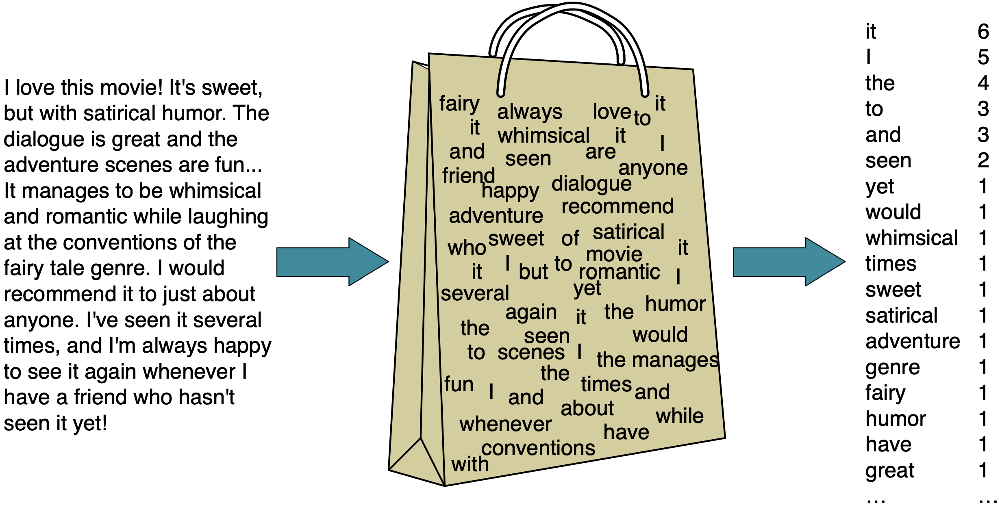
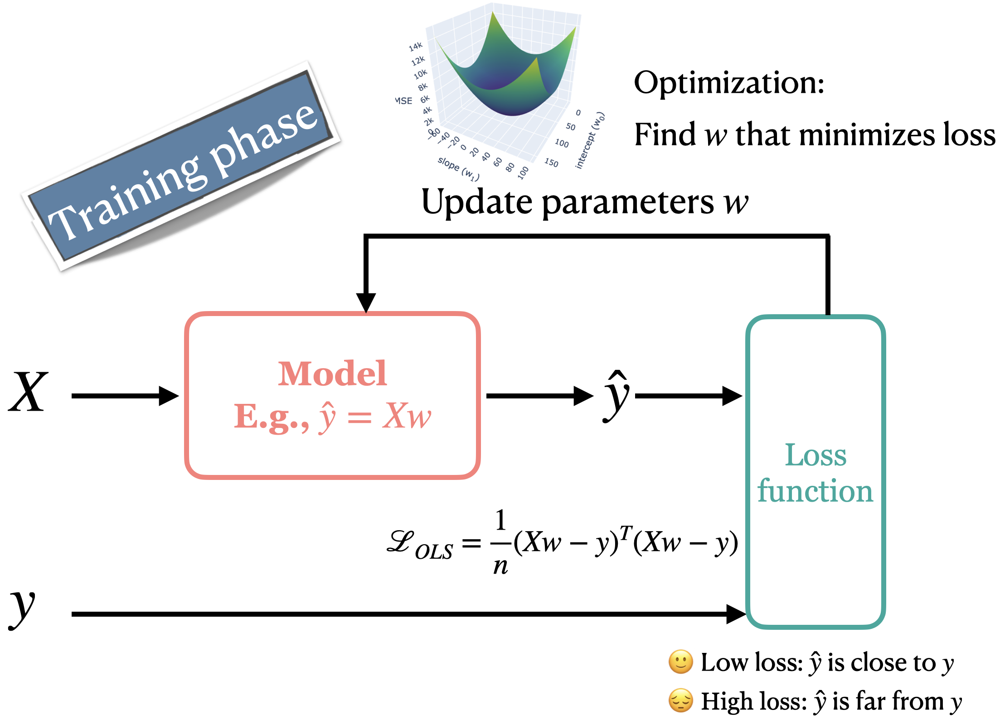
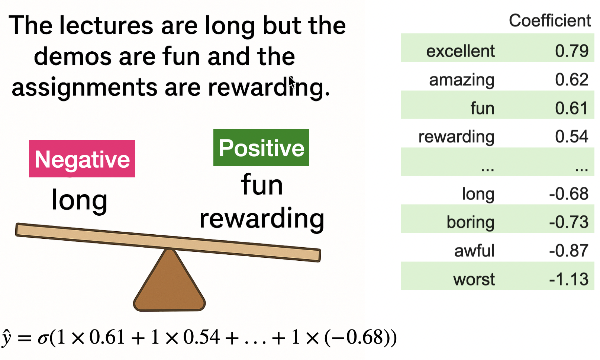

```{python}
import os
import sys

import matplotlib.pyplot as plt
import numpy as np
import pandas as pd

sys.path.append(os.path.join(os.path.abspath("."), "code"))
from plotting_functions import *
from utils import *
from sklearn.compose import ColumnTransformer, make_column_transformer
from sklearn.impute import SimpleImputer
from sklearn.model_selection import cross_val_score, cross_validate, train_test_split
from sklearn.neighbors import KNeighborsClassifier
from sklearn.pipeline import Pipeline, make_pipeline
from sklearn.preprocessing import OneHotEncoder, OrdinalEncoder, StandardScaler
from sklearn.svm import SVC
from sklearn.datasets import make_blobs, make_classification
```

## Focus on the breath!

{.nostretch fig-align="center" width="500px"}


## Announcements 

- Important information about midterm 1
- Where to find slides? 
  - https://kvarada.github.io/cpsc330-slides/lecture.html
- HW3 is due on Monday, Oct 5th, 11:59 pm. 

## Today's big questions {.slide-goals}

1. How do linear models turn features into predictions and probabilities?
2. How do loss functions and regularization guide what a model learns?
3. What can coefficients and prediction probabilities tell us—and where can they mislead us?

## Recap: Dealing with text features {.slide-summary}

- Preprocessing text to fit into machine learning models using text vectorization.
- Bag of words representation 



## Linear models {.smaller}

:::: {.columns}

:::{.column width="45%"}
- Linear regression models a numeric target using a weighted sum of the features and an intercept.
- In this case, with only one feature, our model is a straight line.
- What do we need to represent a line?
  - Slope ($w_1$): Determines the angle of the line.
  - Y-intercept ($b$): Where the line crosses the y-axis.

:::

::: {.column width="55%"}
```{python}
import matplotlib.pyplot as plt
import numpy as np
# Data
hours_studied = [0.5, 1.0, 2.0, 2.0, 3.5, 4.0, 5.5, 6.0]
grades = [25, 35, 70, 40, 60, 55, 75, 80]

# Convert data to numpy arrays and reshape for model fitting
X = np.array(hours_studied).reshape(-1, 1)
y = np.array(grades)

from sklearn.linear_model import LinearRegression
# Fit a linear regression model
model = LinearRegression()
model.fit(X, y)

# Generate predictions for plotting the regression line
X_range = np.linspace(X.min(), X.max(), 100).reshape(-1, 1)
y_pred = model.predict(X_range)

# Plotting the data points and the regression line
plt.figure(figsize=(8, 4))
plt.scatter(X, y, color='green', edgecolors='black', s=130, label='Data Points')
plt.plot(X_range, y_pred, color='blue', linewidth=2, label='Regression Line')
plt.xlabel('# hours studied')
plt.ylabel('% grade in Quiz 2')
plt.title('Linear Models: Prediction')
plt.legend()
plt.grid(True)
plt.show()
```
- Making predictions: $\hat{y} = w_1 \times \text{\# hours studied} + b$

:::
::::

## Predictions with multiple features {.smaller}

| Feature | Value | Coefficient | Contribution |
|---|---:|---:|---:|
| Hours studied ($x_1$) | 5 | 4 | 20 |
| Practice sets ($x_2$) | 6 | 2 | 12 |
| Intercept ($b$) | | | 45 |

The predicted grade is $20+12+45=77$.

$$\hat{y}=w_1x_1+\cdots+w_dx_d+b=\mathbf{w}^{\mathsf T}\mathbf{x}+b$$

- The dot product means **multiply corresponding entries and add**.
- We learn one coefficient per feature and an intercept, shared across examples.

## What happens during `fit`? {.smaller}

1. Use features and model parameters to make predictions $\hat{y}$.
2. Compare predictions with observed targets $y$ using a **loss function**.
  - Loss is a number describing how poorly predictions agree with targets.
  - **Lower loss is better according to that loss function.**
  - Different losses reward different predictions and can produce different fits.
3. Find parameter values that reduce the fitting objective.


::: {.notes}
An optimization procedure can repeatedly update parameters. Some models can instead be fitted by solving a system of equations directly. We do not need the computational details here.
:::

## Loss $\to$ feedback during training

:::: {.columns}

:::{.column width="70%"}

{height=440px}
:::

:::{.column width="30%"}
This illustrates an iterative fitting procedure; some models use a direct solution.
:::
::::


## Residuals and squared-error loss {.smaller}

A **residual** is the observed target minus the prediction: $y-\hat{y}$.

| Observed grade $y$ | Prediction $\hat{y}$ | Residual | Squared error |
|---:|---:|---:|---:|
| 70 | 68 | 2 | 4 |
| 70 | 66 | 4 | 16 |

$$\mathrm{MSE}=\frac{1}{n}\sum_{i=1}^{n}(y_i-\hat{y}_i)^2=\frac{4+16}{2}=10$$

- Positive residual: prediction too low. Negative residual: prediction too high.
- Ordinary least squares chooses coefficients to minimize squared-error loss.
- Squared error penalizes large prediction errors more heavily than small ones.

## Your turn: Trace a prediction and its loss {.slide-your-turn}

A linear model uses $\hat{y}=3x+10$.

| Input $x$ | Observed target $y$ | Prediction | Residual | Squared error |
|---:|---:|---:|---:|---:|
| 2 | 18 | ? | ? | ? |
| 5 | 20 | ? | ? | ? |

1. Fill in the missing values and calculate the mean squared error.
2. Which example contributes more to the loss?

::: {.notes}
Predictions: 16 and 25. Residuals: 2 and -5. Squared errors: 4 and 25. MSE = 14.5. The second example contributes more because its error magnitude is larger.
:::

## `Ridge`: Loss plus regularization

- `LinearRegression` minimizes squared-error loss.
- Correlated features can lead to large, unstable coefficients.
- `Ridge` adds **regularization**: a penalty that discourages large coefficients.
- Fitting balances agreement with training targets against the penalty.
- Regularization can reduce overfitting; it keeps the same prediction rule.

**In this course, we'll use `Ridge` for linear regression.**

## What `Ridge` minimizes {.slide-optional}

$$\underbrace{\sum_{i=1}^{n}(y_i-\hat{y}_i)^2}_{\text{fit the training targets}}
+\underbrace{\alpha\sum_{j=1}^{d}w_j^2}_{\text{discourage large coefficients}}$$

- $n$: training examples; $d$: features. The intercept is not penalized.
- `alpha` controls the strength of the penalty.
- This uses the **sum** of squared errors. Using the mean changes its balance with the penalty unless `alpha` is adjusted too.

## Regularization and scaling {.smaller}

- Larger `alpha` $\rightarrow$ stronger regularization $\rightarrow$ smaller coefficients; greater risk of underfitting.
- Smaller `alpha` $\rightarrow$ weaker regularization; greater risk of overfitting.
- Choose `alpha` using cross-validation on training data; reserve the test set for final evaluation.
- Scale numeric features: their units affect coefficient sizes and hence the penalty.

```python
ridge_pipe = make_pipeline(StandardScaler(), Ridge(alpha=1.0))
cross_validate(ridge_pipe, X_train, y_train)
```

The pipeline fits the scaler separately within each cross-validation fold.

## Training loss vs. evaluation score {.smaller}

| Model | Fitting objective | Default `.score()` |
|---|---|---|
| `Ridge` | Squared-error loss + penalty | $R^2$ |
| `LogisticRegression` | Log loss + penalty | Accuracy |

- `fit` uses its objective to learn coefficients from the training data.
- `score` evaluates predictions; it need not report the fitting loss.
- By default, `cross_validate` uses the estimator's `.score()`.
- Low training loss does **not** guarantee good predictions on new examples.

::: {.notes}
We will introduce log loss shortly and study regression metrics in more detail later. Losses are minimized; the default scores here are maximized.
:::

## Interpreting regression coefficients {.smaller}

- A coefficient describes the change in the **model's prediction** for a one-unit feature increase, holding other represented features fixed.
- After `StandardScaler`, one unit corresponds to one training-set standard deviation of the original feature.
- Correlated features can share predictive information, making individual coefficients unstable.
- Coefficients describe the fitted model; they do **not** establish causal effects.
- A constant change per unit may miss curves or interactions. Extrapolation can give implausible predictions, such as grades above 100%.

## Logistic regression 
- Suppose your target is binary: pass or fail 
- Logistic regression is used for such binary classification tasks.  
- Logistic regression predicts a probability that the given example belongs to a particular class.
- It uses **Sigmoid function** to map any real-valued input into a value between 0 and 1, representing the probability of a specific outcome.
- A threshold (usually 0.5) is applied to the predicted probability to decide the final class label.  

## Logistic regression: Decision boundary 

:::: {.columns}

:::{.column width="60%"}

```{python}
import matplotlib.pyplot as plt
import numpy as np
from sklearn.linear_model import LogisticRegression

# Data
hours_studied = [0.5, 1.0, 2.0, 2.0, 3.5, 4.0, 5.5, 6.0]
grades = ['fail', 'fail', 'pass', 'fail', 'pass', 'fail', 'pass', 'pass']

# Converting target variable to binary (0: fail, 1: pass)
grades_binary = [1 if grade == 'pass' else 0 for grade in grades]

# Reshape the data to fit the model
X = np.array(hours_studied).reshape(-1, 1)
y = np.array(grades_binary)

# Fit logistic regression model
model = LogisticRegression()
model.fit(X, y)

# Generate a range of hours studied for prediction
X_test = np.linspace(min(hours_studied), max(hours_studied), 100).reshape(-1, 1)

# Predict probabilities
probabilities = model.predict_proba(X_test)[:, 1]

# Find decision boundary (where probability = 0.5)
decision_boundary = X_test[np.isclose(probabilities, 0.5, atol=0.01)][0]

# Plotting
plt.figure(figsize=(8, 5))
plt.scatter(hours_studied, y, color='red', label='0=Fail, 1=Pass')
plt.plot(X_test, probabilities, label='Prediction Probability', color='blue')
plt.axvline(x=decision_boundary, ymin=0, ymax=0.5, color='green', linestyle='--')
plt.hlines(y=0.5, xmin=min(hours_studied), xmax=decision_boundary, color='green', linestyle='--')
plt.xlabel('Hours Studied')
plt.ylabel('Probability of Passing')
plt.title('Logistic Regression Prediction Probabilities')
plt.legend(loc="best", fontsize="small")
plt.grid(True)
plt.show()
```
:::
:::{.column width="40%"}
- Probability of passing: $p = \sigma(w^\top x_i + b) = \frac{1}{1 + e^{-(w^\top x_i + b)}}$
- The decision boundary is the point on the x-axis where the corresponding predicted probability on the y-axis is 0.5. 
:::

::::

## Decision scores, probabilities, and classes {.smaller}

$$z=\mathbf{w}^{\mathsf T}\mathbf{x}+b
\qquad p=\sigma(z)=\frac{1}{1+e^{-z}}$$

- `decision_function` returns the raw score $z$.
- `predict_proba` returns probabilities in the order given by `classes_`; $p$ corresponds to `classes_[1]`.
- $z=0$ corresponds to $p=0.5$, the default classification boundary.
- The sigmoid is nonlinear, but the **boundary remains linear**: $\mathbf{w}^{\mathsf T}\mathbf{x}+b=0$.
- With two features the boundary is a line; with $d$ features it is a $(d-1)$-dimensional hyperplane.

## How logistic regression learns: Log loss {.smaller}

Let $p_{\text{observed}}$ be the probability assigned to the **class that actually occurred**.

$$\text{loss for one example}=-\log(p_{\text{observed}})$$

- High probability for the observed class $\rightarrow$ small loss.
- Probability near zero for the observed class $\rightarrow$ very large loss.
- A **confident incorrect prediction** receives a particularly large penalty.
- Logistic regression fits using log loss across training examples plus a regularization penalty.

## Log loss penalizes confident mistakes

```{python}
#| fig-width: 8
#| fig-height: 3.8
probability_observed = np.linspace(0.01, 1, 400)
fig, ax = plt.subplots()
ax.plot(probability_observed, -np.log(probability_observed), color="tab:green")
case_probabilities = np.array([0.05, 0.4, 0.6, 0.95])
ax.scatter(case_probabilities, -np.log(case_probabilities), color="tab:purple", zorder=3)
ax.axvline(0.5, color="black", linestyle="--", linewidth=1)
ax.set(xlabel="Probability assigned to the observed class", ylabel="Log loss for one example", xlim=(0, 1))
plt.show()
```

At the usual threshold, 0.05 is confident and incorrect; 0.95 is confident and correct.

## Your turn: Same accuracy, different probabilities {.slide-your-turn}

The table shows the probability each model assigns to the observed (true) class:

| Model | Example 1 | Example 2 | Example 3 |
|---|---:|---:|---:|
| A | 0.6 | 0.6 | 0.4 |
| B | 0.9 | 0.9 | 0.01 |

1. On the first two examples, both models are correct. Compare their accuracy and log loss without calculating logarithms.
2. On example 3, both models are wrong. Which receives the larger log loss on this example?

::: {.notes}
Both have 100% accuracy on the first two examples; B has lower log loss. On the third, B has much larger loss because it assigns almost no probability to the observed class. Both now have accuracy 2/3. A high predicted probability does not guarantee correctness.
:::

## Regularization: `alpha` vs. `C` {.smaller}

| Model | Stronger regularization | Weaker regularization |
|---|---|---|
| `Ridge` | Increase `alpha` | Decrease `alpha` |
| `LogisticRegression` | Decrease `C` | Increase `C` |

- `C` controls **inverse** regularization strength.
- Too much regularization can cause underfitting; more is not always better.
- Select hyperparameters using cross-validation.
- Probabilities and log loss can change even when class predictions and accuracy stay the same.

## Prediction probabilities and model limitations

- Near the decision boundary: scores near zero, probabilities near 0.5.
- Farther from the boundary: more extreme probabilities.
- A model can be **confidently wrong** if its linear boundary cannot represent the actual relationship.
- Example: a straight Canada–USA boundary can confidently misclassify cities in Alaska.
- A high `predict_proba` value reflects the model's estimate, not a guarantee.

## Sentiment analysis example {.smaller}
:::: {.columns}

:::{.column width="55%"}

:::

:::{.column width="45%"}
- Logistic regression learns **coefficients for each word** from training data.  
- Positive coefficients $\rightarrow$ push prediction toward positive class.  
- Negative coefficients $\rightarrow$ push prediction toward negative class.  
- In this example, positive words (_fun_, _rewarding_) outweigh the negative word (_long_), so the overall sentiment is likely **positive**.  
:::

::::

## Your turn: How many parameters? {.slide-your-turn}

- Imagine you are training a binary logistic regression model. For each of the following scenarios, identify how many parameters (weights and biases) will be learned.
- Scenario 1: 100 features and 1,000 examples
- Scenario 2: 100 features and 1 million examples

## {.smaller}
:::: {.columns}

:::{.column width="50%"}
### Parametric
- Examples: Logistic regression, linear regression, linear SVM  
- Models with a fixed number of parameters, regardless of the dataset size
- Fast predictions; useful for large, sparse feature matrices
- Less flexible, may not capture complex relationships
:::

:::{.column width="50%"}
### Non parametric
- Examples: KNN, SVM RBF, Decision tree with no specific depth specified 
- The stored representation can grow with the training set; $k$-NN retains training examples.
- Flexible, can adapt to complex patterns
- Prediction can be expensive; local structure and distances must be useful.
:::


::::

## Parametric does not mean assumption-free or unable to overfit {.smaller}

- With 100 features, binary logistic regression learns **101 parameters** in both scenarios.
- With 100,000 features, it learns 100,001 parameters and may overfit.
- Non-parametric models still have assumptions and hyperparameters, such as $k$ and the distance measure in $k$-NN.
- A linear model assumes its represented features support a useful linear rule; it does not require normally distributed features or targets.

## (iClicker) Exercise 7.1 {.slide-your-turn}

Select all of the following statements which are TRUE.

- (A) Increasing the hyperparameter `alpha` of `Ridge` is likely to decrease model complexity.
- (B) `Ridge` can be used with datasets that have multiple features.
- (C) With `Ridge`, we learn one coefficient per training example.
- (D) If you train a linear regression model on a 2-dimensional problem (2 features), the model will learn 3 parameters: one for each feature and one for the bias term.


## (iClicker) Exercise 7.2 {.slide-your-turn}

Select all of the following statements which are TRUE.

- (A) Increasing logistic regression’s `C` hyperparameter increases model complexity.
- (B) The raw output score can be used to calculate the probability score for a given prediction.
- (C) For linear classifier trained on $d$ features, the decision boundary is a $d-1$-dimensional hyperplane.
- (D) A linear model is likely to be uncertain about the data points close to the decision boundary.


## Summary {.slide-summary .smaller}

- Linear models use a weighted sum of features and an intercept.
- Loss tells `fit` what counts as a better prediction.
- Squared-error loss emphasizes large residuals; log loss emphasizes confident mistakes.
- Regularization balances fit against coefficient size: larger `alpha` or smaller `C` means a stronger penalty.
- Training loss and evaluation score serve different purposes; use validation to assess generalization.
- Coefficients describe the model, and high predicted probabilities do not guarantee correctness.

# (Optional) Multinomial logistic regression {.slide-optional}

## Softmax Function for Probabilities {.slide-optional}

Given an input, the probability that it belongs to class $j \in \{1, 2, \dots, K\}$ is calculated using the **softmax function**:

$P(y = j \mid x_i) = \frac{e^{w_j^\top x_i + b_j}}{\sum_{k=1}^{K} e^{w_k^\top x_i + b_k}}$

- $x_i$ is the $i^{th}$ example 
- $w_j$ is the weight vector for class $j$.
- $b_j$ is the bias term for class $j$.
- $K$ is the total number of classes.


## Making Predictions {.slide-optional}

1. **Compute Probabilities**:  
   For each class $j$, compute the probability $P(y = j \mid x_i)$ using the softmax function.

2. **Select the Class with the Highest Probability**:  
   The predicted class $\hat{y}$ is:  
   $\hat{y} = \arg \max_{j \in \{1, \dots, K\}} P(y = j \mid x_i)$


## Binary vs multinomial logistic regression {.slide-optional}

|   **Aspect**                       | **Binary Logistic Regression**              | **Multinomial Logistic Regression**  |
|--------------------------|---------------------------------------------|--------------------------------------|
| **Target variable**      | 2 classes (binary)                          | More than 2 classes (multi-class)    |
| **Getting probabilities**  | Sigmoid                                   | Softmax                              |
| parameters               | $d$ weights, one per feature and the bias term | $d$ weights and a bias term per class |  
| **Output**               | Single probability                          | Probability distribution over classes |
| **Use case**             | Binary classification (e.g., spam detection) | Multi-class classification (e.g., flower species) |


## Activity (time-permitting) {.slide-your-turn}

<hr>

So far, we have worked with various transformers and supervised machine learning models. The goal of this activity is collaboratively complete tables that provide an overview of 

1. the strengths, weaknesses, key hyperparameters of different machine learning models
2. the pupose, use cases, and key considerations of various transformers 

(This will serve as a handy reference for your upcoming exam and beyond!)

## Activity description {.slide-your-turn .smaller}

- Your task is to engage in group discussions and fill in the designated row in [this Google document](https://docs.google.com/document/d/1SpCQMn9uZojhiwgsjIoutryNmpbUcM3ez5g-4is2Cxc/edit?usp=sharing).
- For strengths and weaknesses, some things to consider are:
  * concerns about underfitting
  * concerns about overfitting
  * speed
  * scalability for large data sets  
  * interpretability 
  * effectiveness on sparse data
  * ease of use for multi-class classification  
  * ability to represent uncertainty
  * time/space complexity 
  * etc.


## Estimators {.slide-your-turn}

Fill in the following table with at least one entry per box.

Model           |  Strengths | Weaknesses | Key hyperparameters |
----------------|------------|------------|---------------------|
decision tree   |            |            |                     |
$k$-NN              |            |            |                     |
RBF SVM                 |            |            |                     |
linear models                 |            |            |                     |


## Transformers {.slide-your-turn}

Transformation         |  Purpose   | Use cases  | Key consideration   |
-----------------------|------------|------------|---------------------|
  Imputation           |            |            |                     |
  Scaling              |            |            |                     | 
  One-hot encoding     |            |            |                     | 
  Ordinal encoding     |            |            |                     | 
  Bag-of-words encoding|            |            |                     | 


## Coming up

A few big questions remain:

- How do we tune hyperparameters?
- How do we choose our features? (feature selection, dimensionality reduction, regularization etc.)
- How do we come up with new useful features (feature engineering)
- How do we choose between different models? (different evaluation metrics, what happens if we're not happy with our test error?)
- How to deal with class imbalance?
- What do we do if we do not have targets (unsupervised learning)
- How to build models for more interesting data such as images, user preferences, or sequential data?)
