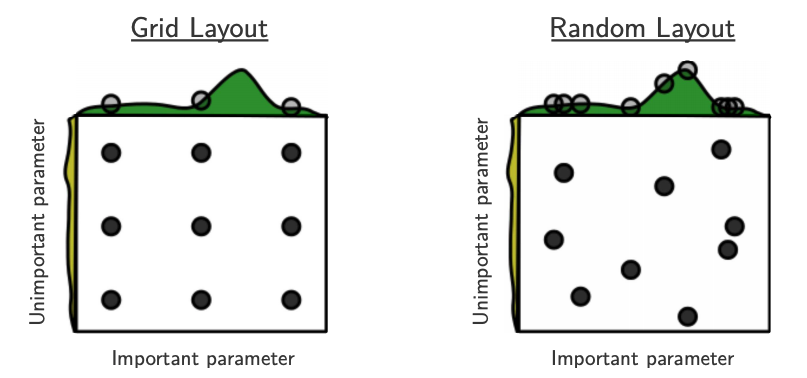

```{python}
#| include: false
from pathlib import Path
import matplotlib.pyplot as plt
import numpy as np
import pandas as pd
from scipy.stats import binom, loguniform, randint
from sklearn.compose import make_column_transformer
from sklearn.dummy import DummyClassifier
from sklearn.feature_extraction.text import CountVectorizer
from sklearn.model_selection import GridSearchCV, RandomizedSearchCV, cross_val_score, train_test_split
from sklearn.pipeline import make_pipeline
from sklearn.preprocessing import OneHotEncoder, StandardScaler
from sklearn.svm import SVC
from sklearn.tree import DecisionTreeClassifier

DATA_DIR = Path("data")
CV = 5
```

## Focus on the breath!

{.nostretch fig-align="center" width="500px"}

::: {.notes}
Take a moment to settle in. Relax your shoulders and take a slow breath in and out.
:::

## Check-in {.slide-your-turn}

**How are you feeling today?**

- (A) Things are more or less under control!
- (B) Excited about hyperparameter optimization!
- (C) Lost 😞
- (D) Tired / sleepy 😴
- (E) Thinking of lunch 🥗

## Announcements {visibility="hidden"}

::: {.notes}
Update this slide with confirmed midterm and assignment information before class. The previous deck contained dates and links from an earlier offering; those have been removed.
:::

## Today's big questions {.slide-goals}

1. How do we choose settings for a **complete pipeline**?
2. How should we spend a limited **search budget**?
3. How much should we trust the **winning validation score**?

::: {.notes}
Changing a setting takes one line. Deciding which setting to use is harder. Today's central puzzle: if trying more settings produces a higher validation score, have we necessarily found a better model?
:::

## Recap: Parameters vs. hyperparameters {.slide-your-turn}

| Model | Learned during `fit` | Chosen before fitting |
|---|---|---|
| Logistic regression | Coefficients, intercept | `C` |
| Decision tree | Splits, leaf predictions | `max_depth` |
| Bag of words | Vocabulary | `max_features` |

**How do we decide which hyperparameter values to use?**

::: {.notes}
The vocabulary is learned from the training documents. Its maximum size is a setting we choose. Search compares models fitted under different settings; it does not directly learn coefficients in the way a model's fit does.
:::

## Start with a familiar problem

**Which tree depth predicts song preferences well?**

- Spotify Song Attributes: numerical audio features, categories, and song titles.
- Target: one listener **likes** (`1`) or **does not like** (`0`) a song.
- Keep the test set aside before making modelling decisions.

```{python}
#| echo: true
spotify_df = pd.read_csv(DATA_DIR / "spotify.csv", index_col=0)
X = spotify_df.drop(columns=["target", "artist"])
y = spotify_df["target"]
X_train, X_test, y_train, y_test = train_test_split(
    X, y, test_size=0.2, stratify=y, random_state=123,
)
```

::: {.notes}
This is the example from Chapter 8, using the Spotify Song Attributes dataset by geomack on Kaggle. We omit artist identity. The target describes this listener, not a universal measure of song quality. All searches use only the training set.
:::

## Reuse our preprocessing tools {.smaller}

| Feature group | Transformation |
|---|---|
| Numerical audio features | `StandardScaler` |
| `time_signature`, `key` | `OneHotEncoder` |
| Binary `mode` | Pass through |
| `song_title` | `CountVectorizer` |

**Keep preprocessing inside the pipeline:** each CV fold learns its own statistics, categories, and vocabulary.

```{python}
#| include: false
numeric_feats = [
    "acousticness", "danceability", "duration_ms", "energy", "instrumentalness",
    "liveness", "loudness", "speechiness", "tempo", "valence",
]
preprocessor = make_column_transformer(
    (StandardScaler(), numeric_feats),
    (OneHotEncoder(handle_unknown="ignore"), ["time_signature", "key"]),
    ("passthrough", ["mode"]),
    (CountVectorizer(max_features=100, stop_words="english"), "song_title"),
)
baseline_score = cross_val_score(
    DummyClassifier(strategy="most_frequent"), X_train, y_train,
    cv=CV, scoring="accuracy",
).mean()
```

::: {.notes}
Scaling is unnecessary for trees, but lets us reuse the preprocessor with an SVM. Recall that the string "song_title" gives CountVectorizer a one-dimensional collection of documents. Other transformers receive lists of columns. The full preprocessing code is in the lecture notes and executable source.
:::

## Choosing a depth with a loop {.smaller}

```{python}
#| echo: true
depth_results = []
for depth in range(1, 20, 2):
    tree_pipe = make_pipeline(
        preprocessor,
        DecisionTreeClassifier(max_depth=depth, random_state=123),
    )
    scores = cross_val_score(
        tree_pipe, X_train, y_train, cv=CV, scoring="accuracy",
    )
    depth_results.append({
        "max_depth": depth, "mean_cv_score": scores.mean(),
    })
depth_results = pd.DataFrame(depth_results)
```

**Compare validation scores**, rather than selecting the highest training score.

::: {.notes}
We already know how to do this. There are ten depths and five folds, so fifty pipeline fits. Cross-validation clones and fits the entire pipeline separately for each fold.
:::

## What did the loop find? {.model-plot}

```{python}
fig, ax = plt.subplots(figsize=(8, 3.4))
ax.plot(depth_results.max_depth, depth_results.mean_cv_score, "o-", color="#145e63")
ax.axhline(baseline_score, linestyle="--", color="#9b5d25", label="Most-frequent baseline")
ax.set(xlabel="Tree max_depth", ylabel="Mean CV accuracy")
ax.set_xticks(depth_results.max_depth)
ax.legend()
fig.tight_layout()
plt.show()
```

The winner is best **among the depths tried, according to these CV scores**.

::: {.notes}
Choose the highest mean validation score and refit that configuration on all training data. Keep the test set untouched because model development is continuing. A finite comparison does not establish the best possible depth on future data.
:::

## From one setting to a candidate pipeline

We could change:

- The model family: tree, k-NN, SVM, linear model.
- Model settings: `max_depth`, `n_neighbors`, `C`, `gamma`.
- Representation: vocabulary size, preprocessing choices.

Each combination defines a **candidate pipeline**.

**The possibilities multiply quickly.**

## Your turn: Search at scale {.slide-your-turn}

Suppose we tune a separate SVM for **10,000 listeners**.

For each listener, try:

- 3 vocabulary sizes
- 4 values of `C`
- 5 values of `gamma`
- 5-fold cross-validation

**How many candidates per listener? How many CV fits in total?**

::: {.notes}
Allow students to calculate before showing the answer. Exclude final refits in this question. Each listener has their own data and search; this is a simplified motivation, not an implementation of a production recommender.
:::

## The computational budget {.slide-summary}

- Candidates per listener: $3 \times 4 \times 5 = 60$.
- CV fits per listener: $60 \times 5 = 300$.
- Across 10,000 listeners: **3,000,000 fits**.
- At one second per fit and validation scoring: **about 34.7 days**, sequentially.

**What should an automated search handle for us?**

::: {.notes}
Bookkeeping, consistent folds, scores and timing, selecting settings, and refitting. Automation alone does not reduce the number of fits when the candidates and folds are the same. Parallelism can reduce elapsed time. Fewer candidates can reduce the work.
:::

## Automating the workflow

1. Define the **pipeline and search space**.
2. Fit each candidate within the training portions of CV.
3. Compare mean validation scores.
4. Select a candidate and **refit on all training data**.

| Tool | Candidates evaluated |
|---|---|
| `GridSearchCV` | Every specified combination |
| `RandomizedSearchCV` | A chosen number of sampled combinations |

::: {.notes}
Both integrate cross-validation and can run fits in parallel. We still decide where to search, how to score, and which data may guide our decisions.
:::

## Naming pipeline hyperparameters {.smaller}

```{python}
#| echo: true
svm_pipe = make_pipeline(preprocessor, SVC())
```

| Search key | What changes? |
|---|---|
| `svc__C` | SVM's `C` |
| `svc__gamma` | SVM's `gamma` |
| `columntransformer__countvectorizer__max_features` | Song-title vocabulary limit |

Use **`step__parameter`**, nesting further when needed.

::: {.notes}
The names come from make_pipeline and make_column_transformer. To inspect available keys, use svm_pipe.get_params(). We first keep the vocabulary fixed so the model search can be shown as a two-dimensional heatmap.
:::

## Grid search {.smaller}

```{python}
#| echo: true
param_grid = {
    "svc__C": [0.001, 0.01, 0.1, 1, 10, 100],
    "svc__gamma": [0.001, 0.01, 0.1, 1, 10, 100],
}
grid_search = GridSearchCV(
    svm_pipe, param_grid, cv=CV, scoring="accuracy",
    n_jobs=2, return_train_score=True,
)
grid_search.fit(X_train, y_train);
```

$6 \times 6 = 36$ candidates → $36 \times 5 + 1 =$ **181 fits**.

::: {.notes}
The extra fit is the default refit=True: the selected pipeline is fitted on all training data. n_jobs=2 limits parallel resource use for the example; n_jobs=-1 uses all available CPU cores. Parallelism can reduce elapsed time but can increase memory use. Training scores are requested for diagnosis.
:::

## What does the fitted search contain? {.smaller}

```{python}
#| echo: true
print("Selected settings:", grid_search.best_params_)
print(f"Selected mean CV accuracy: {grid_search.best_score_:.3f}")
```

- `best_params_`: selected hyperparameters.
- `best_score_`: selected mean **CV validation** score.
- `best_estimator_`: selected pipeline, **refitted on all training data**.
- `cv_results_`: scores and timings for every candidate.

::: {.notes}
The search object can predict directly after refitting. best_score_ is not the score of the refitted pipeline on an independent test set. We will evaluate on the test set only after all choices are finished.
:::

## Read the results, beyond the winner {.smaller}

```{python}
#| echo: true
grid_results = pd.DataFrame(grid_search.cv_results_)
columns = [
    "param_svc__C", "param_svc__gamma",
    "mean_train_score", "mean_test_score", "std_test_score",
]
grid_results.sort_values("rank_test_score")[columns].head(4)
```

**`mean_test_score` means held-out CV-fold score here.**

The search has never seen `X_test` or `y_test`.

::: {.notes}
Training scores can help diagnose underfitting and overfitting. std_test_score describes variation across folds, not a confidence interval for future accuracy. Do not assume a tiny mean-score difference is a meaningful improvement.
:::

## Choose useful ranges

For positive settings such as `C` and `gamma`, start by exploring **orders of magnitude**.

```{python}
#| echo: true
np.logspace(-3, 2, 6)
```

- A grid only covers the values we provide.
- A narrow range can miss useful regions.
- A finer search can follow a promising broad search.

::: {.notes}
Linear spacing is not inherently wrong. Values such as C=1, 2, 3 explore a narrow region; that may be useful later. Model knowledge guides the range. Every refinement is another decision based on validation results.
:::

## Inspect the search landscape {.model-plot}

```{python}
score_grid = grid_results.pivot(
    index="param_svc__C", columns="param_svc__gamma", values="mean_test_score",
).sort_index().sort_index(axis=1)
fig, ax = plt.subplots(figsize=(8, 4.2))
heatmap = ax.imshow(score_grid.to_numpy(), cmap="viridis", aspect="auto", origin="lower")
ax.set_xticks(range(6), labels=score_grid.columns)
ax.set_yticks(range(6), labels=score_grid.index)
ax.set(xlabel="gamma", ylabel="C")
for row in range(6):
    for col in range(6):
        ax.text(col, row, f"{score_grid.iloc[row, col]:.2f}", ha="center", va="center",
                color="white", bbox=dict(facecolor="black", alpha=.4, edgecolor="none"))
fig.colorbar(heatmap, ax=ax, label="Mean CV accuracy")
fig.tight_layout()
plt.show()
```

**Look for promising regions and interactions.**

::: {.notes}
Each cell is one candidate. How much does gamma matter at different C values? Joint tuning can reveal combinations missed by varying one parameter while holding the other fixed. The heatmap uses the existing results; it performs no extra search.
:::

## Your turn: A winner at the boundary {.slide-your-turn}

The highest mean CV accuracy occurs at **`C=100`**, the largest value tried.

Which statements are justified?

- (A) The optimal value of `C` is exactly 100.
- (B) This is a winning candidate among those evaluated.
- (C) Extending the range may be worth trying.
- (D) Use the test set to choose whether to extend the range.

::: {.notes}
B and C. Inspect nearby scores before spending more computation. A boundary winner does not guarantee improvement outside the range. Use training-set CV for further exploration; preserve the test set.
:::

## Adding settings multiplies the cost

Add **6 vocabulary sizes** to the $6 \times 6$ model grid:

$$6^3 = 216\text{ candidates}$$

$$216 \times 5 + 1 = 1{,}081\text{ pipeline fits}$$

Changing the representation can change which model settings work well.

**Can we explore a large space with fewer evaluations?**

## Randomized search

`RandomizedSearchCV` samples **`n_iter` candidate settings**.

- Supply lists of values or probability distributions.
- Set `random_state` for reproducibility.
- Each sampled candidate still needs cross-validation.
- `n_iter` controls candidates, **not elapsed time**.

::: {.notes}
Random search is not inherently faster per fit. It can spend a limited candidate budget over a larger space. Runtime depends on data, folds, and sampled settings. With all-list spaces, candidates are sampled without replacement, up to the available combinations.
:::

## Random search from lists {.smaller}

```{python}
#| echo: true
search_values = {
    "columntransformer__countvectorizer__max_features":
        [100, 200, 400, 800, 1200, 2000],
    **param_grid,
}
random_list_search = RandomizedSearchCV(
    svm_pipe, search_values, n_iter=20,
    cv=CV, scoring="accuracy", random_state=123, n_jobs=2,
)
random_list_search.fit(X_train, y_train);
```

20 of 216 possible candidates → $20 \times 5 + 1 =$ **101 fits**.

::: {.notes}
This search may miss a useful combination. A fixed seed makes the sampled candidates reproducible under the same setup; it does not make them optimal. Vocabulary limits above the available vocabulary size do not add features.
:::

## Sampling from distributions {.smaller}

| Distribution | Useful for | Example |
|---|---|---|
| `randint(a, b)` | Integer settings | Vocabulary size |
| `loguniform(a, b)` | Positive settings spanning orders of magnitude | `C`, `gamma` |

- `randint(100, 2001)` includes 100 through **2000**.
- Log-uniform gives equal probability to equal **multiplicative intervals**.
- The distributions are **our search choices**, not learned from data.

::: {.notes}
Introduce these as ways to choose where trials land. SciPy randint excludes its upper endpoint. Equal multiplicative intervals include 0.01–0.1 and 0.1–1.
:::

## Why use log-uniform? {.slide-your-turn}

Suppose `C` could be anywhere between **0.001 and 100**.

Uniform sampling puts about **90%** of draws between **10 and 100**.

Log-uniform gives equal probability to each tenfold interval:

$$[0.001, 0.01],\ [0.01, 0.1],\ [0.1, 1],\ [1, 10],\ [10, 100]$$

**Which choice gives the smaller orders of magnitude more attention?**

::: {.notes}
Log-uniform. This does not guarantee better settings; it encodes a different allocation of trials. For a wide positive range, uniform draws concentrate in its largest order of magnitude.
:::

## Random search from distributions {.smaller}

```{python}
#| echo: true
param_distributions = {
    "columntransformer__countvectorizer__max_features":
        randint(100, 2001),
    "svc__C": loguniform(1e-3, 1e2),
    "svc__gamma": loguniform(1e-3, 1e2),
}
random_dist_search = RandomizedSearchCV(
    svm_pipe, param_distributions, n_iter=20,
    cv=CV, scoring="accuracy", random_state=123, n_jobs=2,
)
random_dist_search.fit(X_train, y_train);
```

Same candidate budget; a different search space.

## Why can random search use a budget well?

{.nostretch fig-align="center" width="720px"}

If one dimension matters more, a grid repeats its values while varying other dimensions.

[Source: Bergstra and Bengio (2012)](https://www.jmlr.org/papers/v13/bergstra12a.html)

::: {.notes}
The horizontal dimension matters more in this illustration. Random draws from continuous ranges can try nine distinct horizontal values, whereas a three-by-three grid tries only three. We usually do not know which dimensions matter most. This is motivation, not a guarantee that random search always wins.
:::

## Your turn: Budget a search {.slide-your-turn}

Three hyperparameters have **4, 5, and 6** candidate values.

Use **five-fold CV**, with the default final refit.

1. How many pipeline fits does grid search require?
2. How many does random search require with `n_iter=20`?
3. What do we give up by using fewer candidates?

::: {.notes}
Grid: 4 × 5 × 6 = 120 candidates; 120 × 5 + 1 = 601 fits. Random: 20 × 5 + 1 = 101 fits. Many combinations remain unevaluated, and a useful one may be missed. Neither approach guarantees the best settings on future data.
:::

## More trials, higher score, better model?

We can select among searches using their CV scores:

```{python}
#| echo: true
searches = {
    "Grid": grid_search,
    "Random (lists)": random_list_search,
    "Random (distributions)": random_dist_search,
}
pd.DataFrame([
    {"Search": name, "Best mean CV accuracy": search.best_score_,
     "Candidates": len(search.cv_results_["params"])}
    for name, search in searches.items()
])
```

::: {.notes}
These runs have different spaces and budgets, so the table is not a general comparison of the algorithms. A winning score was used for selection. How much should we trust it as an estimate on future data?
:::

## Pizza competition: tuning to the tasters {.smaller}

:::: {.columns}
::: {.column width="45%"}
{.nostretch width="380px"}
:::
::: {.column width="55%"}
- **Training:** practise recipes at home.
- **Validation:** friends taste and give feedback.
- **Selection:** repeatedly adjust for their ratings.
- **Test:** competition judges taste the final recipe.
:::
::::

Your friends' favourite may disappoint the judges.

::: {.notes}
Retain the intuition from the DSCI 571 slides: repeatedly responding to the same tasters can tailor a recipe to that group. This is an analogy. Optimization bias can arise even if friends and judges are sampled from the same population; a distribution mismatch is not required.
:::

## Optimization bias

A validation score reflects both:

- Predictive ability.
- Variation from the particular evaluation examples.

Selecting the **highest** score can select a candidate that benefited from favourable noise.

Its winning score can be **optimistic** about new-data performance.

::: {.notes}
This is also called overfitting the validation set. It differs from fitting too closely to training examples. Valid preprocessing within every fold does not prevent selection bias. Cross-validation reduces dependence on one split but does not eliminate this effect.
:::

## Your turn: Winning by guessing {.slide-your-turn}

A quiz has **10 questions**, each with **4 options**.

- One randomly completed answer sheet: expected accuracy **25%**.
- Generate **100** random answer sheets.
- Keep the sheet that scores highest on these questions.

**Will the winning sheet usually exceed 25%?**

**What is its expected accuracy on new questions?**

::: {.notes}
Yes, the selected score will usually exceed 25%. On new independent questions, random guessing still has expected accuracy 25%. The questions are validation examples; answer sheets are candidates. Selection improved the observed score without adding knowledge. Adapted from the random-answer example attributed to Rodolfo Lourenzutti in the lecture notes.
:::

## More chances to get lucky {.model-plot}

```{python}
number_sheets = np.array([1, 2, 10, 100, 1000, 10000])
fig, ax = plt.subplots(figsize=(8, 3.5))
for number_questions in [10, 100]:
    cdf = binom.cdf(np.arange(number_questions), number_questions, .25)
    expected_best = [np.sum(1 - cdf ** m) / number_questions for m in number_sheets]
    ax.plot(number_sheets, expected_best, "o-", label=f"{number_questions} questions")
ax.axhline(.25, color="grey", linestyle="--", label="New-question expectation")
ax.set(xscale="log", xlabel="Number of answer sheets tried", ylabel="Expected winning accuracy")
ax.legend()
fig.tight_layout()
plt.show()
```

More trials and fewer validation examples can amplify selection effects.

::: {.notes}
The plot is computed exactly from binomial probabilities; students need not learn that calculation. Real models are correlated, unlike these independent answer sheets. This does not quantify bias in our Spotify search. It isolates why selection alone can create optimism.
:::

## CV does not remove selection bias

**All choices count**, including:

- Hyperparameter searches and refined ranges.
- Feature engineering and preprocessing changes.
- Comparing model families.

CV helps us compare candidates using multiple splits.

**The selected CV score still helped choose the winner.**

::: {.notes}
Counting only candidates in one search call understates the development process. Ensembles and regularization can help predictive performance, but they do not turn a reused validation score into an independent evaluation.
:::

## Finish with an untouched test set {.smaller}

After model selection is complete:

```{python}
#| echo: true
selected_name = max(searches, key=lambda name: searches[name].best_score_)
selected_search = searches[selected_name]
final_test_accuracy = selected_search.score(X_test, y_test)
pd.Series({
    "Selected search": selected_name,
    "Selected mean CV accuracy": selected_search.best_score_,
    "Final test accuracy": final_test_accuracy,
})
```

The selected pipeline is already refitted on **all training data**.

::: {.notes}
Selection uses only CV results; the test set is used once at the end. Scores need not match: training sizes and evaluation samples differ, and sampling variation can move the test score either way. A gap alone does not measure optimization bias. Test size and representativeness still matter.
:::

## Your turn: Find two evaluation problems {.slide-your-turn}

A student:

1. Fits `CountVectorizer` on all song titles **before splitting**.
2. Searches 200 SVM settings.
3. Reports the winning `mean_test_score` as **final test accuracy**.

**What went wrong? How would you fix it?**

::: {.notes}
The vocabulary learned from held-out data. Split the raw data first and put vectorization inside the searched pipeline. mean_test_score is a CV validation score used for selection. Evaluate the selected refitted pipeline on untouched test data after development is complete.
:::

## Your turn: A disappointing test score {.slide-your-turn}

The final test score is disappointing.

You change the vocabulary size, rerun the search, and obtain a better score on **the same test set**.

**Can this revised score be reported as an independent final evaluation?**

::: {.notes}
No. The first test result guided development, so that set now participates in selection. Report the reuse transparently and obtain fresh held-out evaluation for the revised model. Improvement on the reused set alone does not establish improvement on future data.
:::

## Summary {.slide-summary}

- Search the **complete pipeline** to keep preprocessing within CV.
- Grid search evaluates every specified combination; random search controls the candidate budget.
- Choose useful ranges and inspect the results beyond the winner.
- Count **candidates × folds + final refit**.
- A winning CV score can be optimistic from **selection**.
- Finish with evaluation on an **untouched test set**.

## Exit question {.slide-your-turn}

A colleague uses a small validation set, tries many settings, and reports **97% validation accuracy**.

**What evidence would you want before expecting similar accuracy on new data?**

::: {.notes}
A sufficiently large, representative evaluation sample unused in selection. The small validation set is noisy, and searching many candidates can make the winning score optimistic. We cannot infer actual new-data accuracy from the reported number alone. Adapted from the question in Mark Schmidt's notes used in Chapter 8.
:::

## Optional: Nested cross-validation {.slide-optional}

An **outer** CV loop evaluates the whole selection procedure:

1. Run a complete **inner search** using each outer training portion.
2. Evaluate its selected pipeline on the outer held-out portion.
3. Summarize the outer evaluation scores.

More computation; evaluation across multiple splits.

::: {.notes}
The outer held-out rows must never guide that fold's inner search. Outer results also need protection from repeated development decisions. This evaluates a selection procedure rather than one fixed fitted model.
:::

## Optional: Searches that adapt {.slide-optional}

- **Successive halving:** begin with many candidates and small resource allocations; give more resources to promising candidates.
- **Bayesian optimization:** use earlier trial results to guide later choices.

Both still require sensible search spaces and protected evaluation data.

::: {.notes}
Limited-resource early results may not rank candidates as they would at full resources. Model-based searches can be useful when individual fits are expensive. These methods are beyond the core requirements today.
:::

## Further reading {.slide-optional}

- [Chapter 8 lecture notes](https://kvarada.github.io/cpsc330-book/book/08_hyperparameter-optimization.html)
- [scikit-learn hyperparameter-tuning guide](https://scikit-learn.org/stable/modules/grid_search.html)
- [GridSearchCV API](https://scikit-learn.org/stable/modules/generated/sklearn.model_selection.GridSearchCV.html)
- [RandomizedSearchCV API](https://scikit-learn.org/stable/modules/generated/sklearn.model_selection.RandomizedSearchCV.html)
- [Bergstra and Bengio: Random Search for Hyper-Parameter Optimization](https://www.jmlr.org/papers/v13/bergstra12a.html)
