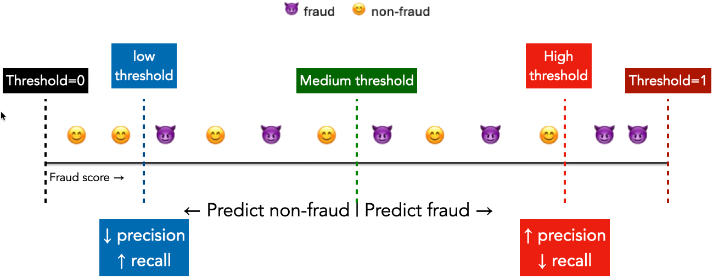
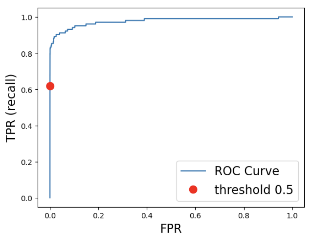

## Focus on the breath!

{.nostretch fig-align="center" width="500px"}

## Announcements 

- Important information about midterm 1
  - https://edstem.org/us/courses/104703/discussion/8335467
  - **Good news for you: You'll have access to our [course notes](https://ubc-cs.github.io/cpsc330-book/) and sklearn, pandas, and numpy documentation in the midterm!**
- HW3 was due on Monday, Oct 5th 11:59 pm.
- HW4 will be due next week.


```{python}
from pathlib import Path
import pandas as pd
import numpy as np
import matplotlib.pyplot as plt
from sklearn.dummy import DummyClassifier
from sklearn.linear_model import LogisticRegression
from sklearn.model_selection import cross_validate, train_test_split, StratifiedKFold
from sklearn.pipeline import make_pipeline
from sklearn.preprocessing import StandardScaler
from sklearn.metrics import (ConfusionMatrixDisplay, PrecisionRecallDisplay,
    confusion_matrix, accuracy_score, precision_score, recall_score, f1_score,
    average_precision_score)
```

## Today's big questions {.slide-goals}

1. When can **accuracy** mislead us, and what does a **confusion matrix** reveal?
2. How do we choose between **precision, recall, and F1** based on the cost of errors?
3. How do **thresholds and ranking metrics** help us choose a decision rule, and how do we evaluate it independently?

## A fraud classification example {.smaller}

- Each row is a transaction; **1 = fraud (positive), 0 = non-fraud**.
- A positive prediction flags a transaction for investigation.
- Reserve the test set; use stratified splits to preserve class proportions.

```{python}
DATA_URL = "https://github.com/firasm/bits/raw/refs/heads/master/creditcard.csv"
local_path = Path("data/creditcard.csv")
cc_df = pd.read_csv(local_path if local_path.exists() else DATA_URL)
development, test_df = train_test_split(
    cc_df, test_size=0.3, random_state=111, stratify=cc_df["Class"])
fit_df, valid_df = train_test_split(
    development, test_size=0.3, random_state=123, stratify=development["Class"])
X_train, y_train = fit_df.drop(columns=["Class", "Time"]), fit_df["Class"]
X_valid, y_valid = valid_df.drop(columns=["Class", "Time"]), valid_df["Class"]
X_test, y_test = test_df.drop(columns=["Class", "Time"]), test_df["Class"]
fit_df[["Amount", "V1", "V2", "Class"]].head()
```

::: {.notes}
Stratification preserves proportions; it does not balance the classes. Random splits keep this demo focused on metrics. Future-transaction deployment would require an evaluation that accounts for time.
:::

## Problem: Class imbalance

$$
\text{Accuracy} = \frac{\text{correct classifications}}{\text{total classifications}}
$$

```{python}
counts = y_train.value_counts().reindex([0, 1])
pd.DataFrame({"Count": counts, "Percentage": 100 * counts / len(y_train)}).round(3)
```

- Fraud is rare: fewer than 2 transactions in every 1,000.
- Predicting non-fraud every time can achieve **over 99% accuracy**.

## `DummyClassifier` {.slide-your-turn}

Predict the accuracy and number of fraud cases caught before revealing the result.

```{python}
#| echo: true
dummy = DummyClassifier(strategy="most_frequent")
dummy.fit(X_train, y_train)
print(f"Validation accuracy: {accuracy_score(y_valid, dummy.predict(X_valid)):.3%}")
```

Should the bank deploy this model?

::: {.notes}
It catches no fraud. High accuracy reflects the large non-fraud class.
:::

## Comparing models on the same validation set {.slide-your-turn}

Which model catches more fraud? What new mistakes does it make?

```{python}
pipe = make_pipeline(StandardScaler(), LogisticRegression(max_iter=2000))
pipe.fit(X_train, y_train)
fig, axes = plt.subplots(1, 2, figsize=(10, 3.5))
for ax, (name, model) in zip(axes, [("Always non-fraud", dummy), ("Logistic regression", pipe)]):
    ConfusionMatrixDisplay.from_estimator(model, X_valid, y_valid,
        labels=[0, 1], display_labels=["Non-fraud", "Fraud"],
        values_format="d", colorbar=False, ax=ax)
    ax.set_title(name)
fig.tight_layout()
plt.show()
```

::: {.notes}
Use the same examples for both models. Rows are actual classes; columns are predicted classes. Logistic regression catches fraud but also flags some legitimate transactions.
:::

## Understanding the confusion matrix
:::: {.columns}
:::{.column width="40%"}

```{python}
# Reuse the logistic-regression pipeline fitted earlier.
fig, ax = plt.subplots(figsize=(5, 3.5))
ConfusionMatrixDisplay.from_estimator(
    pipe, X_valid, y_valid,
    labels=[0, 1], display_labels=["Non-fraud", "Fraud"],
    values_format="d", colorbar=False, ax=ax,
)
ax.set_title("Logistic regression")
fig.tight_layout()
plt.show()
```

:::

:::{.column width="60%"}
- ✅ True negatives (TN):<br>
Actual Non-fraud, predicted Non-fraud
- ✅ True positives (TP):<br> 
Actual Fraud, predicted fraud
- ❌ False positives (FP):<br> 
Actual Non-fraud, predicted Fraud  
- ❌ False negatives (FN):<br> 
Actual Fraud, predicted Non-fraud 
:::
::::

## Confusion matrix questions {.slide-your-turn}

Imagine a spam filter model where emails labeled <br> **1 = spam, 0 = not spam**. 

If a spam email is incorrectly classified as not spam, what kind of error is this?

- (A) A false positive
- (B) A true positive
- (C) A false negative
- (D) A true negative

::: {.notes}
Answer: C (false negative).
:::

## Precision and recall

- **Precision:** Of the transactions flagged, what fraction were fraud?
- **Recall:** Of the actual fraud cases, what fraction did we catch?

$$
\text{Precision}=\frac{TP}{TP+FP}, \qquad
\text{Recall}=\frac{TP}{TP+FN}
$$

## Precision and recall on our validation set
:::: {.columns}

:::{.column width="35%"}
```{python}
# Reuse the logistic-regression pipeline fitted earlier.
fig, ax = plt.subplots(figsize=(5, 3.5))
ConfusionMatrixDisplay.from_estimator(
    pipe, X_valid, y_valid,
    labels=[0, 1], display_labels=["Non-fraud", "Fraud"],
    values_format="d", colorbar=False, ax=ax,
)
ax.set_title("Logistic regression")
fig.tight_layout()
plt.show()
```
:::

:::{.column width="65%"}
```{python}
tn, fp, fn, tp = confusion_matrix(y_valid, pipe.predict(X_valid), labels=[0, 1]).ravel()
pd.DataFrame({"Metric": ["Precision", "Recall"],
    "Calculation": [f"{tp} / ({tp} + {fp})", f"{tp} / ({tp} + {fn})"],
    "Value": [tp / (tp + fp), tp / (tp + fn)]}).round(3)
```
::: 
::::
High precision means a small **fraction of alerts** are false alarms.
High recall means a small **fraction of actual positives** are missed.

## Your turn: calculate the metrics {.slide-your-turn}

A toy fraud detector has **TP=6, FP=4, FN=2, TN=88**.

- What are its precision and recall?

::: {.notes}
Precision = 6/10 = 0.60. Recall = 6/8 = 0.75. Alerts = TP+FP; actual positives = TP+FN.
:::

## Trade-off between precision and recall

- Increasing **recall** often decreases **precision**, and vice versa.  
- Example:  
  - Predict *“fraud”* for every transaction $\rightarrow$ perfect recall, terrible precision.  
  - Predict *“fraud”* only when the predicted probability of fraud is $> 0.95$ $\rightarrow$ typically high precision, low recall.

**The right balance depends on the application and cost of errors.**

## F1-score {.smaller}

- Sometimes, we want a **single metric** that balances precision and recall.  
- The **F1-score** is the **harmonic mean** of the two:

$$
F1 = 2 \times \frac{\text{Precision} \times \text{Recall}}{\text{Precision} + \text{Recall}} = \frac{2TP}{2TP + FP + FN}
$$

- High **F1** means both precision and recall are strong.  
- F1 ignores TN and does **not** encode financial costs or review capacity.

For the toy fraud detector: $F1 = 12/(12+4+2) \approx 0.67$.

## Summary {.slide-summary}

| Metric | What it measures | High value means |
|:--------|:----------------|:------------------|
| **Accuracy** | Overall correctness | Model gets most predictions right |
| **Precision** | Quality of positive predictions | Small fraction of alerts are false alarms |
| **Recall** | Quantity of true positives caught | Small fraction of positives are missed |
| **F1-score** | Balance of precision & recall | Both precision and recall are high |

## iClicker Exercise 9.1 {.slide-your-turn .smaller}

**Select all of the following statements which are TRUE.**

- (A) In screening where a missed disease delays urgent treatment and a false alarm triggers a low-risk follow-up, prioritize precision over recall.
- (B) If a spam filter deletes flagged mail, losing a crucial legitimate email can be more costly than letting a spam email reach the inbox (positive = spam).
- (C) If method A gets a higher accuracy than method B, that means its precision is also higher.
- (D) If method A gets a higher accuracy than method B, that means its recall is also higher.

::: {.notes}
Answer: B. A reverses the stated priority; C and D do not follow from accuracy.

Both models see the same 95 negative and 5 positive examples.

| Model | Actual class | Predicted negative | Predicted positive |
|---|---|---:|---:|
| A | Negative | 90 (TN) | 5 (FP) |
| A | Positive | 5 (FN) | 0 (TP) |
| B | Negative | 80 (TN) | 15 (FP) |
| B | Positive | 0 (FN) | 5 (TP) |

| Model | Accuracy | Precision | Recall |
|---|---:|---:|---:|
| A | 0.90 | 0 | 0 |
| B | 0.85 | 0.25 | 1 |

Higher accuracy does not guarantee higher precision or recall.
:::

## Counterexamples {.smaller}

Both models see the same 95 negative and 5 positive examples.

| Model | Actual class | Predicted negative | Predicted positive |
|---|---|---:|---:|
| A | Negative | 90 (TN) | 5 (FP) |
| A | Positive | 5 (FN) | 0 (TP) |
| B | Negative | 80 (TN) | 15 (FP) |
| B | Positive | 0 (FN) | 5 (TP) |

| Model | Accuracy | Precision | Recall |
|---|---:|---:|---:|
| A | 0.90 | 0 | 0 |
| B | 0.85 | 0.25 | 1 |

Higher accuracy does not guarantee higher precision or recall.

## From probabilities to predictions

- `predict(X)` returns a class label: fraud or non-fraud.
- `predict_proba(X)` returns estimated probabilities for each class.
- We can choose a threshold: predict fraud when its estimated probability exceeds that value.
- Changing the threshold changes the predictions without retraining the model.

## Predicting with logistic regression {.slide-your-turn .smaller}

{.nostretch fig-align="center" width="950px"}

Move from the medium to the low threshold. Which transactions become TP or FP?

**Precision arrows show a tendency, not a guarantee.** Scores stay fixed.

::: {.notes}
Predict fraud for scores at least the threshold. Moving from medium to low adds two fraud cases and two non-fraud cases. Recall increases. Precision depends on the mix added. Threshold changes do not refit the model or improve its ranking.
:::

## Same model, different thresholds

```{python}
#| echo: false
valid_scores = pipe.predict_proba(X_valid)[:, 1]

def threshold_metrics(y_true, scores, threshold):
    predictions = scores >= threshold
    tn, fp, fn, tp = confusion_matrix(y_true, predictions, labels=[0, 1]).ravel()
    return {"Threshold": threshold, "Caught (TP)": tp, "Missed (FN)": fn,
            "False alarms (FP)": fp,
            "Precision": precision_score(y_true, predictions, zero_division=0),
            "Recall": recall_score(y_true, predictions),
            "F1": f1_score(y_true, predictions)}

threshold_table = pd.DataFrame([
    threshold_metrics(y_valid, valid_scores, t) for t in [0.5, 0.1, 0.01]])
threshold_table.round(3)
```

Lowering the threshold cannot decrease recall on fixed data.
Precision can increase or decrease.

## Your turn: can both metrics improve? {.slide-your-turn}

Start with **TP=6, FP=4, FN=2, TN=88**.
Lowering the threshold flags three more transactions: **two fraud, one legitimate**.

1. Calculate the new precision and recall.
2. Does this contradict the usual trade-off?

::: {.notes}
New counts: TP=8, FP=5, FN=0, TN=87. Precision rises from 0.60 to 8/13 ≈ 0.615; recall rises from 0.75 to 1. Precision need not decrease when the threshold falls.
:::

## PR curve
:::: {.columns}

:::{.column width="45%"}
```{python}
fig, ax = plt.subplots(figsize=(7, 5))
PrecisionRecallDisplay.from_estimator(pipe, X_valid, y_valid, ax=ax)
ax.axhline(y_valid.mean(), color="gray", linestyle="--", label="Fraud prevalence")
for row in threshold_table.to_dict("records"):
    ax.scatter(row["Recall"], row["Precision"], color="red")
    ax.annotate(f't={row["Threshold"]}', (row["Recall"], row["Precision"]),
                xytext=(5, -12), textcoords="offset points")
ax.legend(loc="lower left")
plt.show()
```
:::
:::{.column width="45%"}

- Horizontal axis: **recall**; vertical axis: **precision**.
- Lower thresholds move toward greater recall; precision can move either way.
- Desirable region: **top right**.
:::
::::

::: {.notes}
Predicting everything positive gives recall 1 and precision equal to prevalence. Prevalence is also a reference for an uninformative ranking. The no-positive endpoint has undefined precision, conventionally displayed as 1.
:::

## Your turn: choose an operating point {.slide-your-turn}

The bank needs **recall of at least 0.8** and wants the most reliable alerts.

```{python}
threshold_table.round(3)
```

Which of these thresholds qualifies? Which qualifying threshold has highest precision?

::: {.notes}
Use the displayed validation results. This compares only the three shown thresholds, not every possible threshold. A review-capacity constraint could change the choice.
:::

## Average Precision (AP) score example {.smaller}

| Rank | Predicted P(fraud) | Actual label | Precision so far | Recall so far |
|---|---|---|---|---|
| 1 | 0.95 | Positive | 1/1 = 1.00 | 1/3 |
| 2 | 0.85 | Negative | 1/2 = 0.50 | 1/3 |
| 3 | 0.80 | Positive | 2/3 = 0.67 | 2/3 |
| 4 | 0.65 | Positive | 3/4 = 0.75 | 3/3 |
| 5 | 0.40 | Negative | 3/5 = 0.60 | 3/3 |
| 6 | 0.20 | Negative | 3/6 = 0.50 | 3/3 |

**Key observation:** Recall increases only when we encounter
another positive example. AP summarizes precision at the points where recall increases.

::: {.notes}
AP weights precision by each increase in recall. Retrieving positives earlier, with fewer negatives ahead of them, gives higher AP. It measures ranking quality, not probability accuracy.

```{python}
#| echo: true
average_precision_score(y_valid, valid_scores)
```
:::

## iClicker Exercise 9.2 {.slide-your-turn}

Choose the appropriate evaluation metric:

**Scenario 1:** Balance precision and recall at one threshold.

**Scenario 2:** Summarize retrieval of positives across thresholds.

- (A) F1 for 1, AP for 2
- (B) AP for 1, F1 for 2
- (C) AP for both
- (D) F1 for both

::: {.notes}
Answer: A. AP uses scores, including decision_function outputs; it does not require predict_proba.

| F1 Score | Average Precision (AP) |
|---|---|
| Evaluates binary predictions at one chosen threshold. | Evaluates prediction scores across thresholds. |
| Balances precision and recall at that threshold. | Rewards ranking actual positives ahead of negatives. |
| Changes when the classification threshold changes. | Does not require choosing a single threshold. |
| Uses predicted class labels. | Uses prediction scores (e.g., probabilities or decision scores). |
:::

## PR vs ROC {.smaller}

- Both curves use **recall (TPR)**: the fraction of actual fraud caught.
- **PR** pairs recall with **precision**: the fraction of flagged transactions that are fraud.
- **ROC** pairs recall with **FPR**: the fraction of legitimate transactions incorrectly flagged.

$$
\text{TPR}=\text{Recall}=\frac{TP}{TP+FN}, \qquad
\text{FPR}=\frac{FP}{FP+TN}
$$

ROC plots **TPR versus FPR** as the threshold varies; the desirable region is **top left**.

## ROC Curve example 
:::: {.columns}

:::{.column width="45%"}


:::
:::{.column width="55%"}
- **Bottom-left** $\rightarrow$ very high threshold (almost everything predicted negative: low recall, low FPR).  
- **Top-right**  $\rightarrow$ very low threshold (almost everything predicted positive: high recall, high FPR).  
:::
::::

## ROC Curve example {.smaller visibility="hidden"}

| Threshold | New transaction | Actual label | TPR (Recall) | FPR |
|---|---|---|---|---|
| > 0.95 | None | — | 0 | 0 |
| 0.95 | 1 | Positive | 1/3 | 0 |
| 0.85 | 2 | Negative | 1/3 | 1/3 |
| 0.80 | 3 | Positive | 2/3 | 1/3 |
| 0.65 | 4 | Positive | 3/3 | 1/3 |
| 0.40 | 5 | Negative | 3/3 | 2/3 |
| 0.20 | 6 | Negative | 3/3 | 3/3 |

- Start with a threshold above 0.95: Nothing is predicted as positive.
- As we lower the threshold, more transactions are predicted as positive.
- When we include an actual **positive**, TPR increases (move up on the ROC curve).
- When we include an actual **negative**, FPR increases (move right on the ROC curve).
- **Goal:** High TPR and low FPR (top-left corner of the ROC curve).


## ROC AUC

The area under the ROC curve (AUC) represents the probability that the model, if given a randomly chosen positive and negative example, will rank the positive higher than the negative (ties count as half).

For example, AUC-ROC = 0.90 means:
If we randomly pick one fraudulent transaction and one legitimate transaction, there's a 90% chance the model assigns a higher fraud score to the fraudulent transaction, with ties counted as half.

## Why a small FPR can still mean many false alarms

Suppose **100 of 100,000** transactions are fraud.

At **80% recall** and **1% FPR**:

- Fraud caught: 80.
- Legitimate transactions flagged: 999.
- Precision: $80/(80+999) \approx 7.4\%$.

**PR** shows alert reliability; **ROC** shows the fraction of negatives affected.
Both are useful with imbalanced data. Inspect the operating region and counts.

## Exercise 9.4: which model? {.slide-your-turn}

The review team wants to catch at least 80% of positive cases (recall ≥ 0.8) while keeping false alarms as low as possible (maximizing precision).

| Model | AP | Best validation precision meeting the requirement |
|---|---:|---:|
| A | 0.90 | 0.50 |
| B | 0.86 | 0.70 |

Questions:

- Which model would you choose for this application?

::: {.notes}

Choose Model B because it achieves higher precision (0.70 vs. 0.50) while satisfying the recall requirement.

AP summarizes precision across the entire recall range, not just recall ≥ 0.8.

Model A may have better precision at lower recall levels, resulting in a higher overall AP.

This illustrates why the evaluation metric should align with the application's operating requirements.

Both results come from validation data; final performance should be evaluated on an independent test set.
:::

## Compare several metrics with cross-validation {.smaller}

```{python}
#| echo: true
cv = StratifiedKFold(n_splits=3, shuffle=True, random_state=42)
scoring = ["accuracy", "precision", "recall", "f1", "average_precision", "roc_auc"]
cv_results = cross_validate(pipe, X_train, y_train, cv=cv, scoring=scoring)
pd.Series({metric: cv_results[f"test_{metric}"].mean()
           for metric in scoring}, name="Mean CV score").round(3)
```

- Accuracy, precision, recall, F1 use **class predictions**.
- AP and ROC AUC use **scores**.
- Here, `test_` means held-out **CV folds**, not the reserved test set.

## Select a pipeline, then a threshold

1. **Training/CV:** compare candidate pipelines with an explicit objective, e.g. `GridSearchCV(..., scoring="average_precision")`.
2. **Validation:** choose the threshold for the operational goal, e.g. maximize precision subject to **recall ≥ 0.8**.
3. **Test:** evaluate the frozen fitted pipeline and threshold once.

The highest CV AP need not yield the best precision at the required recall.

::: {.notes}
This two-stage strategy is convenient, not a guarantee of the best constrained solution. Specify the requirement before examining results. Validation scores used for selection are optimistic estimates of the selected system.

Threshold-selection implementation:

```{python}
#| echo: true
from sklearn.metrics import precision_recall_curve
precision, recall, thresholds = precision_recall_curve(y_valid, valid_scores)
candidates = pd.DataFrame({"Threshold": thresholds,
    "Precision": precision[:-1], "Recall": recall[:-1]})
qualifying = candidates[candidates["Recall"] >= 0.8]
chosen = qualifying.sort_values(
    ["Precision", "Threshold"], ascending=[False, False]).iloc[0]
chosen.to_frame("Chosen validation operating point").round(3)
```

This demonstration keeps our fitted logistic-regression pipeline fixed.
The validation score helped select the threshold; it is not a final estimate.
:::

## iClicker Exercise 9.5: find the leak {.slide-your-turn}

A student selects a pipeline using CV, tries **100 thresholds on the test set**, and reports the highest test F1.

"The test set was never passed to `fit`, so the evaluation is independent."

Is this correct? How would you repair the workflow?

::: {.notes}
No. Threshold selection uses test labels to choose a decision rule. Select thresholds on development data and freeze the fitted pipeline and threshold before independent evaluation. Once test results guide selection, fresh held-out data is needed to evaluate the revised system.
:::

## Final evaluation: freeze both choices {.smaller}

```{python}
#| echo: true
chosen_threshold = chosen["Threshold"]
test_scores = pipe.predict_proba(X_test)[:, 1]
pd.DataFrame([threshold_metrics(y_test, test_scores, chosen_threshold)]).round(3)
```

- Report **counts** as well as scores to show the scale of the mistakes.
- Do not adjust the model or threshold after seeing these results.
- Refitting can change scores; the chosen threshold may no longer transfer.

::: {.notes}
We keep the fitted pipeline unchanged and do not refit on validation data. In a broader search, the pipeline would first be selected within training CV. Repeatedly changing objectives after examining validation plots adds selection bias.
:::

## Summary questions {.slide-summary .slide-your-turn}

1. Why can **accuracy** be misleading on imbalanced data? What do **FP and FN** reveal that accuracy hides?
2. When would you prioritize **precision** or **recall**, and when is **F1** useful?
3. How do **AP and ROC AUC** differ from metrics at one threshold? Where should we select the pipeline and threshold before final evaluation?

::: {.notes}
- A majority-class classifier can have high accuracy while missing the rare positive class. A confusion matrix separates false alarms (FP) from missed positives (FN).
- Prioritize precision when false alarms are costly, recall when missed positives are costly, and F1 when balancing precision and recall at a chosen threshold.
- AP and ROC AUC summarize rankings; precision, recall, and F1 describe labels at a chosen threshold. Select the pipeline in training CV and the threshold on validation data; evaluate the frozen system on an untouched test set.
:::

